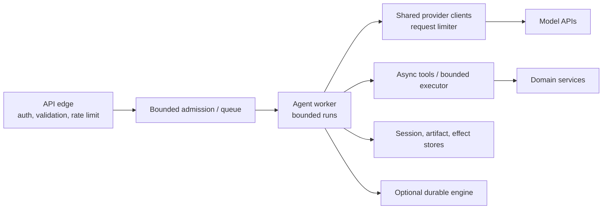

# Deployment, Performance, and Reliability

**Research date:** 2026-08-31  
**Version scope:** Pydantic AI `v2.36.0`

Pydantic AI is an in-process async runtime. Production deployment must supply admission control, process lifecycle, storage, isolation, network policy, deadlines, reconciliation and an operator-visible failure model.

## Recommended service boundary

Keep HTTP routes thin. Authenticate, load authoritative state, construct scoped dependencies/toolsets, admit one bounded turn and persist the result. Long waits or crash-sensitive work should start/signal a durable workflow or job; do not keep an ordinary request task alive indefinitely.

## Resource lifecycle

Agents can be global/reused. Reuse provider and async HTTP clients to preserve connection pools. Pydantic-created clients can be closed through agent/model/provider async context managers; injected clients remain caller-owned. Initialize them at application lifespan start and close them after runs drain.

Create per-run objects for:

- authenticated dependencies and database/unit-of-work state;
- per-user MCP toolsets/sessions and scoped credentials;
- cancellation token and absolute deadline;
- usage/effect budget and correlation metadata;
- UI event-stream encoder.

Do not open a new provider client for every tool or model request. Do not share one authenticated MCP session among tenants.

## Timeouts and cancellation

There is no single built-in whole-run wall-clock timeout. Add an application timeout/cancellation boundary. Model timeout applies per request only when the adapter forwards it. Pydantic-created HTTP clients have generous defaults that may exceed your SLO. Local tool timeouts do not govern every custom/MCP/external toolset.

Configure a hierarchy:

| Boundary | Example control |
|---|---|
| queue wait | request deadline/expiry |
| whole run | `asyncio.timeout`/AnyIO plus cancellation token |
| model request | model settings/client timeout |
| HTTP operation | connect/read/write/pool timeouts |
| local tool | tool/agent timeout |
| MCP/external tool | transport/server deadline |
| durable unit | activity/task/step timeout and cancellation policy |

All child operations receive the remaining absolute deadline. A local timeout must not reset the budget for every retry.

Synchronous tools/hooks execute in threads and can outlive timeout/cancellation. Use a bounded thread executor for long-running servers, migrate I/O to async clients, and isolate non-cooperative computation in terminable processes.

## Backpressure and concurrency

Use `max_concurrency`/`max_queued` for whole-run admission and `ConcurrencyLimitedModel` or shared limiters for provider calls. Also bound:

- per-tenant active and queued work;
- tool-task fan-out and thread-pool workers;
- open MCP sessions and subprocesses;
- stream/event buffer per client;
- eval/telemetry background work;
- durable worker concurrency and poller capacity.

Reject or shed load explicitly when the queue is full. An unbounded waiter list is not backpressure. Prefer fairness by tenant/risk tier rather than letting one long-running conversation consume every slot.

Parallel function tools improve latency only for independent calls. Mark barriers or use run-wide sequential execution for shared-state operations. Load-test the database and downstream services, not just provider throughput.

## Retry and fallback policy

Transport retries are opt-in through the provider/client transport; provider SDKs may already retry. `FallbackModel` moves sequentially to another model and can be delayed by inner SDK retries. Response-inspection fallback is non-streaming; exception fallback can operate with streaming.

Recommended policy:

- one bounded same-provider retry owner respecting `Retry-After` and the run deadline;
- approved fallback routes with independent provider settings and data policy;
- model correction only for model-fixable input/output errors;
- no blind retry of an effect after timeout/connection loss;
- durable-engine retries only for classified transient unit failures;
- one attempt ledger visible in traces/metrics.

Return a controlled overload or terminal failure instead of hiding deterministic defects behind retries.

## Effects and recovery

Every external write carries `operation_id = tenant + workflow/run + tool_call_id + action version` or an equivalent stable business key. Record intent before send where feasible. After success, record the remote ID/result. If the outcome is indeterminate, query/reconcile before another send.

Separate model messages from the effect ledger. A repaired or replayed transcript cannot prove what happened remotely. For high-value operations, use a domain service with transaction/outbox support and keep the agent as a caller, not the transaction coordinator.

## Performance levers

Prioritize structural savings:

1. use the smallest adequate model per classified task;
2. reduce model round trips and retry layers;
3. keep instruction/tool-schema prefixes stable for caching;
4. bound and summarize tool results before context entry;
5. use tool search/on-demand capabilities for large catalogs;
6. stream only when user latency benefits justify connection cost;
7. reuse clients and connection pools;
8. batch deterministic application I/O inside domain APIs, not prompt loops.

Do not set temperature/seed and call the run deterministic. Do not optimize token count by removing authorization, provenance or failure context.

## Health and readiness

Liveness should prove the process/event loop is responsive, not call a model. Readiness should verify configuration, required clients/stores and ability to accept bounded work. Use a separate scheduled canary for real provider credentials/model/profile behavior; keep it cheap, isolated and observable.

Monitor queue wait, active/queued/rejected runs, provider and tool latency, TTFC, cancellation settlement, retries per layer, tokens/cost, tool/effect outcomes, thread-pool saturation, stream buffers, exporter drops and reconciliation backlog.

## Graceful shutdown

1. fail readiness and stop admissions;
2. expire queued work that cannot meet its deadline;
3. cancel or hand off active ordinary runs;
4. let durable workflows remain engine-owned while workers drain safely;
5. persist completed/cancelled history and reconciliation records;
6. close streams, MCP sessions/subprocesses, HTTP/provider clients and database pools;
7. flush eval and telemetry exporters within a bound;
8. terminate isolated processes and alert on unresolved effects.

## Deployment acceptance tests

- [ ] Load exceeds every concurrency/queue boundary and produces explicit shedding.
- [ ] Provider 429/5xx/timeouts exercise the exact maximum attempt tree.
- [ ] Fallback respects total deadline, data policy and feature compatibility.
- [ ] Sync tool/thread saturation cannot exhaust memory or block shutdown forever.
- [ ] Client disconnect, server cancel and process termination have distinct tested outcomes.
- [ ] Crash after remote commit is reconciled without duplicate business effect.
- [ ] Slow UI/eval/telemetry consumers cannot starve agent work.
- [ ] All clients, subprocesses, executors and exporters close or time out visibly.
- [ ] A live canary detects provider/model/profile drift before broad rollout.

## Primary sources

- [Agent concurrency, cancellation and usage](https://ai.pydantic.dev/agent/)
- [Timeouts](https://ai.pydantic.dev/timeouts/)
- [HTTP retries](https://ai.pydantic.dev/models/http-request-retries/) and [fallback models](https://ai.pydantic.dev/models/overview/#fallback-model)
- [Advanced tool concurrency](https://ai.pydantic.dev/tools-advanced/#parallel-tool-calls-concurrency)
- [Model/provider HTTP lifecycle](https://ai.pydantic.dev/models/overview/#http-client-lifecycle)

