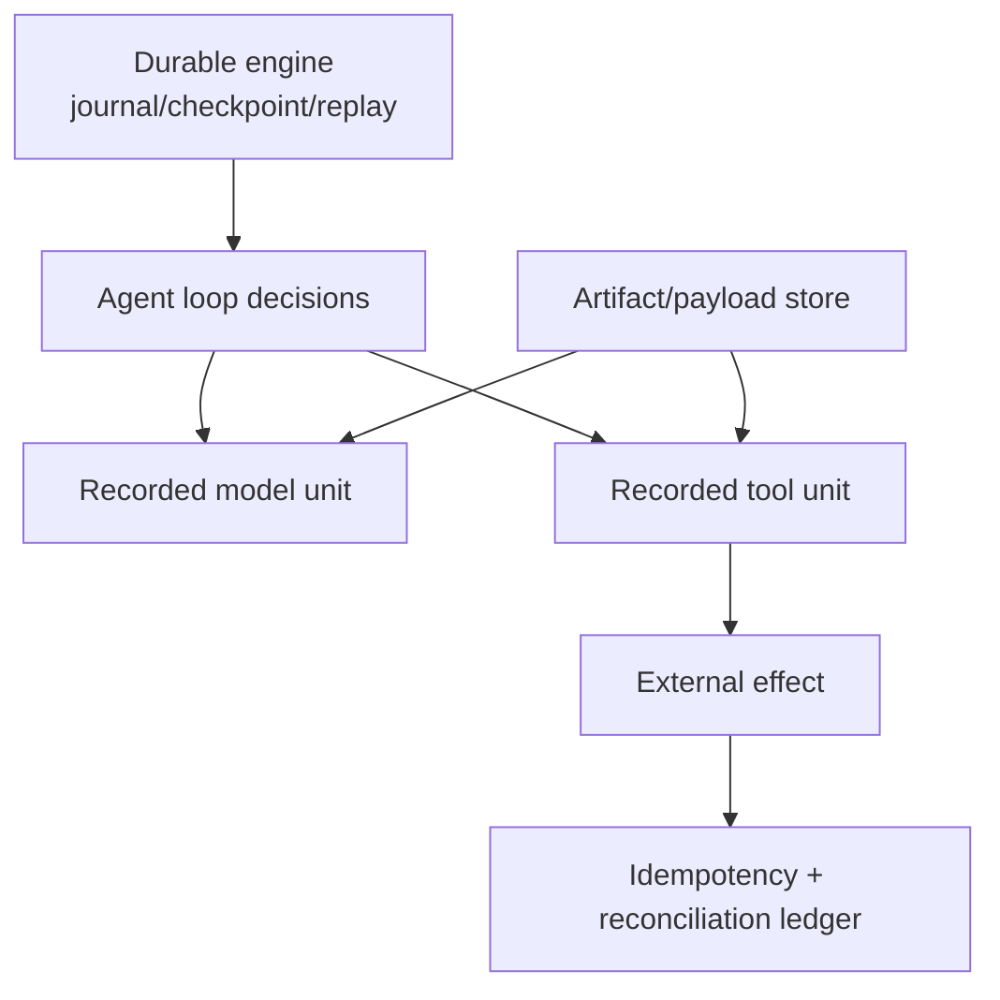

# Durable Execution and Replay Boundaries

**Research date:** 2026-08-31  
**Version scope:** Pydantic AI `v2.36.0`; Temporal, DBOS, Prefect and Restate integrations

Pydantic AI's durable integrations route model/tool operations through another runtime. Durability exists only when the agent runs inside that engine's workflow/flow/handler. Attaching a capability and calling the agent from a normal HTTP request is still an in-process run.

## Guarantee map

The engine can record a completed unit and reuse its result on replay. It cannot generally make an arbitrary external effect exactly once. If a worker crashes after the remote effect commits but before the unit result is checkpointed, the unit may repeat. Business idempotency and reconciliation remain mandatory.

## Integration comparison

| Backend | Activation | Pydantic AI unit mapping | Key caution |
|---|---|---|---|
| Temporal | `agent.run()` inside a Temporal workflow with `TemporalDurability` and plugin | agent loop in workflow; model, MCP and I/O tools as activities | deterministic workflow code, stable activity IDs, payload/history limits |
| DBOS | run inside `@DBOS.workflow` with `DBOSDurability` | model/MCP as steps; function tools need explicit durable-step treatment where applicable | operation order is replay contract; ordinary external steps remain at-least-once around crash window |
| Prefect | run inside `@flow` with `PrefectDurability` | model, MCP and tools as tasks | cache/result persistence and concurrency are configuration-dependent |
| Restate | `RestateAgent` in a Restate service handler | LLM responses journaled; tool effects durable only when wrapped in Restate runs | integration lives in Restate SDK; arbitrary tool code is not automatically a durable step |

Pydantic describes these four as officially supported/co-maintained. Kitaru and Apache Airflow are documented additional external integrations. Qualify those separately; do not infer identical support or semantics from their appearance in the durable overview.

## Temporal

Temporal replays deterministic workflow code and executes I/O in activities. Pydantic AI keeps the loop in the workflow and routes model requests, MCP communication and relevant tools to activities.

Production contracts:

- agent names and executing toolset/capability IDs become stable activity identity; renaming breaks active histories;
- dynamic toolset factories run in replay-sensitive contexts and must be deterministic from serializable dependencies;
- activity inputs/results, dependencies, settings, message metadata and application workflow types are persisted schemas;
- default Temporal payload/event-history limits make large prompts, files and results dangerous; externalize by immutable reference and retain for the workflow lifetime;
- activity retries are distinct from provider/transport/model-correction retries;
- model streaming is buffered at the activity boundary unless a live activity-side event bridge is added;
- same-process cancellation handles do not cross the boundary; cancel the workflow and configure activity cancellation;
- activity `RunContext` is a copy. Mutating `ctx.usage` in a delegated child does not return usage to the parent workflow.

Adding an optional field with a default is usually safer than adding a required or incompatible persisted field. Use worker versioning/patching for workflow-code changes and replay historical executions before rollout.

## DBOS

DBOS persists workflow inputs and completed step results. Replay expects durable operations in the same sequence. Model/MCP work is integrated as steps; application tools performing I/O or nondeterminism need explicit step semantics under the documented integration.

DBOS database transactions can provide strong commit behavior when business and workflow state share the supported transaction. Do not generalize that to remote HTTP, email, filesystem or payment effects. Workflow IDs can act as idempotency keys; keep them stable.

Reordering, inserting or removing durable operations can produce an unexpected-step error. Use DBOS patch/versioning, drain or blue-green workers. Default pickle serialization means persisted records must be trusted infrastructure data and code/schema compatibility must be managed.

## Prefect

Prefect turns model, MCP and tool work into tasks with configurable retry, timeout, cache and result storage. Defaults do not create universal persistence or exactly-once behavior. Task retries default to zero in the Pydantic integration; choose one retry owner.

Cache keys include serializable request/tool/run inputs. Nonserializable security scope may be excluded. If tenant, principal or policy identity exists only in a nonserializable object, cache reuse can cross logical boundaries. Put all security-relevant scope in explicit serializable key material or disable caching.

Prefect result persistence, storage and lock/isolation configuration determine whether cache entries survive workers and whether simultaneous identical tasks duplicate work. The common `READ_COMMITTED` pattern does not by itself prevent concurrent duplicate execution.

Pydantic AI v2.36 changed Prefect hashing for capability-owned durable operations and fixed projection of tool definitions. A flow crossing the upgrade can miss an older cache and re-execute. Drain active flows or pin workers where duplicate effects are unacceptable.

## Restate

`RestateAgent` is maintained in the Restate Python SDK. Restate journals handler execution and model results. An effectful tool becomes a durable Restate operation only when its external work is wrapped with `restate_context().run_typed` or the relevant Restate construct.

Journaled run results are reused on replay. Errors retry unless classified/bounded. Configure invocation timeouts and retention for the longest approval or recovery window; development defaults may be far shorter than business requirements. Treat the order of journaled operations as a versioned contract and deploy immutable service versions for in-flight invocations.

## Approval across a durable wait

Pydantic AI's deferred protocol and the engine's wait/signal/promise primitive are separate. A production bridge should:

1. persist `DeferredToolRequests` and exact validated arguments server-side;
2. suspend using the engine's durable wait primitive;
3. authenticate the approver and bind a one-time decision to workflow and tool-call IDs;
4. revalidate arguments/resource version and re-authorize at resume;
5. build `DeferredToolResults` and continue under a new Pydantic AI run ID;
6. execute the effect idempotently and record the result.

Never generate default random UI/run IDs inside replayable workflow code. Pass stable identifiers so replay and frontend deduplication agree.

## Retry classification at the wire

Engine retry and model correction are different outcomes. A deterministic bad tool argument should become a model-visible `RetryPromptPart`, not an engine task failure. Open [issue #6979](https://github.com/pydantic/pydantic-ai/issues/6979) demonstrates dynamic-tool `ValidationError` crossing the durable wire incorrectly: Temporal and retry-enabled DBOS can exhaust engine attempts before the model receives a correction; Prefect can waste retries and emit noise.

Build a conformance test that sends malformed dynamic-tool arguments through every chosen backend. Version the adapter and its serialized error/result union as an application dependency.

## Large values and streaming

Keep large provider responses, files, traces and tool artifacts out of workflow history. Store them in an encrypted artifact store and persist a typed reference with digest, media type, size, tenant, retention and authorization policy. The object must outlive every replay and audit window.

Durable event handlers are typically at-least-once. Workflow-side event processing must be deterministic; activity/task-side live publishing must be idempotent. A UI reconnect needs stable event IDs and an append-only projection store.

## Upgrade and failure test matrix

- [ ] Crash before effect, after effect/before checkpoint, and after checkpoint.
- [ ] Replay old Temporal histories, recover DBOS workflows, resume Prefect flows and replay Restate journals on new workers.
- [ ] Snapshot agent, workflow, activity/task/operation, toolset, capability and model IDs.
- [ ] Decode old dependency/message/result payloads after optional and incompatible schema changes.
- [ ] Bound total attempts across provider, transport, correction and engine retries.
- [ ] Exercise malformed dynamic-tool validation through the durable wire.
- [ ] Resume approval after identity, policy and resource state change.
- [ ] Cancel during model activity, tool step, wait and event delivery.
- [ ] Exceed payload limits and expire/miss an external artifact.
- [ ] Prove tenant scope participates in Prefect cache identity.
- [ ] Reconcile every external effect with a stable business idempotency key.

## Primary sources

- [Durable execution overview](https://ai.pydantic.dev/durable_execution/overview/)
- [Temporal integration](https://ai.pydantic.dev/durable_execution/temporal/) and [Temporal workflows/activities](https://docs.temporal.io/)
- [DBOS integration](https://ai.pydantic.dev/durable_execution/dbos/) and [DBOS workflows](https://docs.dbos.dev/python/tutorials/workflow-tutorial)
- [Prefect integration](https://ai.pydantic.dev/durable_execution/prefect/) and [Prefect caching](https://docs.prefect.io/v3/concepts/caching)
- [Restate integration](https://ai.pydantic.dev/durable_execution/restate/) and [Restate durable steps](https://docs.restate.dev/develop/python/durable-steps)
- [Dynamic-tool durable validation issue #6979](https://github.com/pydantic/pydantic-ai/issues/6979)

