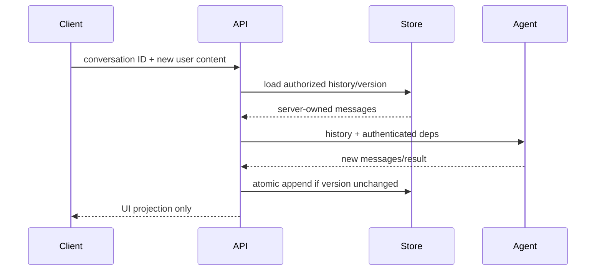

# History, State, Memory, and Persistence

**Research date:** 2026-08-31  
**Version scope:** Pydantic AI `v2.36.0` and first-party Harness boundaries

Pydantic AI core makes conversation history explicit. Persistence, trusted session ownership, semantic memory, artifact storage and effect recovery remain separate application concerns unless a specific capability or durable engine is added.

## Separate the state layers

| Layer | Purpose | Typical key | Not guaranteed by it |
|---|---|---|---|
| model messages | context sent to/returned by models | `conversation_id`, order | authenticity, effect recovery |
| run state | current graph progress, usage, retries, pending calls | `run_id` | survival after process crash |
| session store | server-owned conversation record | tenant + conversation | long-term semantic memory |
| semantic memory | curated facts/notes retrievable later | namespace + subject | complete transcript or audit |
| artifact store | large files, raw responses, tool outputs | immutable digest | authorization to retrieve |
| effect ledger | intent, idempotency and commit state | operation/tool-call ID | model context |
| durable-engine history | replay/checkpoint record | workflow/invocation ID | exactly-once external effects |

Conflating these layers produces subtle failures: a transcript is used as an audit log, a summary becomes authoritative memory, or a checkpoint is assumed to prove a payment executed once.

## Message identity and serialization

Every run gets a new `run_id`; a multi-run conversation keeps a `conversation_id` through history. Deferred-tool resume is a new run and should be correlated with the same conversation and the server-owned pause/workflow record.

Use `ModelMessagesTypeAdapter` for JSON serialization and deserialization. Minor versions may add message parts and optional fields, so store an envelope with:

- schema/application version and Pydantic AI package version;
- tenant, subject and conversation ID;
- ordered immutable message payload or append position;
- encryption/key version, retention class and provenance;
- integrity metadata if transport or storage is not already authenticated.

Append `new_messages()` after a run rather than rewriting the entire transcript. Use an optimistic version or transaction so two concurrent turns cannot append conflicting histories unnoticed.

Pydantic AI supports provider-valid repair for local histories, including incomplete call/result shapes. Repair is a request-compatibility operation. Keep separate effect state so repair never implies “safe to execute again.”

Do not mutate stored message objects or parts in place. Use immutable replacement. In-place mutation can make cached telemetry serialization stale and can break the relationship between original history and `new_messages()`.

## Trust boundary

Deserialization validates structure, not provenance. A client may fabricate model responses, tool calls, tool results, approval results, file URLs and system prompts. `sanitize_messages()` and UI-adapter defaults remove or constrain dangerous shapes, but they do not authenticate the history.

Recommended server-owned session path:

When the client protocol requires round-tripped history, treat it as a UI projection. Prefer authoritative server history when executing tools or accepting approvals. Pydantic AI's UI adapters ignore client compaction when explicit server history is supplied.

## Instructions and hand-offs

Current-agent `instructions` replace historical instructions on a continued run. `system_prompt` parts remain in history. Cross-agent hand-off must therefore decide whether old system authority should persist. Use current instructions by default; reinject/replace system prompts deliberately; remove tool context the receiving agent cannot interpret.

Provider-uploaded file references and native-tool parts can be route-specific. A fallback provider may not be able to replay them. Store canonical artifacts outside history and adapt references for the selected route.

## History processing and compaction

`ProcessHistory` runs before every model request and replaces the live history, including the current prompt. It can filter, trim or summarize, but it must preserve protocol invariants.

Before deploying a processor, prove it preserves:

- the current user input and required instruction/system authority;
- call/result IDs and valid ordering;
- `ToolAvailabilityDeltaPart` or equivalent tool-search reveal evidence;
- pending deferred calls and approval correlation;
- `run_id`, timestamps, metadata and boundaries needed by `new_messages()`;
- tenant isolation and redaction policy.

Summaries are lossy, model-generated data. Record the source message range, summary model/prompt/version, creation time and a link to the immutable originals. Never let summary text elevate untrusted content into system authority. Keep legal/audit records outside model context processing.

Context compaction in core/Harness and provider-native compaction solve token pressure; they do not create semantic memory. A summary may omit a constraint or adversarial instruction. Regression-test important constraints after compaction.

## Harness persistence and memory

The first-party Harness documents separate capabilities:

- **Step Persistence** stores settled run snapshots, an event log and an effect ledger, and supports continuing or forking from a settled step with in-memory, file, SQLite and MongoDB backends.
- **Conversation Search** retrieves earlier persisted turns, including context dropped by compaction.
- **Memory** stores namespaced Markdown notes intended to outlive a conversation, with bounded injection and search.

These can be valuable, but their store, transaction, concurrency, encryption, retention and tenant contracts determine production safety. Step Persistence is not the same guarantee as Temporal/DBOS/Prefect/Restate workflow replay. Inspect whether a crash can occur between an effect and the settled snapshot, and use the effect ledger/idempotency contract accordingly.

Memory writes need policy:

- separate immutable application instructions from agent-authored notes;
- allowlist memory namespaces and writers;
- validate provenance, sensitivity, expiry and tenant scope;
- use quotas, optimistic concurrency, review and rollback;
- prevent retrieved memory from being treated as higher authority than its source;
- evaluate poisoned, stale, contradictory and over-retrieved notes.

## Provider-held conversations

Some providers can retain conversation state and let later requests reference it. This reduces payload assembly but introduces provider retention, deletion, region, access and portability constraints; earlier tokens may still be billed. It may be incompatible with Zero Data Retention. Keep the application conversation ID and audit/effect state even if the provider holds model context.

## Persistence transaction

For a tool-using turn, the safest practical sequence is:

1. authenticate and load the session version;
2. create a run/effect intent with stable IDs;
3. execute idempotent tools and record outcomes;
4. obtain and validate the final model output;
5. atomically append new messages plus run status where possible;
6. finalize effect records, or leave them reconcilable if the transaction spans systems.

No generic database transaction covers a remote provider, email, payment API and session store. Design sagas/reconciliation around those boundaries.

## Acceptance tests

- [ ] Concurrent turns detect or merge version conflicts without losing history.
- [ ] V1/current serialized fixtures load through `ModelMessagesTypeAdapter`.
- [ ] Unknown message parts are preserved or handled safely.
- [ ] Forged tool calls, approvals, system prompts and file references cannot gain authority.
- [ ] Compaction preserves safety, deferred calls and tool-search state.
- [ ] Memory is tenant-scoped, quota-bound, reviewable and resistant to poisoning.
- [ ] Crash after effect but before history append is reconciled exactly once at the business layer.
- [ ] Provider switch handles uploaded/native content without silent semantic loss.

## Primary sources

- [Messages and chat history](https://ai.pydantic.dev/message-history/)
- [Message types API](https://ai.pydantic.dev/api/messages/)
- [History processing](https://ai.pydantic.dev/capabilities/process-history/)
- [Compaction](https://ai.pydantic.dev/capabilities/compaction/)
- [Pydantic AI Harness](https://pydantic.dev/docs/ai/harness/)

