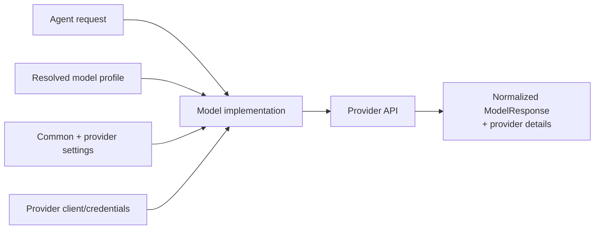

# Messages, Instructions, Models, and Providers

**Research date:** 2026-08-31  
**Version scope:** Pydantic AI `v2.36.0`

Pydantic AI provides a common message and model interface, not full provider equivalence. The portable core is useful—requests, responses, typed parts, tool definitions, settings, usage, and events—but model profiles and provider-specific settings decide what can actually be sent and how it behaves.

## Message model

A run history is an ordered list of `ModelRequest` and `ModelResponse` values. Requests contain parts such as user prompts, system prompts, tool returns, and retry prompts. Responses contain text, thinking, tool calls, native-tool parts, files, usage, model identity, timestamps, state, and provider details.

Treat these as a protocol:

- preserve part order, tool-call IDs, response state, and request/response boundaries;
- serialize with `ModelMessagesTypeAdapter`, not arbitrary `model_dump()` conventions;
- handle unknown message parts, stream events, and optional fields defensively because the version policy permits additions in minor releases;
- preserve raw provider details separately when incident diagnosis or adapter migration needs them;
- never infer that deserializing a message authenticates who created it.

Interrupted or suspended responses are not ordinary complete turns. Pydantic AI can repair dangling tool-call histories before reuse so a provider receives a valid sequence, but repair makes the wire shape acceptable; it does not prove that a tool ran, did not run, or can safely be retried.

## Instructions versus system prompts

The distinction matters across reused history:

| Mechanism | Reused with `message_history` | Recommended use |
|---|---|---|
| `instructions` | old instructions are omitted; current agent's instructions are applied | default agent behavior and dynamic request policy |
| `system_prompt` | stored as parts in history and retained | deliberate cross-run or cross-agent prompt continuity |
| enqueued user content | appended during a run | new facts, external events, steering or follow-up work |
| enqueued `SystemPromptPart` | mid-conversation system part | only application-authored instruction changes |

Prefer instructions. Dynamic instructions can read `RunContext` and are reevaluated. A receiving agent in a hand-off gets its own instructions, while earlier tool calls and returns remain in history. If agents do not share tool semantics, filter or summarize the history rather than sending opaque tool context.

Never place untrusted tool output or webhook text into a system part. The message role is an authority signal to the model, not a sanitizer.

## Models, providers, and profiles

A model implementation converts Pydantic AI's common structures into one provider API. A provider configures credentials, base URL, client and provider-specific profile resolution. A model profile describes capabilities and request-shape behavior for a model/provider combination.

Profiles are operational data, not a permanent truth table. Providers change model behavior and SDKs. A custom profile can override what Pydantic AI believes is supported, but it cannot add a capability to the remote API. Pin model identifiers or snapshots where available and keep a provider conformance suite.

V2 requires provider-prefixed string model names. Notable V2 behavior: `openai:` selects the Responses API; use `openai-chat:` for Chat Completions. Provider-specific objects remain the clearest choice when credentials, endpoints, profiles, transport, retry policy, or settings require explicit control.

## Settings precedence

Model settings merge in this order, with later values winning:

1. model-level defaults;
2. agent-level settings;
3. run-time settings.

Provider-specific `ModelSettings` subclasses expose settings outside the portable common set. Avoid sending a wide shared dictionary across providers and assuming ignored values are harmless. Build tested settings per route and log the resolved model plus safe setting metadata.

Important non-portable surfaces include:

- native structured output and its schema subset;
- whether structured output can coexist with function/native tools;
- parallel tool calls and tool-choice syntax;
- reasoning/thinking controls and whether thinking appears in history;
- native web, file, code, memory, MCP and image tools;
- prompt caching and cache-control parts;
- usage fields, costs, finish reasons and safety errors;
- streaming cancellation and background/suspended responses;
- provider-held conversations and retention restrictions.

## HTTP clients, fallbacks, and retries

Reuse async HTTP clients to retain connection pools and amortize TLS setup. Close them during process shutdown. Provider SDKs may implement their own retry layer; Pydantic AI also offers HTTP transports that use Tenacity and can respect `Retry-After`. Inventory both before enabling either.

`FallbackModel` tries a different model after a configured failure; it does not retry the same model. The winning response is the one added to history. Fallback improves availability but can change data retention, region, price, tool support, safety policy, structured-output behavior, or response quality. Authorize the fallback route and re-check that the full request is compatible before sending it.

Prefer a narrow exception/response policy:

- retry a known transient connection or rate-limit error on the same provider;
- fall back only for explicitly classified outages or unsupported response conditions;
- do not fall back on authentication, authorization, invalid schema, content-policy, or application errors;
- bound the combined transport plus fallback time inside the run deadline.

## Native tools and multimodal content

Native tools execute at the provider, not in the Pydantic AI process. Their availability and event shape differ from function tools. Tool visibility, approval, network policy, billing, data location, and effect semantics therefore belong to the provider contract.

Media can be sent as URLs, inline binary content, or provider-uploaded file references. Provider support differs. When a URL is forwarded, the provider downloads it using its own environment and, for cloud schemes, potentially application IAM. When Pydantic AI downloads `http(s)` itself, its URL controls and size limits apply. Never pass untrusted `s3://` or `gs://` references under privileged provider credentials. Use server-created pre-signed HTTPS references and enforce MIME, byte, redirect, DNS, and time bounds.

`UploadedFile` includes a provider name and is not portable across providers. A history processor may remove incompatible file parts for a fallback provider, but textual references to the missing file can still confuse the model. Store canonical artifacts outside model history and derive provider-specific references per request.

## Provider conformance suite

Run the same cases against every allowed model route:

- [ ] simple text, unicode, long context and multimodal inputs;
- [ ] each output mode and the schemas that use unions, enums, constraints and recursion;
- [ ] one, parallel, malformed, unknown and mixed output/function tool calls;
- [ ] native-tool success, denial, timeout, partial results and usage;
- [ ] stream part ordering, time to first chunk, cancellation and interrupted history repair;
- [ ] provider error mapping, `Retry-After`, fallback selection and deadline exhaustion;
- [ ] prompt-cache behavior and cost/usage reconciliation;
- [ ] history replay with uploaded files, provider details and prior thinking parts.

## Selection rule

Use the common interface for application structure, but treat each model route as a separately qualified dependency. Portability is demonstrated by tests, not by a shared method name.

## Primary sources

- [Models and providers](https://ai.pydantic.dev/models/overview/) and [model settings](https://ai.pydantic.dev/api/settings/)
- [Messages and history](https://ai.pydantic.dev/message-history/)
- [Agent instructions and settings](https://ai.pydantic.dev/agent/)
- [Native tools](https://ai.pydantic.dev/native-tools/) and [multimodal input](https://ai.pydantic.dev/input/)
- [HTTP request retries](https://ai.pydantic.dev/models/http-request-retries/)

