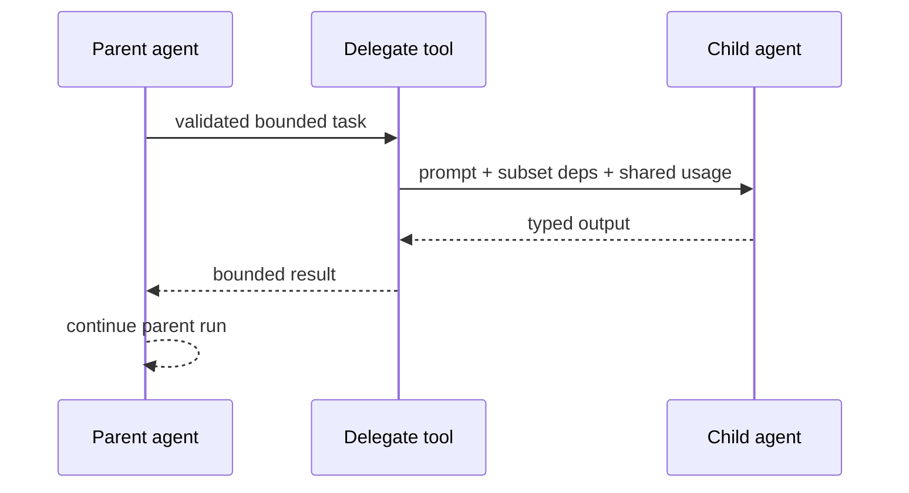

# Multi-Agent Systems and Delegation

**Research date:** 2026-08-31  
**Version scope:** Pydantic AI `v2.36.0` and first-party Harness delegation boundaries

Multiple agents increase model calls, tool surfaces, context transfers, cancellation paths and failure combinations. Start with one agent. Add delegation only when a specialist has a measurably different model, instruction set, data boundary, toolset or context budget.

## Pattern ladder

| Pattern | Control returns to caller? | Use when |
|---|---:|---|
| one agent with typed tools | n/a | default; one policy and context are enough |
| agent delegation through a tool | yes | parent chooses/uses a bounded specialist result |
| output-function hand-off | no, current run ends | validated terminal routing to another application stage |
| programmatic successive agents | application decides | deterministic routing, human input, different dependencies |
| Pydantic Graph/workflow | explicit graph decides | topology, checkpoints and state transitions are product logic |
| Harness subagents/dynamic workflow | model-directed specialists | isolated research/coding tasks justify added autonomy |

Delegation is not automatically superior to one larger prompt. Evaluate outcome, cost, latency and failure rate against the single-agent baseline.

## Delegation through a tool

A parent tool should be `async def` and `await child.run(...)`; sync run methods cannot be called from inside an active agent callback. Agents are reusable and do not belong inside dependencies. Pass the child the subset of dependencies it needs.

Pass `usage=ctx.usage` so child model requests, tokens and best-effort cost accrue to the parent limits. Cost cannot be reconstructed from aggregate tokens when models have different prices, so preserve per-response/provider data in telemetry.

Under Temporal, the tool's activity receives a copied context and child mutations do not return to the workflow. The parent can under-report usage and fail to charge its limits. Return a usage delta explicitly or write a server-side usage ledger; see [issue #6886](https://github.com/pydantic/pydantic-ai/issues/6886).

## Dependency and authority propagation

Do not pass a broad parent dependency object simply because the types allow it. Define the child's least-privilege view:

- authenticated subject and tenant, not a user-supplied identity string;
- read-only repository instead of an administrative client;
- scoped credentials with expiry and audience;
- remaining budget/deadline;
- correlation IDs and policy version;
- an output channel, not direct access to the parent's mutable state.

The parent must validate the child's output like any other untrusted model/tool result. A typed child output does not authorize the parent to act on it.

## Cancellation and failures

Cancellation is run-scoped. A child calling `ctx.cancel()` inside a parent tool cancels the child; if uncaught, it normally becomes a failed tool result the parent model can react to. To cancel the whole tree, share a `CancellationToken`. To propagate conditionally, catch `RunCancelled` in the delegate tool and cancel the parent context.

Define a failure taxonomy before composing agents:

- child invalid output → bounded child correction, then typed failure to parent;
- child cancellation → cancel parent, return failed result, or continue with fallback;
- child provider failure → narrow provider fallback or parent-visible failure;
- deadline/budget exhaustion → terminal; do not ask another agent to “try harder”;
- partial child side effect → reconcile by operation ID before any retry.

Nested retries multiply. Give each child a maximum request/cost allocation inside the parent's total budget and cap recursion/delegation depth.

## Hand-off and history

Programmatic hand-off runs agents in succession. A receiving agent can get prior `message_history`, but earlier tool calls, results and system prompts remain. Current `instructions` are replaced by the receiving agent's instructions; historical system prompt parts are not.

Share only context the recipient can interpret. Prefer a typed hand-off object plus selected user facts over a full transcript. When full history is needed, remove obsolete authority and provider-specific parts, retain provenance, and validate the resulting provider history.

An output function can produce the hand-off payload and end the current run. Keep routing in application code when it depends on authorization, regulation, money, or deterministic workflow state.

## Harness subagents and dynamic workflows

The first-party Harness includes subagent and dynamic-workflow capabilities. They can isolate context and fan out work, but they add another capability/package, execution environment, budget and trust boundary. Configure named allowed children and a hard maximum child-call count. Do not allow recursive creation or unrestricted tool inheritance by default.

Shared writable memory and workspaces need ownership, locking and conflict policy. A subagent should return an artifact/diff/result; the parent or application decides whether to merge or commit.

## Topology review

For every edge, document:

| Question | Required answer |
|---|---|
| Who chooses the child? | application, model tool call, or workflow |
| What crosses? | typed task, selected history, dependencies, credentials |
| Who owns budget? | one shared ledger and child allocation |
| Who may commit effects? | explicit tool/service and authorization policy |
| How does cancellation propagate? | isolated, shared token, or workflow cancellation |
| What is persisted? | parent/child messages, artifacts, usage, effect state |
| How are failures returned? | stable typed result, not raw exception text |

## Acceptance tests

- [ ] Single-agent baseline is measured against the multi-agent design.
- [ ] Child receives only scoped dependencies/tools and cannot escalate through the parent.
- [ ] Shared usage, cost, request and depth limits stop a recursive loop.
- [ ] Parent validates schema-valid but false or unauthorized child output.
- [ ] Child cancel, parent cancel and shared-tree cancel have distinct expected outcomes.
- [ ] Cross-agent history cannot retain unintended system authority or opaque tool state.
- [ ] Parallel children cannot race shared writes or memory.
- [ ] Durable execution records child cost/effects despite context-copy/replay behavior.

## Primary sources

- [Multi-agent applications](https://ai.pydantic.dev/multi-agent-applications/)
- [Dependencies](https://ai.pydantic.dev/dependencies/)
- [Message sharing](https://ai.pydantic.dev/message-history/#sharing-messages-between-agents)
- [Cancellation and sub-agents](https://ai.pydantic.dev/agent/#cancellation-and-sub-agents)
- [Pydantic AI Harness capabilities](https://pydantic.dev/docs/ai/harness/)
- [Temporal delegate-usage issue #6886](https://github.com/pydantic/pydantic-ai/issues/6886)

