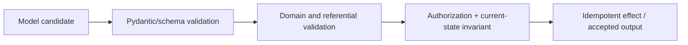
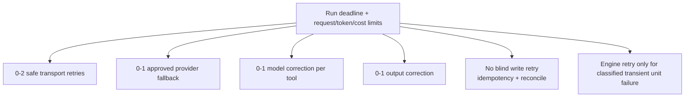

# Outputs, Validation, Retries, and Errors

**Research date:** 2026-08-31  
**Version scope:** Pydantic AI `v2.36.0`

Pydantic AI makes output schemas and correction paths first-class. This reduces malformed data at the model boundary. It does not establish truth, authorization, transaction safety, or durability.

## Output modes

| Mode | Mechanism | Strength | Main limitation |
|---|---|---|---|
| `ToolOutput` | model calls a generated output tool | portable default; supports several alternatives | competes with function tools; per-output-tool retry semantics |
| `NativeOutput` | provider enforces a JSON schema response format | strongest provider-side syntax constraint | model/schema/tool combinations vary by provider |
| `PromptedOutput` | schema is placed in instructions and text is parsed | works without native tool/schema support | least reliable; model is not forced to obey schema |
| `TextOutput` / `str` | plain text, optionally transformed by a function | natural responses and custom processing | application must define semantic validity |
| output function | validated arguments call terminal application function | custom validation/hand-off at run end | side effects are terminal and need idempotency |

The default accepts Pydantic models, dataclasses, typed dictionaries, scalars, collections, unions and lists of choices. Non-object schemas are wrapped for tool calling. A union may become several output tools so the model selects a simpler schema.

`StructuredDict` is a special escape hatch: its supplied JSON schema is shown to the model, but it does not provide Pydantic runtime validation. Validate its returned dictionary yourself.

## Three validation layers

1. **Schema validation** checks parseability, types and declared constraints.
2. **Semantic validation** checks existence, cross-field rules, allowed transitions, freshness and business meaning.
3. **Authority/effect validation** checks the authenticated subject, tenant, policy, current resource version and commit preconditions.

Only the first layer is intrinsic to a Pydantic output type. Output validators may add semantic checks and raise `ModelRetry`, but high-stakes authorization must use trusted dependencies and authoritative state. Never ask the model to repair an authorization failure by revealing sensitive policy details.

Streaming validators and output functions can run on multiple partial snapshots before the final value. Use `ctx.partial_output` to avoid irreversible effects and final-only checks during partial validation.

## Five retry layers

Pydantic AI documents five independent mechanisms:

| Layer | Re-attempt | History | Budget owner |
|---|---|---|---|
| transport | same HTTP request | invisible | HTTP/provider client |
| fallback | same logical request on another model | winning response only | fallback chain |
| function tool | ask model to correct one call | `RetryPromptPart` | counter per tool name |
| output | ask model to correct final output | `RetryPromptPart` | global text path or per output tool |
| model-request hook | repeat model request after hook `ModelRetry` | retry prompt; rejected response rules depend on hook | output-side budget |

`max_retries=N` means one initial attempt plus `N` retries. The built-in tool and output default is one retry. A single integer sets both tool and output budgets; a dictionary can set them separately.

Tool retry precedence is: per-tool, per-toolset, override block, per-run argument, per-run spec, agent default, built-in default. The counter is keyed by tool name and resets after success. A model that alternates failure/success or invents new names can make many calls without exhausting one tool counter. `UsageLimits.request_limit`, the wall-clock deadline, and a total effect budget are the real run bounds.

Retries from transport, provider SDK, fallback, model correction, a job queue, and a durable engine multiply. Draw an attempt tree and choose one owner for each failure class.

## Error and control-flow taxonomy

| Outcome | Meaning | Model-visible? | Operational action |
|---|---|---:|---|
| argument/output `ValidationError` | shape failed | yes, as bounded correction | count model request and preserve diagnostic privately |
| `ModelRetry` | model can change call/output | yes | use only when correction can help |
| `ToolFailed` | completed call has a definitive failure | yes, failed tool result | no tool-retry count; request limit must bound repetition |
| `ApprovalRequired` / `CallDeferred` | pause/control flow | represented as deferred requests | persist and resume; not an error |
| `UnexpectedModelBehavior` | invalid behavior or correction budget exhausted | no automatic recovery | terminate or classify at application boundary |
| `ModelHTTPError` / `ModelAPIError` | provider/transport problem | not normally | use narrow retry/fallback policy |
| `UsageLimitExceeded` | enforced budget reached | no | stop and report controlled terminal state |
| `RunCancelled` | first-party cancellation | no | persist completed history; suppress future authority |
| other tool exception | programming/infrastructure error | no by default | fail run; optional narrow hook mapping |

`ToolFailed` does not consume the per-tool retry budget and successful-tool-call limits do not count it. A model can therefore repeat failed calls until a request, token, cost, or deadline limit stops it.

Do not put exception strings or Pydantic error details into model context without review. Field names, rejected values, paths, database identifiers and internal types may be sensitive. Map expected failures to a stable public taxonomy and retain the original exception in protected telemetry.

## Output tools mixed with function tools

V2 defaults to `end_strategy='graceful'`. When a successful output tool and function tools appear in the same response, function tools may execute rather than being skipped. This is a behavior change from V1's early strategy and is material for writes.

Design rules:

- never use a final-output race to authorize side effects;
- set an explicit strategy and test every mixed-call ordering;
- make co-emitted effectful calls idempotent;
- use run/event APIs that complete the full graph when all tools matter;
- consider separating “draft a command” output from application-controlled execution.

## Retry ownership example

Provider requests are safe to transport-retry only when the provider's request state and idempotency contract are known. An effectful tool is not safe to retry merely because it raised a timeout: the remote system may have committed. Query by idempotency key or reconcile before trying again.

## Acceptance tests

- [ ] Invalid syntax, missing fields, wrong union branch, excessive nesting and oversized values.
- [ ] Schema-valid but nonexistent, stale, inconsistent and unauthorized objects.
- [ ] Each output mode on every provider route, including tools plus structured output.
- [ ] `ModelRetry`, `ToolFailed`, ordinary exceptions, output validator failures and hook failures.
- [ ] Maximum combined attempts across all retry layers; verify backoff fits the deadline.
- [ ] Mixed output/function calls under `early`, `graceful` and any exhaustive behavior used.
- [ ] Streaming partial output never performs a final side effect.
- [ ] Sensitive rejected values and stack traces do not enter retry prompts or exported traces.

## Primary sources

- [Output](https://ai.pydantic.dev/output/)
- [Retries](https://ai.pydantic.dev/retries/)
- [Advanced tool failures](https://ai.pydantic.dev/tools-advanced/#tool-retries)
- [Exception API](https://ai.pydantic.dev/api/exceptions/)
- [Agent output retry behavior](https://ai.pydantic.dev/agent/#how-output-retries-are-enforced)
