# Security Advisories and Permission Boundaries

**Research date:** 2026-08-31  
**Version scope:** all published `pydantic-ai` and `pydantic-ai-slim` advisories through the cutoff; current V2 `2.36.0`

Pydantic schemas constrain data shape. They do not authenticate history, authorize a tool, sandbox code, make remote URLs safe, protect secrets, or make effects idempotent. Security must be enforced at the authenticated API, dependency/toolset construction, network/OS boundary and final effect commit.

## Advisory ledger

Current V2 `2.36.0` is newer than every published fixed V2 version in this table. Pin the full installed set and verify transitive UI/provider packages rather than checking only a top-level requirement.

| Advisory | Severity | Affected | Fixed | Boundary |
|---|---:|---|---|---|
| [GHSA-2jrp-274c-jhv3](https://github.com/pydantic/pydantic-ai/security/advisories/GHSA-2jrp-274c-jhv3) | High | `>=0.0.26,<1.56.0` | `1.56.0` | SSRF in URL download handling |
| [GHSA-wjp5-868j-wqv7](https://github.com/pydantic/pydantic-ai/security/advisories/GHSA-wjp5-868j-wqv7) | High | `>=1.34.0,<1.51.0` | `1.51.0` | stored XSS/path traversal in Web UI CDN URL |
| [GHSA-cqp8-fcvh-x7r3](https://github.com/pydantic/pydantic-ai/security/advisories/GHSA-cqp8-fcvh-x7r3) | Moderate | `>=1.56.0,<1.99.0` | `1.99.0` | IPv6-encoded SSRF blocklist bypass |
| [GHSA-cg7w-rg45-pc59](https://github.com/pydantic/pydantic-ai/security/advisories/GHSA-cg7w-rg45-pc59) | Moderate | V1 `>=1.56.0,<1.102.0`; V2 beta `<2.0.0b3` | `1.102.0`; `2.0.0b3` | more IPv6 transition-form SSRF bypasses |
| [GHSA-h7p7-w5gc-xj3w](https://github.com/pydantic/pydantic-ai/security/advisories/GHSA-h7p7-w5gc-xj3w) | Moderate | V1 `>=1.65.0,<1.106.0`; V2 beta `<2.0.0b6` | `1.106.0`; `2.0.0b6` | client provider metadata caused uploaded-file confused deputy |
| [GHSA-jpr8-2v3g-wgf9](https://github.com/pydantic/pydantic-ai/security/advisories/GHSA-jpr8-2v3g-wgf9) | Moderate | V1 `>=1.88.0,<1.107.1`; V2 `<2.5.0` | `1.107.1`; `2.5.0` | sanitized trailing history could leave executable dangling call |
| [GHSA-v2xh-2vp8-57h8](https://github.com/pydantic/pydantic-ai/security/advisories/GHSA-v2xh-2vp8-57h8) | Moderate | V1 `>=1.77.0,<1.107.2`; V2 `<=2.23.0` | `1.107.2`; `2.24.0` | unbounded remote-content buffering/DoS |
| [GHSA-3gh4-cghq-f8v4](https://github.com/pydantic/pydantic-ai/security/advisories/GHSA-3gh4-cghq-f8v4) | Low | V1 `<1.107.4`; V2 `<2.27.1` | `1.107.4`; `2.27.1` | retry prompt escaped telemetry content redaction |
| [GHSA-h4xc-3qfq-jf93](https://github.com/pydantic/pydantic-ai/security/advisories/GHSA-h4xc-3qfq-jf93) | High | V1 `>=1.34.0,<1.107.4`; V2 `<2.28.0` | `1.107.4`; `2.28.0` | visited website could trigger local web agent/tool execution |
| [GHSA-q2xc-rrxj-58x9](https://github.com/pydantic/pydantic-ai/security/advisories/GHSA-q2xc-rrxj-58x9) | Moderate | V1 `>=1.34.0,<1.107.5`; V2 `<2.30.0` | `1.107.5`; `2.30.0` | missing Host validation enabled DNS-rebinding access |

The official advisory records are canonical for exact package ranges. V1 security support was promised for at least six months after V2 stable (through at least 2026-12-23), but new deployments should use a current fixed V2 unless compatibility prevents it.

## Authorization pipeline

```mermaid
flowchart LR
    Caller["Authenticated caller"] --> Scope["Build tenant-scoped deps/toolsets"]
    Scope --> Model["Model requests a tool"]
    Model --> Validate["Schema/domain validation"]
    Validate --> Approve["Optional human approval"]
    Approve --> Authorize["Server-side authz + current state"]
    Authorize --> Effect["Idempotent constrained effect"]
    Effect --> Audit["Audit + reconciliation record"]
```

Tool filtering reduces exposure; approval reduces autonomous action. Neither replaces `Authorize`. The commit check must use trusted server state and exact resource/action/subject/tenant identifiers.

## Untrusted history and UI

Pydantic AI's server surfaces can reconstruct a run from supplied history. A client can fabricate tool calls, results, system prompts, files and approvals. The framework does not cryptographically prove their provenance. This is a documented trust boundary.

- authenticate the endpoint and authorize conversation access;
- prefer server-owned history for tool execution;
- run `sanitize_messages()` on untrusted serialized history;
- build per-request toolsets from authenticated dependencies;
- persist high-stakes pauses and approvals server-side;
- reject another user/tenant's conversation, call or result ID;
- protect local development web UIs from network exposure and hostile browser origins.

The built-in web UI is development/debug tooling, not a production frontend.

## URLs, files and SSRF

Remote content must pass scheme, DNS/IP, redirect, port, byte, content-type and time policies. Revalidate every redirect target and resolved address; defend against IPv4/IPv6 encodings, transition forms, NAT64, DNS rebinding and cloud metadata addresses. Apply egress firewall/proxy policy so application correctness is not the only barrier.

`force_download='allow-local'` should be limited to server-authored URLs. Cloud-storage schemes forwarded to a provider can be read under provider/service-account IAM; never construct them from untrusted input. Convert approved uploads to server-generated, scoped, expiring HTTPS references.

Stream and cap bodies before allocation. Verify compressed and decompressed size. Store large content outside messages and inspect with isolated parsers.

## MCP, tools and code execution

A function tool runs with the agent process's credentials, network and filesystem access. An MCP server adds another software and identity boundary. A shared MCP session is one identity; build per-user instances for tenant-scoped credentials.

For risky tools:

- split read and write scopes;
- use short-lived least-privilege credentials;
- restrict egress and allowed endpoints;
- isolate shell/browser/code work in a process/container/VM with resource limits;
- mount only required files, keep secrets out of the workspace and model context;
- allowlist business operations, not interpreters that can spawn arbitrary commands;
- require approval for externally visible/destructive operations and re-authorize after approval;
- record an idempotency/effect ledger.

Harness shell allowlists are documented as best effort, not a sandbox. Filesystem path/symlink controls are defense in depth; OS isolation remains the hard boundary.

## Prompt injection and data flow

Treat web pages, retrieved documents, tool results, memory, MCP descriptions and client context as untrusted data. Keep them in user/tool content, not instructions/system messages. Do not let retrieved text select credentials, authorization scope, approval status or policy.

Constrain outputs used by downstream code with an allowlisted domain model. Re-lookup referenced objects by tenant and verify invariants. Encode for the destination context to prevent SQL, shell, HTML and template injection.

## Secrets and observability

Do not place secrets in prompts, tool schemas/descriptions, exception messages, retry prompts, history metadata or durable payloads. Dependencies can contain clients/keys, but telemetry may serialize unexpected fields if custom hooks add them.

Use `include_content=False`, `include_binary_content=False` and allowlisted attributes, then test with secret canaries. Avoid raw HTTP capture. Encrypt histories, approvals, artifacts, workflow payloads and traces; apply tenant-scoped access, retention and deletion.

## Security regression suite

- [ ] Encoded loopback/private/metadata IPv4 and IPv6, NAT64/6to4/ISATAP, redirects and DNS rebinding.
- [ ] Oversized, endless, compressed-bomb and wrong-content-type downloads.
- [ ] Forged history, system prompt, tool call/result, approval and uploaded-file metadata.
- [ ] CSRF/content-type/origin/Host attacks against local and production UI routes.
- [ ] Cross-tenant conversation, MCP session, cache, memory and artifact access.
- [ ] Schema-valid unauthorized tool calls and approval after role/resource change.
- [ ] Shell/file/browser escape attempts under OS isolation.
- [ ] Secret canaries in prompts, retries, exceptions, binary/custom types and traces.
- [ ] Duplicate/replayed effects after timeout, cancellation and durable crash windows.
- [ ] Dependency lock/advisory scan before every release.

## Primary sources

- [Pydantic AI security advisories](https://github.com/pydantic/pydantic-ai/security/advisories) and [security policy](https://github.com/pydantic/pydantic-ai/security/policy)
- [Message-history trust boundary](https://ai.pydantic.dev/message-history/#trust-boundary-for-client-supplied-history)
- [UI trust model](https://ai.pydantic.dev/ui/overview/#trust-model-for-client-submitted-messages)
- [Multimodal URL trust model](https://ai.pydantic.dev/input/#user-side-download-vs-direct-file-url)
- [MCP client security](https://ai.pydantic.dev/mcp/client/)
