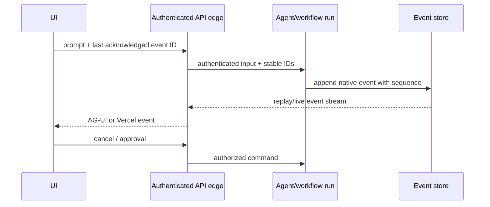
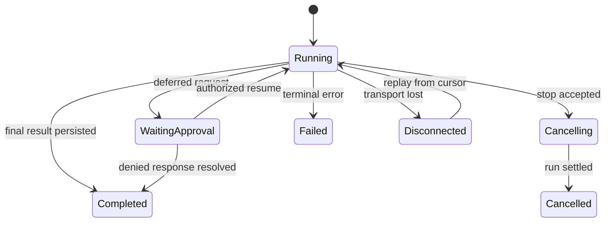

# Streaming, Events, and UI Protocols

**Research date:** 2026-08-31  
**Version scope:** Pydantic AI `v2.36.0`

Streaming is a distributed state protocol, not merely printing tokens. The server, UI adapter and client must agree on run identity, part ordering, tool state, approval state, cancellation, reconnection and completion.

## Choose the correct stream

| API | Emits | Use when | Caveat |
|---|---|---|---|
| `run_stream()` | convenient accumulated/delta final output | rendering a simple final answer | first matching output finalizes the run |
| `run(event_stream_handler=...)` | completed result plus all events to handler | server needs result and live observation | handler must not block the loop |
| `run_stream_events()` | raw events and final result event | UI/protocol translation | consumer assembles content |
| `iter()` plus node streams | node and event control | custom orchestration and partial structured validation | application drives the graph |

`run_stream()` can finalize on text, an output tool, or deferred calls before later tool calls. Use the all-event surfaces when the UI must represent the actual complete agent trajectory.

## Event model

Model streams emit part-start, part-delta and part-end events for text, thinking, tool-call arguments and other response parts. Tool execution adds function-tool call and result events. Output tools have distinct V2 event types. Deferred requests/results and enqueued messages have their own events, and `run_stream_events()` ends with `AgentRunResultEvent`.

The version policy allows new event variants and optional fields in minor releases. Use a tolerant dispatcher with an unknown-event telemetry counter. Do not write an exhaustive `else: raise` unless the deployed package is rigidly pinned and the failure is intentional.

For structured output, streamed values are accumulated snapshots, not deltas. Partial Pydantic validation may omit incomplete fields. Replace the rendered snapshot on each yield rather than appending values. Full validation still occurs at completion.

`stream_text(delta=True)` yields raw deltas and skips accumulated validation/transform behavior. It also does not add an assembled final output message to the result's messages. Persist from the completed response/event state, not the UI string buffer.

## Cancellation has distinct scopes

- leaving `run_stream_events()`'s async context cancels its background run and cleans up;
- `StreamedRunResult.cancel()` stops the current response stream, where supported;
- `AgentRunEvents.cancel()`, `AgentRun.cancel()` or `RunContext.cancel()` cancel the whole run and produce `RunCancelled`;
- external task cancellation remains `CancelledError`;
- provider SDKs that expose only an async iterator may stop local consumption without proving remote generation or billing stopped;
- synchronous tool threads and already committed effects cannot be forcibly rolled back.

Cancelled responses are marked interrupted and may contain incomplete tool arguments. History repair makes later provider input valid. It does not make an ambiguous effect safe to repeat.

An open [cancellation design issue #6460](https://github.com/pydantic/pydantic-ai/issues/6460) documents a residual edge where user/provider/Temporal code swallows external cancellation. Treat it as a conformance-test lead: cancel while a model, hook and parallel tool absorb `CancelledError`, and assert the run cannot silently succeed.

## UI adapters

Pydantic AI supports AG-UI and Vercel AI event stream adapters. A `UIAdapter` parses frontend input, builds run arguments, runs `run_stream_events()`, transforms native events, and encodes the protocol response. A `UIEventStream` can transform events arriving over a queue or durable-workflow bridge without running the agent itself.

Create a fresh event-stream instance per run; it stores current message, part and tool-call state. In replayable workflow code, pass explicit run/thread IDs. Default UUID generation on replay is nondeterministic and breaks client deduplication.

## Client input is untrusted

Adapters sanitize client-supplied messages and file references, but they cannot prove the client did not fabricate history, a tool call, a result or an approval. The endpoint must authenticate and authorize the caller. Build the toolset from server-trusted dependencies and re-authorize inside tools.

Security-relevant adapter controls include:

- allowed URL schemes and forced-download behavior;
- removal of untrusted system prompts and provider-uploaded file references;
- trailing/dangling tool-call sanitization;
- tool-argument validation before approval/execution;
- content type, origin/host, CSRF and DNS-rebinding protection at the HTTP edge;
- byte, event, queue and connection limits.

Several 2026 advisories affected exactly these seams. Run current fixed versions and keep adapter regression tests.

## Durable streaming

Durable engines often execute model streams inside an activity/task/step and replay buffered events after it finishes. A “streaming API” in application code therefore does not guarantee live tokens across the engine boundary. Activity-side event handlers can deliver live events but may run more than once before their result is checkpointed.

Use an external append-only event channel with:

- stable workflow, run, message, part and tool-call IDs;
- a monotonic sequence or idempotency key;
- at-least-once delivery and client deduplication;
- bounded buffers and slow-consumer policy;
- snapshot/resume after reconnect;
- a terminal state distinct from connection close;
- protected storage for hidden thinking and sensitive tool data.

Never execute a business side effect from a UI event callback. The durable application command/effect path is authoritative; the stream is a projection.

## Operational state machine

Transport disconnection is not run cancellation. Decide whether a client disconnect detaches, cancels, or leaves a durable run active; implement that policy explicitly.

## Acceptance tests

- [ ] Unknown event variants and optional fields do not corrupt client state.
- [ ] Reconnect from every event boundary yields one logical message/tool result.
- [ ] Duplicate and out-of-order delivery is deduplicated or rejected.
- [ ] Partial structured snapshots replace rather than append.
- [ ] Mixed text/tool/output responses match the chosen run API semantics.
- [ ] Client-supplied system prompts, uploaded-file metadata, approvals and dangling calls are hostile inputs.
- [ ] Cancel during provider stream, parallel tools, sync tool, approval wait and durable activity.
- [ ] Slow clients cannot exhaust worker memory; hidden/sensitive events never cross the adapter.

## Primary sources

- [Agent streaming](https://ai.pydantic.dev/agent/#streaming-all-events)
- [Streamed output and cancellation](https://ai.pydantic.dev/output/#streamed-results)
- [UI event streams](https://ai.pydantic.dev/ui/overview/)
- [AG-UI adapter](https://ai.pydantic.dev/ui/ag-ui/) and [Vercel AI adapter](https://ai.pydantic.dev/ui/vercel-ai/)
- [Cancellation issue #6460](https://github.com/pydantic/pydantic-ai/issues/6460)

