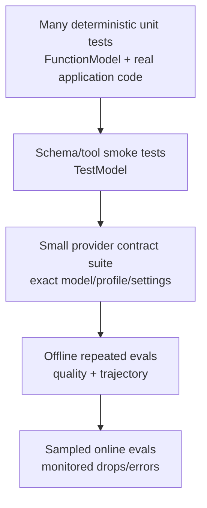

# Testing, Evals, and Model Fakes

**Research date:** 2026-08-31  
**Version scope:** Pydantic AI and Pydantic Evals shipped with `v2.36.0`

Use deterministic tests for control-flow correctness and bounded live-model evaluations for model behavior. A fake-model pass proves that your loop and schemas work against the fake—not that a provider will honor settings, emit the same events, or choose safe tools.

## Test pyramid

Set `pydantic_ai.models.ALLOW_MODEL_REQUESTS = False` in ordinary tests so accidental real-provider traffic fails. `TestModel`, `FunctionModel`, test embeddings and documented local models remain usable.

## `TestModel`

`TestModel` procedurally generates JSON-schema-valid arguments, can call configured function tools, and returns text or structured output appropriate to the agent. It can restrict called tools, accept custom output text/arguments and expose the last model request parameters.

Use it for:

- tool registration and schema smoke tests;
- dependency injection and tool execution wiring;
- broad output-type coverage;
- inspection of assembled instructions, definitions and settings;
- fast tests that do not care which exact call the model selects.

It contains no ML and does not generate domain-realistic choices. It cannot emulate provider-executed native tools; remove them under `Agent.override()` unless a test only inspects registration. Generated edge values can change when schema generation improves, so assert invariants rather than arbitrary fake values.

## `FunctionModel`

`FunctionModel` receives messages and `AgentInfo` and returns a scripted `ModelResponse`. It is the best control-flow test double because it can produce exact calls, malformed arguments, retries, usage and stream chunks.

Use it to test:

- tool-call IDs and call/result pairing;
- invalid arguments followed by corrected calls;
- unknown tools, `ModelRetry`, `ToolFailed` and retry exhaustion;
- mixed output tools and function calls;
- deferred approval/external execution and resume;
- cancellation, partial streams and interrupted history;
- fallback classification and provider-like error mapping;
- nested-agent usage accounting.

Capture the actual exchange with `capture_run_messages()`. Avoid full snapshots dominated by timestamps and generated IDs; normalize those fields or assert the meaningful sequence of part types, tool names, arguments and outcomes.

## Provider contract tests

Run a small scheduled or release-gated suite against each exact production route. Verify the remote capability, not just the adapter:

- schema features and all output modes used in production;
- parallel/mixed tool calls, tool choice and strictness;
- model settings, timeouts, usage, cost fields and finish reasons;
- native tools and uploaded/multimodal inputs;
- stream ordering, cancellation and background/suspended behavior;
- retry/fallback classification and `Retry-After` handling;
- prompt caching and provider-held history.

Record provider, requested and actual model, profile, SDK/package versions and effective settings with results. Keep live cases bounded and isolated from production effects.

## Pydantic Evals model

Pydantic Evals is code-first: a typed `Dataset` contains `Case` values and dataset/case evaluators; an experiment runs a task and returns an `EvaluationReport`. Evaluators can produce assertions, numeric scores, labels or several named results.

Use deterministic evaluators for release gates: exact/normalized values, invariants, duration/cost bounds, required/forbidden spans and tool trajectories. LLM judges are flexible but paid, stochastic and bias-prone. Treat them as evidence, not the only gate.

`EvaluatorContext` can inspect inputs, output, expected output, metadata, duration, attributes, metrics and the span tree. Span-based checks catch a lucky final answer reached through a forbidden tool, excessive model calls or an unsafe path.

## Concurrency, repetition and retries

Cases and evaluators run concurrently by default. Set `max_concurrency` to match provider, database and evaluator capacity; use one for sequential stateful cases. `repeat` gives indexed repeated runs for measuring stochastic distributions.

Task retries and evaluator retries are separate Tenacity policies. Retry only recognized transient infrastructure failures. A deterministic bad output, context overflow or evaluator assertion should remain visible. Record all attempts and cost.

Recommended thresholds use distributions:

- success rate with confidence bounds over repeated runs;
- p50/p95 latency and time to first chunk;
- requests, tokens, cost and tool counts;
- invariant violation rate, not only average judge score;
- worst-group results across language, tenant class and risk scenario.

## Online evaluation

Online evaluators run sampled work in the background. Each evaluator has a concurrency limit; when full, evaluations are dropped rather than queued. Without an `on_max_concurrency` handler, the drop can be silent. Independent sampling across several evaluators raises the probability that at least one runs; correlated sampling constrains it.

Monitor accepted, dropped, failed and timed-out evaluations. Call `wait_for_evaluations()` in tests and graceful shutdown. Do not let evaluator traffic share unbounded provider capacity with user requests.

## High-value datasets

| Category | Cases |
|---|---|
| validation | missing/wrong/oversized fields; semantically false but valid values |
| authorization | cross-tenant IDs, revoked role, stale approval, forged history |
| effects | duplicate delivery, timeout after commit, crash windows, reconciliation |
| context | compaction, tool-result flood, poisoned memory, incompatible provider history |
| tools | unknown name, parallel conflict, MCP error, native-tool mismatch |
| streaming | disconnect, duplicate/out-of-order events, partial structured output |
| durability | replay, schema upgrade, large payload, engine/model retry classification |
| operations | overload, queue bound, cancellation, shutdown and telemetry redaction |

## Release gate

- [ ] Unit tests block all real model traffic.
- [ ] `FunctionModel` covers every correction, failure, deferral and cancellation branch.
- [ ] Provider contracts run against pinned production models.
- [ ] Evals score final outcome and internal trajectory/invariants.
- [ ] Stochastic gates use repeated distributions, not one run.
- [ ] Concurrency and retries are bounded and included in cost.
- [ ] Online-eval drops/errors are observable and flushed at shutdown.
- [ ] Dataset, judge, rubric, model and package revisions are recorded.

## Primary sources

- [Testing](https://ai.pydantic.dev/testing/)
- [`TestModel`](https://ai.pydantic.dev/api/models/test/) and [`FunctionModel`](https://ai.pydantic.dev/api/models/function/)
- [Pydantic Evals](https://ai.pydantic.dev/evals/) and [core concepts](https://ai.pydantic.dev/evals/core-concepts/)
- [Eval concurrency](https://ai.pydantic.dev/evals/how-to/concurrency/), [retries](https://ai.pydantic.dev/evals/how-to/retry-strategies/), and [multi-run evaluation](https://ai.pydantic.dev/evals/how-to/multi-run/)
- [Online evaluation](https://ai.pydantic.dev/evals/online-evaluation/)

