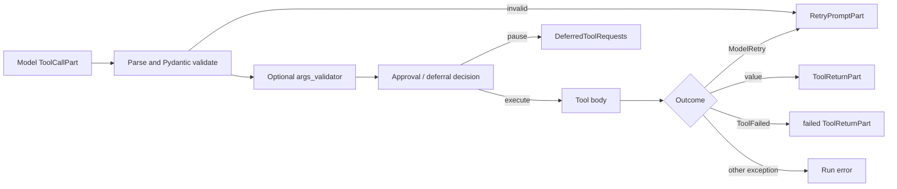
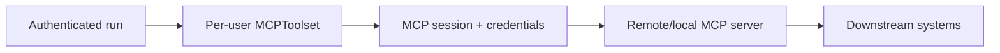

# Tools, Toolsets, MCP, and Approvals

**Research date:** 2026-08-31  
**Version scope:** Pydantic AI `v2.36.0`

Tools turn model output into code execution. Pydantic AI gives this boundary strong schema generation, validation, lifecycle, retry, and deferral mechanics. The application must add the missing authority and effect guarantees.

## Function-tool pipeline

Pydantic validates syntax and declared constraints before execution. An `args_validator` may perform asynchronous or domain-aware checks and can request approval or deferral. The final tool body must still load the current resource and authorize the current caller immediately before any write. Time can pass between validation, approval, and resume.

Keep tool contracts narrow:

- choose a stable, unique, action-oriented name and description;
- expose only fields the model must choose;
- derive subject, tenant, credentials, scopes and idempotency policy from trusted dependencies;
- return bounded structured results rather than raw database rows, pages, logs or exceptions;
- separate read operations from externally visible or destructive writes;
- attach an operation ID to writes and make repeated calls safe or reconcilable.

## Dynamic tools and toolsets

A per-tool `prepare` callback can alter or omit its definition for a step. Agent-wide preparation can transform the full function-tool list. Toolsets group definitions and lifecycle; wrappers can combine, filter, prefix, rename, require approval, defer loading, include return schemas, add metadata, or change execution.

Dynamic exposure improves relevance and reduces prompt size. It is defense in depth, not authorization. A prior message history can contain a tool call even if the current model would not be shown that tool, and a client can fabricate history. The execution path must reject unauthorized calls.

Tool names share a model namespace. Prefix separate domains and MCP servers to prevent collisions. Renaming a tool that appears in persisted history, approval records, traces, durable activity names, or eval datasets is a protocol migration.

Custom toolsets have per-run and per-step lifecycle. Use a per-run instance for authenticated remote sessions that should be shared within one run. Use per-step construction only when discovery truly changes at each model request and the cost is acceptable.

## Parallel execution and ordering

Independent tool calls can execute concurrently. A `sequential` tool acts as a barrier; other calls may still run in parallel around it. Run-wide sequential mode or provider `parallel_tool_calls=False` is needed when every call must be serialized.

Do not depend on model emission order for writes. If two operations share state, encode the dependency in one transactional tool, a workflow, or an explicit plan executed by application code. Parallel calls need individual timeouts, cancellation, result ordering, and a policy for completed siblings when one fails.

The `tool_calls_limit` is checked before a batch executes. If the batch would exceed the limit, none of its calls execute. It counts successful calls; failed results and correction attempts still need a request limit and deadline.

## MCP client boundary

`MCPToolset` exposes tools from Streamable HTTP, stdio, or other supported FastMCP transports. Pydantic AI does not operate the remote server for Streamable HTTP. Stdio launches a subprocess and therefore expands the local code-execution boundary.

A shared `MCPToolset` instance maintains one session and one resolved identity across overlapping runs. Request-local credentials in a `ContextVar` do not make a shared established session safe. Build one toolset per concurrent user/run from typed dependencies, typically with a dynamic toolset configured once per run.

For every MCP server:

- authenticate the caller and mint least-privilege, tenant-scoped credentials;
- allowlist server endpoints and transports; protect DNS, redirects and proxies;
- prefix tool names and filter definitions against server-side policy;
- cap discovery response, schema, argument, result, sampling and elicitation sizes;
- set connect, request, idle and total run deadlines;
- choose whether MCP tool errors become model-correctable retries or failed results;
- log server identity and tool-call ID without secrets;
- close sessions and subprocesses during cancellation and shutdown.

MCP elicitation must not request secrets, and user interaction needs an application-owned confirmation channel. Provider-native MCP and locally executed MCP have different trust, network, approval and data-retention boundaries.

## Approval and external execution

Approval and deferral are control flow, not errors. A tool can raise `ApprovalRequired` or `CallDeferred`; the run returns `DeferredToolRequests` with validated calls and IDs. The application later supplies `DeferredToolResults` with approvals, denials, results, `ModelRetry`, or `ToolFailed` outcomes alongside the original history.

Persist a paused call as a server-owned record:

| Field | Why it matters |
|---|---|
| run/conversation/tool-call IDs | bind the decision to one call |
| normalized tool name and validated arguments | show and execute exactly what was reviewed |
| subject, tenant and policy version | prevent cross-user or stale-policy replay |
| resource version/hash | detect changed targets |
| requested effect and risk explanation | support an informed decision |
| approver identity, decision, time and reason | auditability |
| expiry and one-time resume token | prevent indefinite or repeated approval |
| idempotency key and effect state | safe execution and reconciliation |

Client-supplied history can forge an approval because Pydantic AI does not sign calls or decisions. For high-stakes tools, store the paused run and decision server-side and construct `deferred_tool_results` from that record. Re-authorize on resume and again immediately before commit.

External execution uses the same deferred protocol for frontend tools and background jobs. Schedule work with the tool-call ID, persist the job ID, and make result delivery idempotent. A retry or reconnect must not schedule a duplicate. Large results belong in an artifact store with a digest and bounded model summary.

## Failure matrix

| Failure | Required behavior |
|---|---|
| malformed arguments | bounded model-visible correction; no approver or tool body |
| valid but unauthorized call | stable denial; protected audit; no sensitive policy detail |
| tool definite failure | `ToolFailed`; request limit bounds repeated alternate attempts |
| transient model-correctable condition | `ModelRetry` only when changing the call can help |
| timeout/cancellation | suppress late authority; reconcile indeterminate effects |
| approval after resource changed | reject stale decision and request a new review |
| MCP session identity bleed | fail isolation test; never reuse shared authenticated instance |
| background result delivered twice | one idempotent transition; duplicate becomes a no-op |

## Acceptance checklist

- [ ] Malformed calls never reach approval or execution.
- [ ] Hiding a tool does not replace execution-time authorization.
- [ ] Parallel writes cannot violate ordering or invariants.
- [ ] Every approval is server-owned, expiring, one-time and bound to exact arguments.
- [ ] MCP credentials and sessions are isolated per user/tenant.
- [ ] Timeouts, retries, reconnects and resumes cannot duplicate an effect.
- [ ] Tool and MCP results are bounded before entering history or telemetry.

## Primary sources

- [Function tools](https://ai.pydantic.dev/tools/) and [advanced tool behavior](https://ai.pydantic.dev/tools-advanced/)
- [Toolsets](https://ai.pydantic.dev/toolsets/)
- [Deferred tools and approval](https://ai.pydantic.dev/deferred-tools/)
- [MCP client](https://ai.pydantic.dev/mcp/client/) and [MCP specification](https://modelcontextprotocol.io/specification/)

