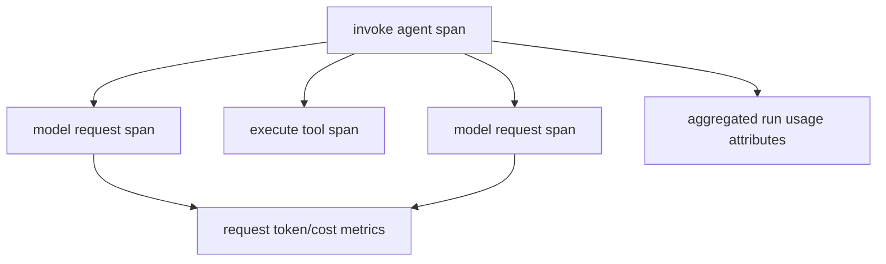

# Tracing, Logfire, and OpenTelemetry

**Research date:** 2026-08-31  
**Version scope:** Pydantic AI `v2.36.0`; default instrumentation format V5

Pydantic AI instrumentation is OpenTelemetry-based. Logfire offers the first-party experience, but the same spans can be exported through the Logfire SDK to another backend or emitted with the OpenTelemetry SDK directly.

## Signal model

Instrumentation can produce an agent-run span, model-request spans, tool spans and GenAI metrics. Important metrics include input/output token histograms, best-effort USD cost and streaming time to first chunk.

Do not sum both request-level usage and run-level aggregated usage. V2 uses `gen_ai.aggregated_usage.*` on run spans to reduce double counting while request spans retain request usage.

Time to first chunk is observed when the consumer receives the first streamed chunk. A slow consumer or buffering layer can inflate it; track provider/request latency, queue time and client delivery separately.

## Enablement and scope

`logfire.instrument_pydantic_ai()` instruments globally. An `Instrumentation` capability can scope settings to selected agents. `Agent.instrument_all()` supports a raw OTel configuration. Reuse one configured exporter/provider per process and flush it during shutdown.

Instrumentation version is a data contract. V5 is the current default and treats deferrals as control flow rather than span errors. V6 is opt-in and changes the role representation for tool-result messages. V2–V4 are deprecated compatibility formats. Pin the version for dashboards and stored trace evals; validate before changing it.

The OTel GenAI semantic conventions and some metrics remain experimental, and Pydantic's version policy permits attribute/default changes in minor releases. Build dashboards on a tested normalized layer rather than scattered raw-field assumptions.

## Content and redaction

`include_content=False` omits ordinary prompt/completion/message/tool content. `include_binary_content=False` omits recognized binary values. `include_model_request_parameters=False` can remove request parameters, but tool definitions may still be emitted.

These are useful defaults, not proof of absence. Binary content nested in application-defined models/dataclasses may escape binary detection. Metadata, dependency representations, exception strings, URLs, file IDs, tool/schema descriptions and custom span attributes can contain secrets.

Use a source-level allowlist:

- stable IDs, tenant pseudonym, model/provider, operation and outcome;
- sizes, counts, latency, usage, retry class and policy version;
- hashes/digests instead of raw artifacts;
- sanitized public error category instead of stack/response body;
- no credentials, authorization headers, prompts, full tool values or client histories by default.

The August 2026 [GHSA-3gh4-cghq-f8v4 advisory](https://github.com/pydantic/pydantic-ai/security/advisories/GHSA-3gh4-cghq-f8v4) fixed retry-prompt content leaking when `include_content=False`; fixed V2 starts at 2.27.1. Keep a regression canary that forces a retry containing a synthetic secret.

Avoid `logfire.instrument_httpx(capture_all=True)` in production unless a tightly controlled temporary incident procedure explicitly redacts headers/bodies. It can capture authorization and complete model payloads.

## Correlation

Every trace should connect:

- request/trace ID, Pydantic AI `run_id` and `conversation_id`;
- workflow/invocation ID for durable execution;
- model request ID and requested/actual model;
- tool-call ID, tool/toolset/capability ID and idempotency key;
- approval/pause record and external job/effect ID;
- deployment, package, provider SDK, prompt and policy version.

Do not use trace IDs as authorization tokens. Store protected audit/effect records independently; traces are sampled and exporters can drop.

## Durable and multi-agent traces

Name parent and child agents so delegation is distinguishable. Passing shared usage aggregates cost but does not automatically connect every external system span; propagate OTel context through supported clients and messages.

Durable activities/tasks/steps may replay or retry. A handler can emit duplicate spans/events. Include workflow attempt and stable operation identity, and avoid treating raw span count as business effect count. Workflow-side deterministic replay should not make non-deterministic telemetry decisions that affect control flow.

## Operational dashboards

Track at least:

| Area | Signals |
|---|---|
| demand | admitted, queued, rejected and active runs |
| latency | queue, provider, tool, approval wait, end-to-end, TTFC |
| reliability | completion, cancellation, limit, provider/tool/error taxonomy |
| retries | attempts by transport, fallback, correction and engine layer |
| usage | requests, input/output/cache tokens, estimated and billed cost |
| tools | calls, failures, corrections, denials, timeouts, effect reconciliation |
| context | request tokens, cache hits/busts, compaction and result truncation |
| evals | quality/invariant score, online accepted/dropped/error counts |
| telemetry | exporter queue, drops, span size and flush failures |

Metrics need bounded cardinality. Do not label with raw prompt, user ID, tool arguments, file URL, tool-call ID or conversation ID. Keep those in sampled protected traces or indexed audit stores.

## Trace-based evaluation

Pydantic Evals can inspect span trees. Useful invariant checks include:

- required authorization/approval span precedes an effect;
- forbidden tool or provider route never appears;
- model/tool request count stays within budget;
- a fallback occurs only after an allowed error;
- no side-effecting tool runs during partial output validation;
- cancellation has no later authoritative commit;
- durable replay reuses model results rather than charging a second call.

## Acceptance checklist

- [ ] Staging trace contains the intended run/model/tool hierarchy and correlations.
- [ ] A secret canary is absent from prompts, retries, tools, exceptions, binary values and HTTP spans.
- [ ] Dashboards do not double-count request and aggregated run usage.
- [ ] Instrumentation version is explicit and upgrade-tested.
- [ ] Exporter overload and process termination expose dropped/unflushed data.
- [ ] Duplicate durable attempts do not inflate business outcome metrics.
- [ ] Metric labels stay within cardinality budgets.
- [ ] Trace retention, access, region and deletion match data policy.

## Primary sources

- [Logfire integration](https://ai.pydantic.dev/logfire/)
- [Instrumentation capability](https://ai.pydantic.dev/capabilities/instrumentation/)
- [OpenTelemetry GenAI semantic conventions](https://opentelemetry.io/docs/specs/semconv/gen-ai/)
- [Pydantic Evals span evaluators](https://ai.pydantic.dev/evals/evaluators/span-based/)
- [Telemetry redaction advisory](https://github.com/pydantic/pydantic-ai/security/advisories/GHSA-3gh4-cghq-f8v4)

