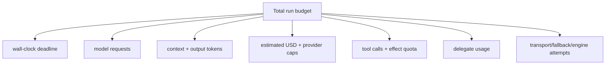

# Usage, Limits, Context, and Cancellation

**Research date:** 2026-08-31  
**Version scope:** Pydantic AI `v2.36.0`

A safe run needs several independent bounds. No single token or retry limit controls provider latency, tool work, nested agents, queued tasks, external effects, or durable-engine attempts.

## Limit map

`UsageLimits` can bound requests, cumulative input/output/total tokens, one request's input tokens, successful tool calls and estimated cost. At this snapshot, the default request limit is 50; most other limits are opt-in.

| Limit | Check point | Caveat |
|---|---|---|
| `request_limit` | before the next model request | strongest loop bound; nested runs must share usage |
| token totals | normally after response | over-limit request may already be billed |
| `per_request_input_tokens_limit` | after response by default | enable supported pre-counting to block before send |
| `tool_calls_limit` | before a returned batch executes | counts successful tools; if batch exceeds, none run |
| `cost_limit` | as known usage accrues | model price may be unknown or estimated |
| `max_concurrency` | run admission | per-process unless using a shared/distributed limiter |
| tool timeout | around supported local tool execution | sync thread can continue; MCP/custom toolset needs own timeout |
| wall-clock deadline | application/runtime | must propagate to provider and tools |

`count_tokens_before_request=True` supports only selected model adapters and adds latency or counting work. Provider-side hard budgets and billing alerts remain necessary. `genai-prices` cost estimates are useful controls, not a financial ledger.

## Context is a budgeted request

The model context includes instructions, history, tool schemas, native-tool declarations, retry prompts, tool results and the current prompt. Cumulative input tokens can be misleading when cached prefixes are cheap; a per-request input limit is the direct context-window guard.

Use this reduction order:

1. keep tool schemas and instructions small and stable;
2. retrieve only relevant artifacts and memory;
3. bound tool results at their source;
4. use tool search/on-demand capability loading for large catalogs;
5. preserve recent exact turns and summarize older history;
6. externalize large files/results with typed references;
7. stop rather than silently dropping safety or authority context.

History processors replace the live history. Test that trimming preserves current input, required system/instruction behavior, tool-call/result pairing, deferred-tool availability evidence and audit identifiers.

## One total run budget

Pass the parent's `ctx.usage` to an in-process delegate so nested requests contribute to the same limits. Under Temporal, activity context is serialized as a copy; mutations made by a child run inside the activity do not return to workflow state. [Issue #6886](https://github.com/pydantic/pydantic-ai/issues/6886) documents this limitation. Return usage explicitly or record it externally; do not trust the parent result as a full budget record in that topology.

Keep an independent business-effect quota. A successful tool-call count does not express the number or value of rows changed, messages sent, dollars transferred, or child jobs created.

## Concurrency and backpressure

Agent `max_concurrency` protects process-local capacity. Model wrappers can share a `ConcurrencyLimit` across agents. Decide whether overflow waits or raises and bound the queue; otherwise limiting active runs merely moves unbounded memory into waiting tasks.

Use separate pools for:

- interactive versus batch work;
- model requests versus tool I/O;
- slow synchronous tools versus async operations;
- tenants or risk tiers requiring fair-share isolation.

Across replicas, enforce provider quotas and global fairness in an external limiter or queue. Keep queue delay inside the user-visible deadline and expire work that no longer has authority.

## Cancellation contract

Pydantic AI distinguishes first-party run cancellation from environmental cancellation. A fresh `CancellationToken` can govern one or several runs and is thread-safe and idempotent. It is single-use; once cancelled, reusing it prevents later runs from starting.

First-party cancellation raises `RunCancelled`, which carries completed history and usage. External `asyncio.CancelledError` propagates unchanged so Python, shutdown and durable-engine semantics remain intact; `RunCancelled.from_cancellation()` can recover attached state.

Cancellation is run-scoped. A delegate cancelling itself inside a parent tool normally surfaces as a failed tool result rather than cancelling the parent. Share one token to cancel a tree, or explicitly propagate from the tool.

## Stop waiting versus stop work

For an async tool, task cancellation can reach awaited operations if clients propagate it. For a sync tool in a worker thread, Python cannot kill the thread. The run may stop waiting and discard the return while the tool continues.

Every effectful tool needs:

- a propagated absolute deadline, not just a local timeout duration;
- short downstream connect/read/write timeouts;
- a stable idempotency key and operation record;
- a commit-authority check immediately before write;
- a way to query/reconcile an indeterminate outcome;
- rejection of a late result after the run lost authority.

For non-cooperative or untrusted computation, use a process/container boundary that can be terminated and resource-limited.

## Durable cancellation

In-process tokens and `RunContext.cancel()` do not automatically cross Temporal, Prefect or other serialized durable units. Cancel the engine workflow/flow/invocation and configure its activity/task cancellation behavior. Model streams may be buffered inside the durable unit, so a local stream handle cannot always reach the provider operation.

External cancellation that is swallowed is a known hard edge under active design. Test against the open [cancellation semantics issue #6460](https://github.com/pydantic/pydantic-ai/issues/6460), especially Temporal wait-for-cancellation completion and user tools that catch `CancelledError`.

## Shutdown sequence

1. stop admitting new runs;
2. signal first-party cancellation or engine cancellation;
3. wait a bounded grace period for async tools and stream cleanup;
4. stop late commits and persist resumable/cancelled state;
5. close MCP sessions, provider clients, HTTP pools and telemetry exporters;
6. terminate isolated workers after their grace period;
7. mark unresolved effects for reconciliation.

## Acceptance checklist

- [ ] A malicious loop ends on request, token/cost, time and effect budgets.
- [ ] Unknown prices cannot silently bypass the organization's spend control.
- [ ] A parallel tool batch is rejected atomically when it exceeds the call limit.
- [ ] Nested-agent usage is included or explicitly accounted outside the run.
- [ ] Queue length and wait time are bounded under overload.
- [ ] Reusing a cancelled token cannot affect another session.
- [ ] Cancellation during sync work cannot authorize a late commit.
- [ ] Durable cancellation settles the engine state and preserves completed history once.

## Primary sources

- [Agent usage limits, concurrency and cancellation](https://ai.pydantic.dev/agent/)
- [`UsageLimits` and `RunUsage` API](https://ai.pydantic.dev/api/usage/)
- [Timeouts](https://ai.pydantic.dev/timeouts/)
- [Streaming cancellation](https://ai.pydantic.dev/output/#cancelling-streams)
- [Cancellation issue #6460](https://github.com/pydantic/pydantic-ai/issues/6460) and [durable delegate-usage issue #6886](https://github.com/pydantic/pydantic-ai/issues/6886)

