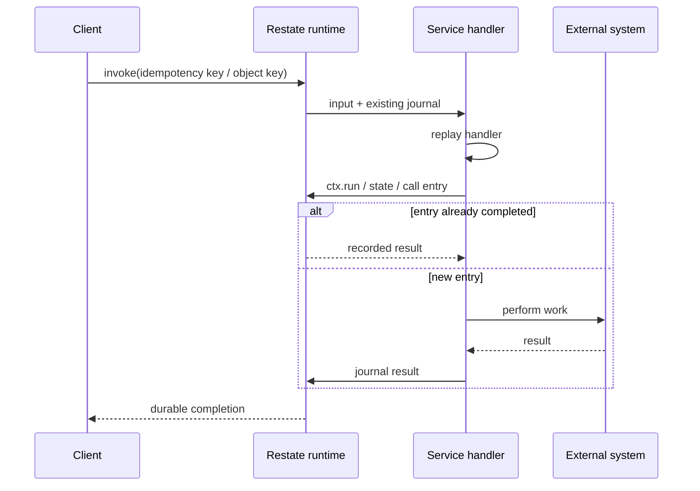
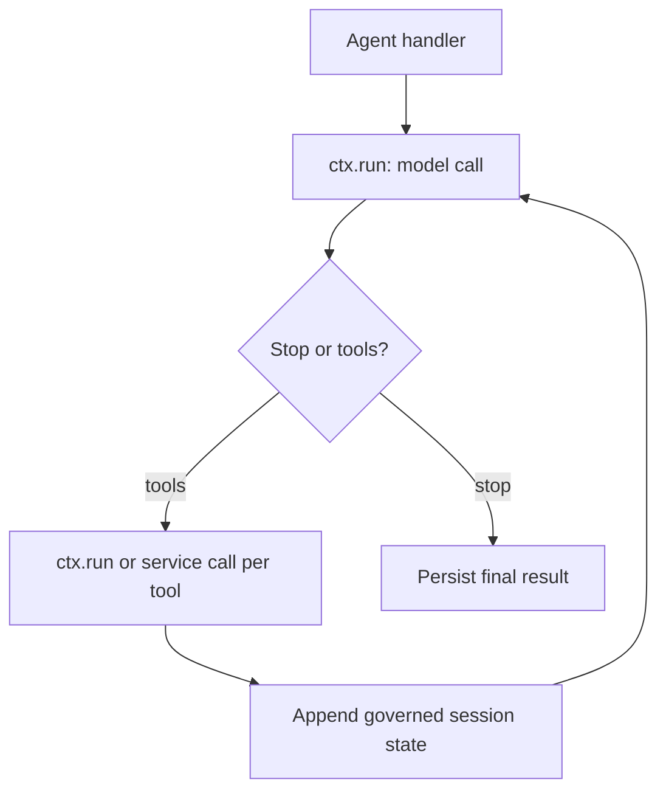
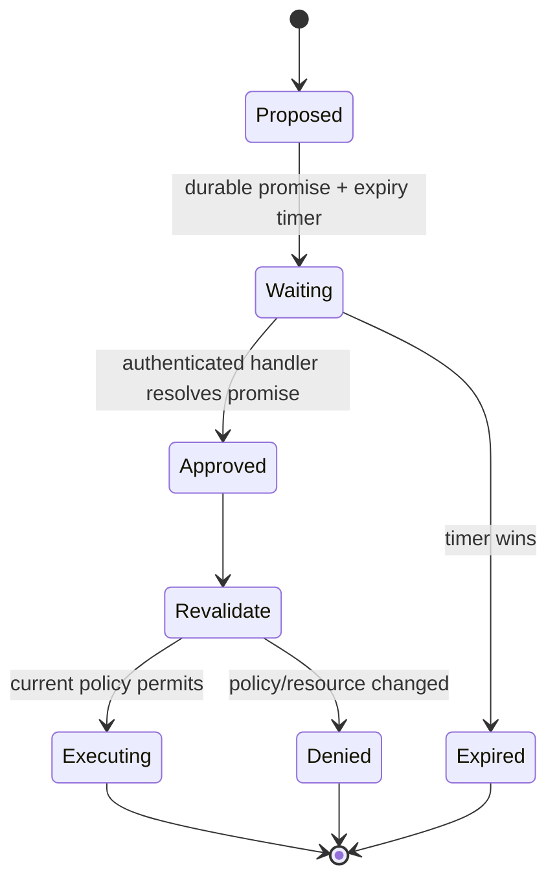
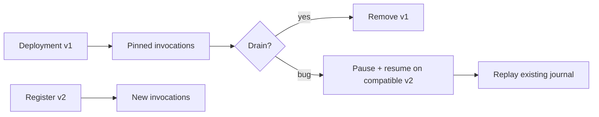

# Restate for Agent Workflows

**Research date:** 2026-08-31  
**Status:** Research-backed technology guide  
**Scope:** Restate runtime/Cloud, journaled handlers, service types, retries, interactions, versioning, security, and agent integrations

## Bottom line

Choose Restate when agent work fits a log-first durable-service model: ordinary handlers, journaled async operations, keyed single-writer objects, durable calls, timers, and promises across containers or serverless endpoints. It is particularly compelling for one durable inbox/session per agent or domain entity.

Wrap every model call, built-in tool, external API, random/time value, and nondeterministic framework operation in a Restate durable boundary. Bound retries explicitly. A journal prevents completed operations from being re-executed after their results are recorded; it cannot atomically cover an arbitrary remote effect that commits before the journal receives the result.

## Execution model

The runtime owns the journal ordering. When a handler suspends or fails, a later attempt re-enters from the start, but SDK operations already in the journal replay their recorded outcomes. Handler control flow must therefore issue compatible operations in compatible order.

## Pick the service type intentionally

| Type | Concurrency/state | Agent use |
|---|---|---|
| Basic Service | Parallel handlers; no keyed built-in state | Stateless durable tasks, shared utilities, model/tool execution |
| Virtual Object | One writer per key plus shared readers; per-key K/V state | Agent session/inbox, account/resource controller, serialized state machine |
| Workflow | One main run per ID plus shared signals/queries; durable promises | Finite approval/process lifecycle that must execute once per ID |

A Virtual Object is often a better session primitive than a forever-open Workflow: each message is a durable invocation serialized for that key, while state persists across messages. A Workflow is stronger when a named process has a defined completion and interaction contract.

## Durable agent loop

Restate’s integration guidance distinguishes low-level LLM SDKs from agent SDKs. Low-level clients are straightforward: the application owns the loop and wraps each model call. Agent SDKs require deeper interception so model calls, built-in tools, generated IDs/timestamps, tool errors, and session state are all replay-safe. If one surface escapes the integration, replay can repeat cost or effects.

Use bounded maximum attempts on LLM `ctx.run` blocks. Restate retries non-terminal errors by default; a persistent 4xx, malformed tool request, or provider policy rejection must become `TerminalError` or an application outcome. Infinite durable retry is still an infinite bill.

## Concurrency and determinism

Use Restate’s deterministic combinators for racing/gathering operations where required by the SDK. Native event-loop/goroutine selection can resolve in a different order on replay. Keep concurrent operation creation order stable, store winner/merge decisions durably, and avoid mutating outer variables inside a `ctx.run` then depending on that mutation after replay.

Virtual Objects serialize writers per key, but this does not authorize the writer. Derive the key from authenticated tenancy, validate requested resources inside the handler, and prevent a caller from selecting another tenant’s object key.

## External effects

`ctx.run` records a final result or terminal error. If a remote target commits and the process/network fails before Restate commits that result, the block can retry. Use:

- a deterministic operation ID from invocation/step identity;
- target-side idempotency key or status lookup;
- a receipt stored in the journal and, for important effects, a domain operation ledger;
- explicit `OUTCOME_UNKNOWN` handling when reconciliation is impossible;
- compensation as a new durable action, never a fiction that rollback erased reality.

Restate service-to-service actions can receive stronger runtime delivery properties inside its own log boundary. Do not extend those claims to a non-participating SaaS API.

## Human waits and interactions

Durable promises/awakeables, timers, Workflow handlers, and Object handlers can model approval or external input without holding compute. Bind the response to the workflow/object key and exact proposal. Time out stale requests and revalidate authorization after wake-up.

## Suspension, timeouts, and cancellation

If a service produces no journal progress longer than the inactivity timeout, Restate asks it to suspend; after the abort timeout it can interrupt the execution. A long unwrapped LLM call can therefore be retried. Tune timeouts to the call distribution, but prefer journaled operations over simply extending a global stall window.

Distinguish pause, cancel, kill, purge, and restart-as-new in runbooks. Cancellation is a control request; an in-flight external request may complete. Kill makes the invocation terminal but cannot undo effects. Restarting from a journal prefix is powerful repair and must be access-controlled, audited, and reconciled against effects after the cut point.

## Versioning and deployment lifetime

Restate pins an invocation to the immutable service deployment where processing began. New invocations route to the newest registered deployment. Existing endpoints must remain addressable until their invocations finish or are deliberately moved.

Moving an invocation to a new deployment works only when the code is compatible with recorded entries. Reordering/adding SDK operations or changing their inputs can cause nondeterminism. Split months-long processes into shorter invocations/delayed calls if retaining old service endpoints for months is unacceptable. Keep domain/prompt/tool schema versions separate from the deployment ID.

## Operations, scaling, and retention

Restate partitions invocation journals, timers, state, and idempotency metadata by key. Hot keys serialize by design. Monitor invocation backlog/age, retry backoff, suspended versus stuck runs, partition skew, journal bytes, timer volume, service latency, deployment drain, zombie invocations, and storage/replication health.

Self-hosting requires durable-log storage, replication/quorum, partition and snapshot operations, ingress/admin/fabric network controls, upgrades, backup/DR, and service endpoint availability. Cloud/BYOC change that responsibility split; benchmark the selected mode rather than transferring vendor throughput claims.

## Security and data

Inputs, outputs, `ctx.run` results, state, calls, promises, and selected headers may persist in journals. The self-hosted security guide warns that headers reaching ingress are retained; strip proxy credentials. Restrict admin and fabric ports, enable request identity for service endpoints, and use authentication/authorization in front of ingress.

Client-side journal encryption coverage and SDK parity are version-specific. The current Cloud guide documents `JournalValueCodec` support for TypeScript. Minimize data even when encrypted and set completed-journal/workflow-state retention deliberately.

## Adoption tests

- [ ] Crash before/after every `ctx.run` result and external target commit.
- [ ] Verify low-level and agent-SDK integration wraps built-in tools, IDs, time, and errors.
- [ ] Bound provider retry attempts, duration, and terminal classification.
- [ ] Stress same-key serialization, cross-key parallelism, and tenant-key spoofing.
- [ ] Race durable promise resolution, expiry timer, cancellation, and redeploy.
- [ ] Pause/resume a failed invocation on a compatible new deployment.
- [ ] Prove old deployment drain and detect zombies before removal.
- [ ] Tune inactivity/abort timeouts with slow model/tool calls.
- [ ] Strip sensitive headers and inspect encrypted/unencrypted journal surfaces.
- [ ] Exercise operator restart-from-prefix without duplicating later effects.

## Choose something else when

- a dedicated mature workflow platform and its broader ecosystem are required;
- Postgres-only embedding is more important than durable services/objects;
- Python data-pipeline scheduling and infrastructure provisioning dominate;
- Dapr is already the strategic distributed application runtime;
- the team cannot operate Restate or use Cloud and cannot retain immutable endpoints for the needed lifetime.

## Primary sources and failure-test leads

- [Restate architecture](https://docs.restate.dev/references/architecture), [services](https://docs.restate.dev/foundations/services), and [service invocation protocol](https://github.com/restatedev/service-protocol/blob/main/service-invocation-protocol.md)
- [Durable steps](https://docs.restate.dev/develop/ts/durable-steps), [error handling](https://docs.restate.dev/develop/python/error-handling), and [service configuration](https://docs.restate.dev/services/configuration)
- [Versioning](https://docs.restate.dev/services/versioning), [introspection](https://docs.restate.dev/services/introspection), and [security](https://docs.restate.dev/server/security)
- [Agent integration guidance](https://docs.restate.dev/ai/sdk-integrations/integration-guide), [durable agents](https://docs.restate.dev/ai/patterns/durable-agents), and the [Aient case study](https://restate.dev/use-cases/aient)

See [durable-runtime selection](../comparisons/durable-agent-workflow-runtimes.md) and the [research packet](../research/packets/durable-agent-workflow-runtimes.md).
