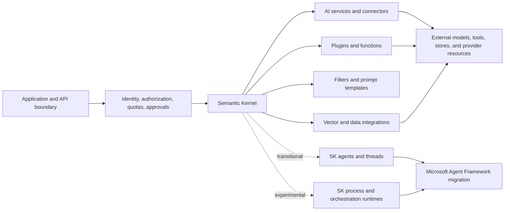

# Semantic Kernel

> **Research date:** 2026-08-31
> **Scope:** Semantic Kernel 1.x as a retained kernel, connector, plugin, filter, agent, process, and data-integration ecosystem across .NET, Python, and Java.

## Bottom line

Semantic Kernel (SK) remains an actively released integration library, but it is no longer Microsoft's strategic starting point for new agent and workflow systems. Microsoft describes [Microsoft Agent Framework (MAF) 1.0 as the successor](https://github.com/microsoft/semantic-kernel) and directs new agent development there. Existing SK 1.x applications do not need a blind rewrite: stable kernels, plugins, prompt assets, connectors, filters, and vector-search components can remain useful while agent/session/orchestration surfaces migrate deliberately.

The production boundary matters more than the product name:

SK is an in-process library. It is not an authorization server, durable workflow engine, model sandbox, or provider-independent guarantee of identical behavior.

## Use this area when

- maintaining an existing SK application;
- retaining plugins, filters, prompt templates, connectors, or vector-search assets during migration;
- assessing whether an SK agent, thread, process, or orchestration dependency is safe to extend;
- building production controls around model-selected functions;
- comparing .NET, Python, and Java packages without assuming feature parity.

For a new Microsoft agent project, begin with the [Microsoft Agent Framework guide](../microsoft-agent-framework.md). For a portfolio-level migration sequence, use [AutoGen and Semantic Kernel migration](../autogen-and-semantic-kernel-migration.md).

## Ecosystem decision map

| Surface | Current posture | Practical action |
|---|---|---|
| Kernel, service selection, dependency injection | Retainable SK core | Keep if it provides clear value; freeze composition per request and test connector routing. |
| Native, prompt, OpenAPI, and MCP functions | Retainable with security controls | Preserve business functions behind an application-owned authorization boundary; adapt them into MAF tools when migrating. |
| Filters | Useful in-process interception | Use for deterministic validation, policy hooks, telemetry, and result shaping; never treat them as a sandbox or durable approval system. |
| Chat-completion agents and threads | Supported SK 1.x, but transitional | Stabilize existing workloads; migrate new agent/session development to MAF. |
| Provider-specific SK agents | Package maturity varies | Pin the exact package and provider, test resource cleanup, and migrate behavior rather than type names. |
| Agent orchestration | Preview/experimental | Avoid making it a new production control-plane dependency. Prefer MAF workflows or an established durable workflow system. |
| Process Framework | Alpha/experimental in current packages | Use for evaluation or bounded in-process work only unless the application supplies its own durability and recovery guarantees. |
| Legacy planners | Removed/deprecated | Use native model function calling; do not confuse Handlebars prompt templates with the removed Handlebars planner. |
| Vector abstractions and connectors | Split by language and package | Keep the data plane independently versioned. In .NET, follow the move to `Microsoft.Extensions.VectorData` and `CommunityToolkit.VectorData`. |

## Guide map

| Guide | Main question |
|---|---|
| [Ecosystem boundaries and lifecycle](ecosystem-boundaries-and-lifecycle.md) | What is strategic, retained, transitional, or experimental? |
| [Kernel, services, and connectors](kernel-services-and-connectors.md) | How should a kernel be composed, scoped, and routed? |
| [Agents, threads, and messages](agents-threads-and-messages.md) | Where does conversation state live, and who owns its lifecycle? |
| [Plugins, functions, and tool calling](plugins-functions-and-tool-calling.md) | How does model-selected execution work safely? |
| [Filters, middleware, and policy](filters-middleware-and-policy.md) | Where can calls be intercepted, and what cannot filters guarantee? |
| [Processes, planning, and orchestration](processes-planning-and-orchestration.md) | Which orchestration APIs remain, and how mature are they? |
| [Memory, vector data, and RAG](memory-vector-data-and-rag.md) | How should retrieval state, schemas, and connector moves be managed? |
| [Streaming, structured output, and multimodality](streaming-structured-output-and-multimodality.md) | How should partial responses and schemas be handled? |
| [Observability, testing, and debugging](observability-testing-and-debugging.md) | What evidence makes an SK system operable? |
| [Security, permissions, and tool isolation](security-permissions-and-tool-isolation.md) | What trust boundaries are required around model-driven actions? |
| [Reliability, deployment, and operations](reliability-deployment-and-operations.md) | What must the host application provide? |
| [Packages, language parity, and migration](packages-language-parity-and-migration.md) | Which packages are mature, and how should migration be staged? |

The supporting [research packet](../../research/packets/semantic-kernel-agents-deep-dive.md) records the version snapshot, claim ledger, source discrepancies, and refresh triggers behind these guides.

Map SK threads, provider resources, streams, process state, and external effects into the repository's application-owned [agent state and event contract](../../runtime/agent-state-and-event-contracts.md). Chat history, in-process state, and provider identifiers are not a complete run ledger or migration contract.

## Version snapshot

This is a research snapshot, not a floating compatibility promise.

| Ecosystem | Verified current stable core | Important qualification |
|---|---:|---|
| .NET | `Microsoft.SemanticKernel` 1.80.0 | Core and Agents.Core are stable; provider agents, orchestration, runtimes, YAML, A2A, and Process packages carry preview/beta/alpha suffixes. |
| Python | `semantic-kernel` 1.44.1 | Python 3.10+; many connectors are optional extras; agent/provider behavior must be tested per extra. |
| Java | `com.microsoft.semantic-kernel:semantickernel-api` 1.5.0 | Separate repository and narrower surface; do not infer .NET/Python agent, process, filter, or telemetry parity. |
| Microsoft Agent Framework | 1.0 GA | Strategic successor for new Microsoft agent/session/workflow development. |

Verify the [NuGet package](https://www.nuget.org/packages/Microsoft.SemanticKernel/), [PyPI package](https://pypi.org/project/semantic-kernel/), [Maven artifact](https://central.sonatype.com/artifact/com.microsoft.semantic-kernel/semantickernel-api), and exact provider package before each upgrade.

## Production invariants

1. Treat every model-produced argument and retrieved record as untrusted input.
2. Authorize inside the tool at the moment of effect; plugin visibility is not permission.
3. Keep thread, provider resource, vector schema, prompt, model, and tool-schema versions observable.
4. Bound every run by time, iterations, tool calls, tokens/cost, and concurrency.
5. Make external effects idempotent and recoverable; neither agent chat nor a local process runtime provides exactly-once execution.
6. Pin the complete package set and run provider-specific adoption tests before promotion.
7. Keep domain state outside chat history and process-local memory.
8. Plan migration around behaviors and state ownership, not one-to-one class substitutions.

## When to refresh this area

Refresh when Microsoft publishes an SK support or end-of-life date, an SK agent/process package changes maturity, MAF changes its SK compatibility adapters, a connector moves packages, a new security advisory appears, or a core registry version changes materially.

## Primary sources

- [Semantic Kernel repository and lifecycle notice](https://github.com/microsoft/semantic-kernel)
- [Semantic Kernel releases](https://github.com/microsoft/semantic-kernel/releases)
- [Semantic Kernel documentation](https://learn.microsoft.com/en-us/semantic-kernel/)
- [Semantic Kernel and Microsoft Agent Framework announcement](https://devblogs.microsoft.com/agent-framework/semantic-kernel-and-microsoft-agent-framework/)
- [Microsoft Agent Framework 1.0 announcement](https://devblogs.microsoft.com/agent-framework/microsoft-agent-framework-version-1-0/)
- [Migration from Semantic Kernel](https://learn.microsoft.com/en-us/agent-framework/migration-guide/from-semantic-kernel/)
