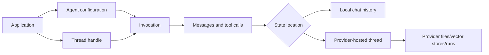
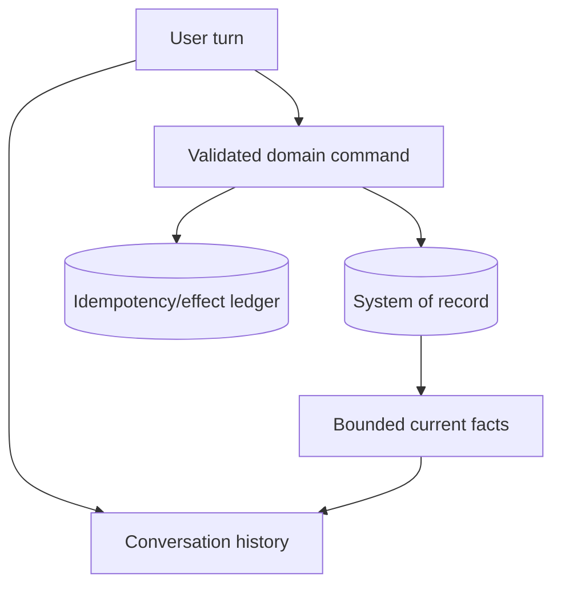

# Agents, Threads, and Messages

> **Research date:** 2026-08-31
> **Posture:** Maintain well-tested SK agents where they already work; use Microsoft Agent Framework for new Microsoft agent/session development.

## Mental model

An SK agent binds instructions, a model/provider, tools, and invocation behavior. A thread carries conversational state. Messages are the transport artifacts exchanged by the application, agent, model, and tools.



The [agent architecture documentation](https://learn.microsoft.com/en-us/semantic-kernel/frameworks/agent/agent-architecture) distinguishes local chat histories from service-managed threads. That distinction determines persistence, cleanup, concurrency, compliance, and migration.

## Agent families are not interchangeable

The .NET and Python repositories include chat-completion agents plus provider-specific agents such as Azure AI Agent, OpenAI Assistant/Responses, Copilot Studio, and other integrations. Package maturity differs by family. Java has a narrower agent surface in its separate repository.

| Family | State tendency | Main operational concern |
|---|---|---|
| Chat-completion agent | Application/local history | Persist and reduce history correctly; do not share mutable history concurrently |
| Provider-hosted assistant/response agent | Provider thread/run resources | Track IDs, retention, deletion, files, and provider billing |
| Copilot/other hosted agent | External service session | Treat service contract, identity, and regional policy as provider-specific |
| Multi-agent/orchestration wrapper | Runtime and pattern dependent | Preview maturity, termination, shared context, and replay behavior |

Do not infer stability from the word `Agent`. Core abstractions and `Agents.Core` may be stable while a provider package or orchestration package is preview/alpha.

## Thread ownership contract

Define this contract before implementation:

| Question | Required answer |
|---|---|
| Who creates the thread? | Application, SK agent, or provider |
| Where is state stored? | Local database, process memory, or provider service |
| What is the durable identifier? | Application conversation ID plus provider/thread ID mapping |
| Who serializes concurrent turns? | One owner per logical conversation |
| How is history reduced? | Deterministic reducer preserving instructions and tool-call/result pairs |
| Who deletes resources? | Explicit lifecycle job with provider-specific API |
| What is the retention policy? | Tenant/data-classification policy, not an SDK default |
| How is it migrated? | Exportable application state plus a provider-specific mapping strategy |

Some stateful provider agents require their matching thread implementation. Fail fast on an incompatible agent/thread pair instead of silently constructing a new conversation.

## Conversation state is not domain state

Chat history can be truncated, reordered by a reducer, held by a provider, or rebuilt during migration. It must not be the only record that an order was approved, a payment was submitted, or an incident was acknowledged.



Store business state in the system of record. Project only the minimum current facts into the prompt.

## Message semantics

Complete and streaming invocations use different content shapes. Python's modern agent APIs distinguish a final `AgentResponseItem`—which carries both a message and thread—from asynchronous sequences of messages and streaming message fragments. Preserve the returned thread handle; dropping it can create an unintended new conversation.

Messages can include more than text:

- function calls and function results;
- annotations and citations;
- file or image references;
- usage, finish reasons, model metadata, and provider identifiers;
- multiple choices or content items.

Persist a normalized application event record, not `ToString()`/`str()` output. Keep raw provider payloads only when policy permits and retention is bounded.

## Concurrency and ordering

Do not allow two turns to mutate the same local thread concurrently unless the thread implementation and business semantics explicitly support it. A safe default is one serialized writer per conversation with optimistic version checks:

```text
load conversation(version N)
run with bounded context
append user/tool/assistant events if version is still N
otherwise retry from the new authoritative state
```

Parallel tool calls inside one turn are a separate concern. They must still respect effect ordering and tool-level idempotency.

## History reduction

A reducer must preserve protocol integrity. In particular:

- keep system/developer instructions required by the connector;
- keep tool calls paired with their tool results;
- preserve unresolved approvals and safety decisions outside lossy summaries;
- version the summarization prompt/model;
- store the pre-reduction event log when audit requirements demand it;
- test token budgets against the exact model tokenizer.

Summaries are derived data. Rebuild them when the reducer changes.

## Resource cleanup

Provider-hosted agents can create threads, runs, files, code-interpreter artifacts, or vector stores. The generic agent abstraction cannot guarantee one universal delete operation because provider resources differ. Maintain an application inventory:

```text
application_conversation_id
provider + account/project + region
agent/resource/thread/run/file/vector IDs
created_at + last_used_at + retention_class
deletion_status + retry_count
```

Run reconciliation to detect orphaned resources and confirm deletion. The official [SK-to-MAF migration guide](https://learn.microsoft.com/en-us/agent-framework/migration-guide/from-semantic-kernel/) makes the same provider-specific lifecycle boundary explicit for MAF sessions.

## Migration guidance

Characterize behavior before replacing an SK agent:

1. instructions and message-role mapping;
2. thread creation/resume rules;
3. tool exposure and automatic invocation;
4. streaming event order;
5. history reduction;
6. hosted resource creation/deletion;
7. retries, timeouts, and telemetry;
8. structured-output/refusal behavior.

MAF uses agents and sessions rather than asking callers to know an SK-specific thread type. Migrate the state/lifecycle contract first; adapt plugins as tools; shadow representative traffic; then switch ownership.

## Failure modes

| Failure | Cause | Control |
|---|---|---|
| Conversation unexpectedly restarts | Returned thread/session handle discarded | Persist application and provider identifiers atomically |
| Tool result is detached from call | Reducer or concurrent writer breaks protocol order | Pair by tool-call ID and serialize updates |
| Provider storage violates retention expectations | Hosted resources are not inventoried | Explicit resource ledger and reconciled deletion |
| Duplicate external effect after retry | Chat replay re-executes a tool | Idempotency key and effect ledger outside the thread |
| Migration changes answers or tool use | Role/tool/session semantics differ | Behavioral characterization and shadow comparison |

## Primary sources

- [Agent architecture](https://learn.microsoft.com/en-us/semantic-kernel/frameworks/agent/agent-architecture)
- [Common Agent API and thread management](https://learn.microsoft.com/en-us/semantic-kernel/frameworks/agent/agent-api)
- [Agent streaming](https://learn.microsoft.com/en-us/semantic-kernel/frameworks/agent/agent-streaming)
- [Semantic Kernel Python agents source](https://github.com/microsoft/semantic-kernel/tree/main/python/semantic_kernel/agents)
- [Semantic Kernel .NET agents source](https://github.com/microsoft/semantic-kernel/tree/main/dotnet/src/Agents)
- [Migration from Semantic Kernel](https://learn.microsoft.com/en-us/agent-framework/migration-guide/from-semantic-kernel/)

## Related guides

- [Streaming, structured output, and multimodality](streaming-structured-output-and-multimodality.md)
- [Reliability, deployment, and operations](reliability-deployment-and-operations.md)
- [Packages, language parity, and migration](packages-language-parity-and-migration.md)
