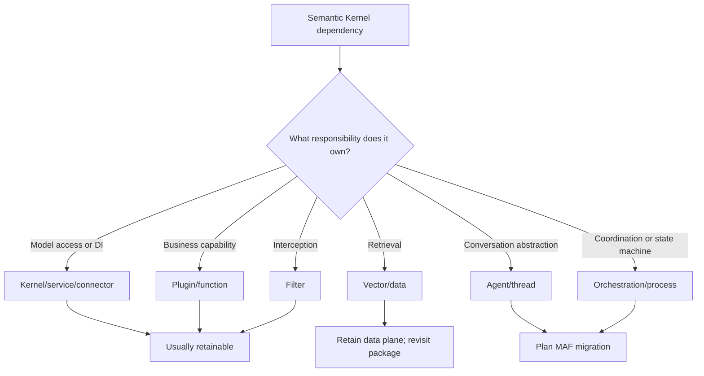
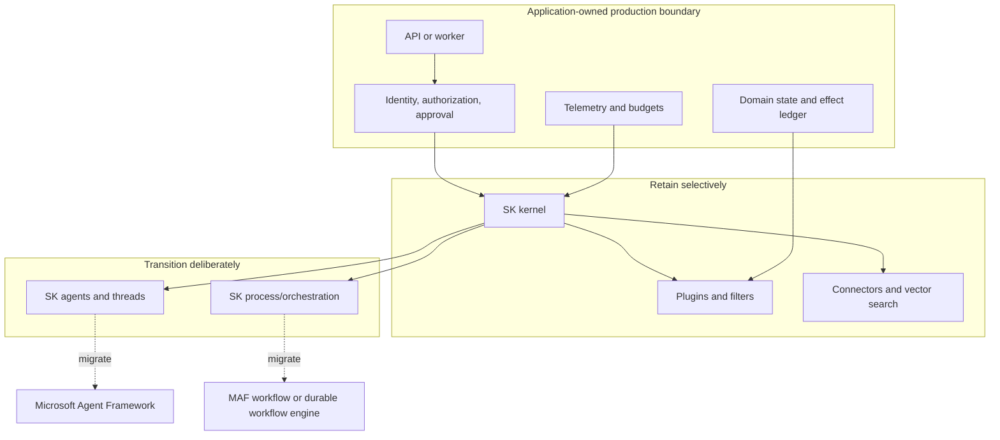

# Ecosystem Boundaries and Lifecycle

> **Research date:** 2026-08-31
> **Decision:** Treat Semantic Kernel 1.x as a maintained, retained integration substrate and its agent/process layers as a migration surface—not as the default architecture for a new Microsoft agent system.

## The lifecycle boundary

Microsoft announced in October 2025 that Microsoft Agent Framework is the successor to both Semantic Kernel and AutoGen. It committed to maintaining SK 1.x for existing users while directing most new agent investment to MAF. [MAF 1.0 became generally available in April 2026](https://devblogs.microsoft.com/agent-framework/microsoft-agent-framework-version-1-0/). The current [SK repository](https://github.com/microsoft/semantic-kernel) is active and publishes 1.x releases, but its README now leads with the successor notice.

These facts are compatible:

- **SK is not abandoned.** Core packages continue to receive fixes, dependency updates, connector changes, and security hardening.
- **SK is not the strategic destination for new agent architecture.** Microsoft asks new agent projects to use MAF.
- **Migration need not be all-or-nothing.** Plugins, vector search, prompt assets, and service integrations can be retained or adapted while the agent/session/workflow layer changes.

The 2025 announcement said SK support would continue while substantial usage remains and for at least one year after MAF GA. Treat that as published direction, not as a contractual support-lifecycle date; no exact SK end-of-life date was found in the official sources reviewed.

## Classify before changing

| Classification | Keep when | Change when |
|---|---|---|
| Kernel and connectors | The host needs SK's DI, routing, prompt, filter, or function-call integration | Direct provider/MAF clients make the kernel redundant or routing semantics are too implicit |
| Plugins/functions | They are provider-neutral, explicitly authorized, and covered by contract tests | They expose host capabilities directly to the model or couple business logic to SK context types |
| Filters | They implement deterministic, in-process concerns with explicit order | They are being used as the only authorization, approval, or isolation boundary |
| Vector/data | Schemas and retrieval are independently versioned and tenant-scoped | The connector is deprecated/moved or the application relies on legacy `IMemoryStore` abstractions |
| Agents/threads | A stable existing workload has good tests and no near-term feature need | New work requires MAF sessions, workflows, checkpoints, or strategic provider investment |
| Process/orchestration | A bounded experiment accepts alpha/preview risk | The system requires durable recovery, long waits, strong replay, or production support guarantees |

## Retained core versus agent framework

The word *framework* hides different jobs. A kernel dispatches model calls and functions inside a host process. An agent framework adds durable identity/session/workflow abstractions and a strategic extension surface. A workflow system persists execution, schedules retries, and reconciles effects. Those are not interchangeable.

## Decision rules

### Extend SK 1.x only when

- the capability is already stable in the exact language/package;
- its business value outweighs a later adapter or migration;
- the application owns identity, authorization, state, retries, and resource cleanup;
- provider behavior is verified by integration tests; and
- there is a bounded exit path.

### Prefer MAF when

- starting a new Microsoft agent application;
- adding new agent/session/workflow behavior to a system already due for change;
- relying on future Microsoft provider, workflow, checkpoint, or orchestration investment; or
- reducing parallel use of AutoGen and SK agent abstractions.

### Prefer a durable workflow engine when

- runs wait for hours or days;
- external effects must be reconciled after crashes;
- operations require human approval that survives process restarts;
- replay, versioned state-machine changes, timers, or operational visibility are hard requirements.

MAF workflows may still be appropriate inside that architecture; evaluate their current durability contract rather than assuming the word *workflow* supplies every operational guarantee.

## Migration is a boundary exercise

Do not search for a replacement class for every SK type. Inventory:

1. model and provider dependencies;
2. prompt and tool schemas;
3. thread and provider-hosted resource identifiers;
4. business state currently hidden in chat history;
5. filter order and policy behavior;
6. external effects and idempotency keys;
7. vector collections, embedding versions, and tenancy filters;
8. telemetry fields and cost limits.

Then preserve behavior with characterization tests and move one seam at a time. The official [SK-to-MAF migration guide](https://learn.microsoft.com/en-us/agent-framework/migration-guide/from-semantic-kernel/) documents compatibility adapters for Python kernel functions and vector search, enabling a staged cutover.

## Failure modes

| Failure | Why it happens | Control |
|---|---|---|
| Treating active releases as strategic feature investment | Maintenance and successor investment are conflated | Track both registry releases and lifecycle announcements |
| Freezing all SK code | Retainable components are rewritten without value | Classify each dependency by responsibility |
| Extending preview orchestration because core is stable | Package maturity is inferred from the meta-package version | Inspect the exact package suffix and source annotations |
| Assuming a published support sentence is an SLA | Blog direction is treated as a contractual date | Record the statement and refresh trigger; use formal support terms where required |
| Migrating chat transcripts but not state ownership | Hidden business state is lost or replayed incorrectly | Externalize domain state and build behavioral migration tests |

## Primary sources

- [Semantic Kernel and Microsoft Agent Framework](https://devblogs.microsoft.com/agent-framework/semantic-kernel-and-microsoft-agent-framework/)
- [Microsoft Agent Framework 1.0](https://devblogs.microsoft.com/agent-framework/microsoft-agent-framework-version-1-0/)
- [Semantic Kernel repository](https://github.com/microsoft/semantic-kernel)
- [Migration from Semantic Kernel](https://learn.microsoft.com/en-us/agent-framework/migration-guide/from-semantic-kernel/)
- [SK .NET migration samples](https://github.com/microsoft/semantic-kernel/tree/main/dotnet/samples/AgentFrameworkMigration)

## Related guides

- [Packages, language parity, and migration](packages-language-parity-and-migration.md)
- [Processes, planning, and orchestration](processes-planning-and-orchestration.md)
- [Reliability, deployment, and operations](reliability-deployment-and-operations.md)
