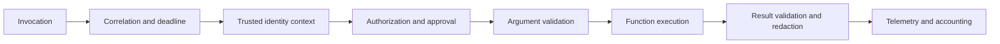
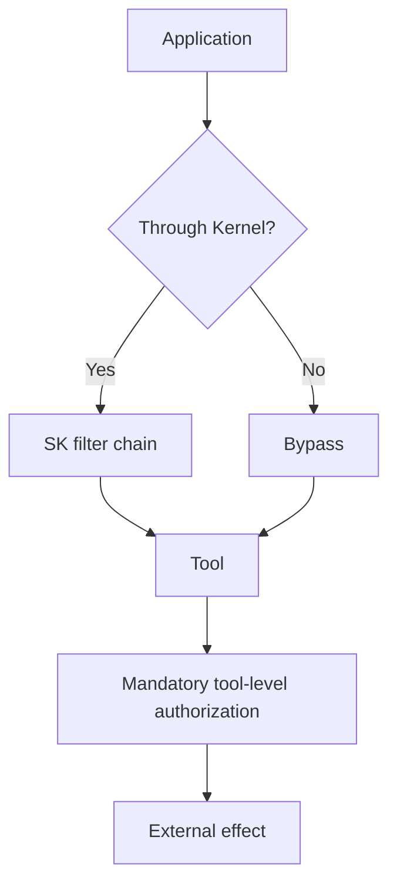

# Filters, Middleware, and Policy

> **Research date:** 2026-08-31
> **Principle:** Use filters as explicitly ordered in-process interception. Keep authorization, isolation, and durable approval as application services.

## Filter types

Current .NET and Python SK provide three principal filter points:

| Filter | Runs around | Best uses | Does not cover |
|---|---|---|---|
| Function invocation | Any `KernelFunction` invocation | Validation, authorization hook, caching, retry classification, result shaping | Direct code that bypasses kernel invocation |
| Prompt render | Prompt-template rendering | Template-variable validation, prompt inspection/redaction, rendered-prompt policy | Native method functions and provider behavior after rendering |
| Auto function invocation | A function called inside the automatic tool loop | Tool-loop policy, result editing, early termination | Manual invocation and direct service calls |

The official [filters documentation](https://learn.microsoft.com/en-us/semantic-kernel/concepts/enterprise-readiness/filters) uses an around-continuation model: code before the continuation runs on the way in; code after it runs on the way out. Not calling the continuation skips the operation. A filter may inspect arguments, observe exceptions, replace results, or terminate an automatic loop.



This order is illustrative, but the invariants are not: policy must run before the effect, and sensitive results must be redacted before model or telemetry exposure.

## Make order a reviewed contract

Filter order can change correctness. For example, a cache lookup before authorization can leak another caller's result, and retry around an approval gate can repeat an approved effect.

In .NET, filters resolved through dependency injection should not be assumed to preserve a security-significant order. Add them directly to the kernel's filter collections in an explicit order when order matters. Python filter execution follows registration order; still capture that order in tests.

Write an order test that records entry and exit:

```text
enter correlation
enter authorization
enter validation
enter execution
exit execution
exit validation
exit authorization
exit correlation
```

Fail startup if required policy filters are missing.

## Filters are not universal middleware

Kernel filters apply only when execution passes through the relevant kernel path. A direct call to an AI service may need the kernel passed for filters to participate; direct HTTP/provider SDK calls and plugin-internal dependencies bypass them entirely.

Map every effect path:



Tool-level authorization is mandatory because it covers both paths.

## Security policy pattern

A policy filter can make an early decision using trusted request context and normalized arguments:

1. resolve the authoritative caller and tenant;
2. identify the qualified function and effect class;
3. validate and canonicalize arguments;
4. evaluate policy and approval state;
5. inject an authorization decision ID and idempotency key;
6. invoke the function;
7. verify/redact the result;
8. record outcome without sensitive content.

The function must recheck that decision at effect time, especially if the request crossed a queue, approval, retry, or long-running boundary.

## Exception and retry semantics

Filters can inspect exceptions or retry an invocation, but retry only when the failure classification and effect boundary are known.

| Condition | Safe default |
|---|---|
| Provider request rejected before acceptance | Retry with bounded backoff if documented transient |
| Read-only tool times out | Retry if the operation is safe and deadline remains |
| Write tool outcome is unknown | Reconcile by idempotency key; do not blindly repeat |
| Policy/validation rejection | Do not retry; return a stable machine-readable result |
| Tool result violates schema | Quarantine/redact; do not send raw result to the model |

Avoid a retry filter nested both around the auto loop and the individual function unless budgets account for multiplication.

## Streaming filters

With an asynchronous stream, failures can occur during enumeration after the function has returned its stream object. A streaming-aware filter must:

- preserve the asynchronous type and cancellation token;
- wrap iteration, not only stream construction;
- validate/redact each content item without corrupting function-call fragments;
- observe terminal status and usage;
- dispose the iterator/provider response on cancellation;
- avoid buffering an unbounded stream just to inspect it.

## Caching

Cache only deterministic, bounded results. The key must include every value that can change the authorized result:

```text
qualified function + normalized arguments + tenant/authorization scope
+ data/version epoch + tool implementation version + policy version
```

Never cache an authorization decision longer than its credential or policy lifetime. Do not cache model-generated responses as if they were tool truth.

## Observability without leakage

Filter telemetry should capture function ID, schema/version hash, policy decision ID, latency, attempt, status, result size, and error class. Arguments, rendered prompts, tool results, and exceptions may contain secrets or personal data. Record hashes or allowlisted fields by default; make sensitive capture an exceptional, time-bounded diagnostic mode.

## Failure modes

| Failure | Why | Control |
|---|---|---|
| Authorization filter never runs | Call bypasses kernel path | Tool-level authorization and effect-path inventory |
| Policy runs after cache | Cached cross-scope data returned | Authorization before scope-aware cache lookup |
| Filter order changes after DI refactor | Order was implicit | Explicit registration and order test |
| Streaming error disappears | Filter observes only stream creation | Wrap and instrument enumeration |
| One approved write executes twice | Nested retries repeat unknown effect | Idempotency and reconciliation |
| Prompt filter is treated as universal input validation | Native tools do not render prompts | Validate at each actual boundary |

## Primary sources

- [Filters in Semantic Kernel](https://learn.microsoft.com/en-us/semantic-kernel/concepts/enterprise-readiness/filters)
- [Semantic Kernel .NET filter abstractions](https://github.com/microsoft/semantic-kernel/tree/main/dotnet/src/SemanticKernel.Abstractions/Filters)
- [Semantic Kernel Python filters](https://github.com/microsoft/semantic-kernel/tree/main/python/semantic_kernel/filters)

## Related guides

- [Kernel, services, and connectors](kernel-services-and-connectors.md)
- [Plugins, functions, and tool calling](plugins-functions-and-tool-calling.md)
- [Security, permissions, and tool isolation](security-permissions-and-tool-isolation.md)
