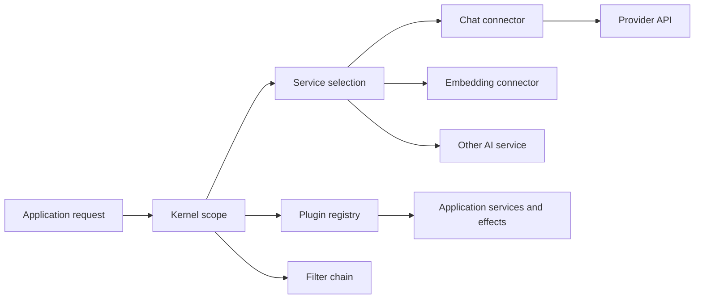
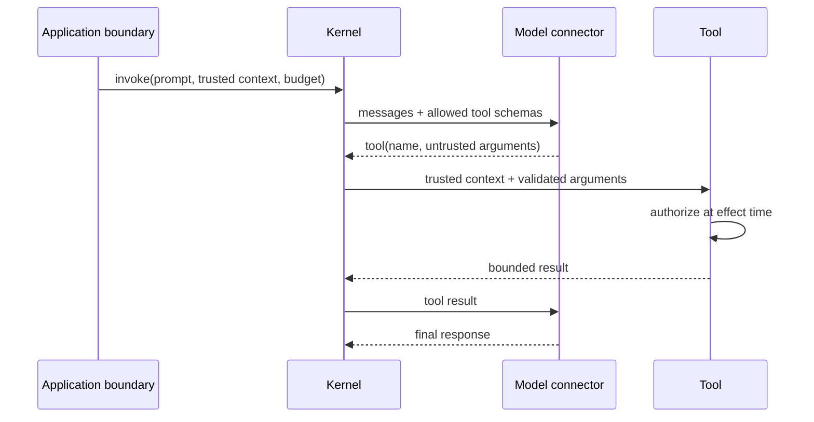

# Kernel, Services, and Connectors

> **Research date:** 2026-08-31
> **Principle:** Compose a small, stable kernel per application scope; make service routing explicit; keep connector-specific behavior behind adoption tests.

## What the kernel actually does

The [Semantic Kernel documentation](https://learn.microsoft.com/en-us/semantic-kernel/concepts/kernel) describes the kernel as a lightweight dependency-injection and orchestration container. It holds AI services, plugins, prompt templates, filters, and per-invocation context. It is the dispatch center for model calls and function invocation, not a durable runtime.



The host still owns request identity, authorization, budgets, persistence, cancellation, and recovery.

## Scope and mutability

Kernel construction is cheap relative to a model call. The important issue is mutable composition:

- plugins and filter collections can change;
- service selection can depend on IDs, model metadata, and registration;
- invocation data and culture are contextual;
- plugin objects and their dependencies may themselves be stateful.

The .NET guidance recommends a transient kernel because the plugin collection is mutable. A cloned .NET kernel gets new plugin/filter collections but shares the service provider and underlying plugin object instances. Python clone behavior similarly does not turn mutable plugin dependencies into isolated state. **Clone registry composition; do not assume a deep security or concurrency boundary.**

Safe patterns:

| Pattern | When it works | Risk to avoid |
|---|---|---|
| Build a transient kernel from a shared service provider | Request-scoped plugins/filters or tenant routing | Recreating heavyweight HTTP/provider clients per request |
| Freeze one kernel after startup | Truly immutable plugins, filters, routing, and dependencies | Runtime mutation or tenant-specific state on shared objects |
| Clone a baseline kernel | Small per-run changes to registries or filters | Assuming plugin instances or singleton dependencies are copied |

Heavy provider clients, HTTP handlers, telemetry providers, and connection pools should follow their recommended long-lived lifetimes. The kernel can be short-lived while its services are not.

## Make service selection explicit

SK can register multiple services and choose among them using service IDs, model IDs, and execution settings. Production routing should not depend on registration order or an accidental default.

Use a stable routing input:

```text
workload class + tenant policy + data region + capability + budget
    -> approved service ID
    -> approved model/deployment ID
    -> versioned execution settings
```

Record the selected service ID, provider, deployment/model, connector version, and execution-settings hash on every invocation. Reject an unavailable or unauthorized route rather than silently falling back to a more expensive, weaker, or differently governed model.

### Routing checklist

- Give every production service a unique, meaningful service ID.
- Keep model names/deployment IDs in governed configuration, not in model-visible prompts.
- Validate capability requirements such as tools, structured output, vision, and streaming.
- Enforce regional, tenant, and data-classification policy before selection.
- Bound retries and define whether fallback is allowed for each workload.
- Conformance-test each connector/model pair after upgrades.

## Connectors normalize shape, not semantics

Connectors present common SK interfaces for chat, embeddings, images, audio, function calling, and other provider capabilities. The abstraction reduces application coupling but cannot erase provider differences in:

- tool-selection rules and parallel calls;
- structured-output dialect and enforcement;
- message roles, system/developer instructions, and history limits;
- streaming chunk types, finish reasons, and usage reporting;
- safety filters and refusal behavior;
- retry headers, rate limits, cancellation, and idempotency;
- hosted thread/file/vector-resource lifecycle.

The SK 1.80.0 release fixed Gemini connector behavior so `FunctionChoiceBehavior` respected the supplied function list. This is a useful production lesson: a common interface is not proof of common behavior. Test the exact connector and model.

## Capability contracts

Create one adoption suite per supported connector/model pair:

1. system instruction precedence;
2. single and multiple tool calls;
3. excluded-tool enforcement;
4. malformed and partial tool arguments;
5. structured-output success and schema violation;
6. streaming order, cancellation, and usage totals;
7. history truncation/reduction;
8. rate-limit and transient-error handling;
9. content filtering/refusal;
10. telemetry attribute presence and redaction.

Do not advertise a capability to application code until this suite passes.

## Context propagation

Pass trusted identity and request metadata separately from model-produced arguments. A plugin that needs `tenant_id`, `user_id`, or an approved resource scope should receive them through authenticated application context or dependency injection. Never ask the model to repeat a trusted identifier and then treat it as authoritative.



## Failure matrix

| Symptom | Likely boundary | First check |
|---|---|---|
| Wrong model receives request | Kernel routing | Service ID, selector, execution settings, fallback policy |
| Tool absent or unexpectedly visible | Kernel/plugin composition | Plugin registry snapshot and function-choice filters |
| Cross-request data leak | Scope/lifetime | Shared kernel, plugin instance, singleton mutable state |
| Provider behaves differently after upgrade | Connector | Package/model versions and adoption-suite delta |
| Cancellation returns but work continues | Connector/tool | Cancellation propagation through provider and plugin dependencies |
| Trace is missing model spans | Telemetry setup | Provider lifetime, instrumentation switches, exporter pipeline |

## Primary sources

- [Understanding the kernel](https://learn.microsoft.com/en-us/semantic-kernel/concepts/kernel)
- [AI service selection](https://learn.microsoft.com/en-us/semantic-kernel/concepts/ai-services/)
- [Semantic Kernel .NET source](https://github.com/microsoft/semantic-kernel/tree/main/dotnet/src/SemanticKernel.Core)
- [Semantic Kernel Python source](https://github.com/microsoft/semantic-kernel/tree/main/python/semantic_kernel)
- [Semantic Kernel 1.80.0 release](https://github.com/microsoft/semantic-kernel/releases/tag/dotnet-1.80.0)

## Related guides

- [Plugins, functions, and tool calling](plugins-functions-and-tool-calling.md)
- [Filters, middleware, and policy](filters-middleware-and-policy.md)
- [Observability, testing, and debugging](observability-testing-and-debugging.md)
