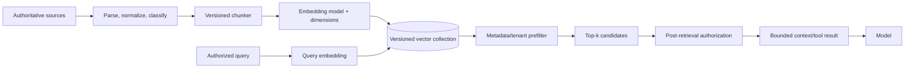

# Memory, Vector Data, and RAG

> **Research date:** 2026-08-31
> **Decision:** Treat retrieval as an independently versioned data system. Migrate legacy memory abstractions, enforce tenancy outside model judgment, and verify connector ownership per language.

## “Memory” covers different state

Do not collapse these into one feature:

| State | Purpose | Correct owner |
|---|---|---|
| Conversation history | Preserve recent interaction context | Thread/session plus application event store |
| Domain state | Record authoritative business facts and effects | Transactional system of record |
| Semantic retrieval index | Find relevant chunks/records | Versioned vector/search collection |
| Model-generated summary | Compress context | Rebuildable derived data |
| Agent/process runtime state | Coordinate a run | Runtime plus durable application/workflow state where required |

Vector search is retrieval, not memory in the human sense and not a source of truth.

## Current abstraction direction

The old .NET `IMemoryStore`/Semantic Memory path has moved toward `Microsoft.Extensions.VectorData.VectorStore`. The [official migration guide](https://learn.microsoft.com/en-us/semantic-kernel/support/migration/memory-store-migration) describes richer schemas, multiple vector fields and types, filtering, and index/distance configuration.

In .NET, many vector providers were extracted from the SK repository into `CommunityToolkit.VectorData.*`; SK 1.80 removed migrated providers and left redirects. Python still distributes many vector connectors as `semantic-kernel` optional extras. Java maintains separate data/vector modules. Package ownership and maturity therefore differ by language.

## Agent memory providers are a separate experimental surface

SK's [.NET agent-memory documentation](https://learn.microsoft.com/en-us/semantic-kernel/frameworks/agent/agent-memory) describes experimental context providers such as Mem0-backed long-term memory and a whiteboard that extracts requirements, proposals, decisions, and actions from messages. These are derived context systems, not authoritative memory.

- Store provenance, extractor/prompt/model version, confidence, timestamp, tenant/user scope, and expiry with every extracted item.
- Let users correct and delete personal memories; reconcile deletion with any external memory service.
- Never derive identity, authorization, consent, or an irreversible business fact solely from a model-extracted memory.
- Treat recalled memory as untrusted prompt content and defend against stored prompt injection.
- Review whether every message is sent to a third-party memory service, including region, retention, training, and deletion terms.
- Evaluate precision, false-memory rate, staleness, and cross-user leakage before enabling it.

Prefer explicit user/profile fields in the system of record when the information is structured and important. Use an agent memory provider only for bounded personalization or context where an incorrect recall cannot authorize an effect.



## Version the retrieval contract

Persist or configure together:

- source record ID and source revision;
- parser/chunker version and chunk offsets;
- embedding provider, model, dimensions, and normalization;
- collection/schema/index version;
- distance metric and index parameters;
- metadata filter schema;
- ACL/tenant fields and policy version;
- ingestion time, deletion/tombstone state, and content hash.

Changing an embedding model or dimensions normally requires a new collection or a controlled reindex. Dual-write and shadow-query before cutover; do not mix incomparable vectors silently.

## Schema design

A production record should have a stable key and enough metadata to enforce scope without retrieving sensitive content first:

```text
record_id, tenant_id, source_id, source_revision
document_classification, ACL/resource scope
chunk_index, content_hash, parser_version
embedding_model_version, vector
bounded display text or protected content reference
created_at, deleted_at
```

Use server-side metadata filtering for tenant and coarse access scope whenever the store guarantees it. Reauthorize returned source records because index ACLs can be stale and because the model cannot enforce policy.

## Ingestion correctness

Use an idempotent pipeline:

1. read a source revision;
2. normalize and classify it;
3. produce deterministic chunk IDs;
4. embed with a pinned model;
5. upsert the versioned records;
6. tombstone chunks no longer present;
7. mark the source revision indexed only after successful reconciliation.

Queues may deliver twice and sources may change mid-run. Conditional writes and content hashes prevent duplicate or stale chunks.

## Retrieval quality and safety

Measure retrieval separately from final answer quality:

- recall@k / success of finding the gold source;
- precision and irrelevant-context rate;
- tenant/ACL leakage rate (must be zero);
- stale/deleted-source rate;
- latency and cost per query;
- citation/source attribution correctness;
- prompt-injection success rate from retrieved content.

Retrieved text is untrusted. Delimit it, minimize it, keep system/tool policy outside it, and never let a retrieved instruction expand tool permissions.

## Vector search as a tool

SK can expose search as a kernel function and can use contextual function selection to retrieve relevant function schemas. Apply the same tool controls:

- inject tenant/ACL context from the host;
- cap `top_k`, filters, returned fields, and byte size;
- reject arbitrary collection/index names;
- prevent raw vector or broad scan access unless explicitly required;
- log collection/schema/embedding versions;
- authorize each returned record.

The official MAF migration guide supports converting a Python vector-store search function through `KernelFunction.as_agent_framework_tool`, enabling the data plane to remain while the agent layer migrates.

## Maturity and security warnings

Check the exact connector's package and support label. A stable SK core version does not make every vector connector stable. In-memory stores are useful for tests and single-process experiments, not durable multi-instance production.

The critical [CVE-2026-26030 / GHSA-xjw9-4gw8-4rqx](https://github.com/microsoft/semantic-kernel/security/advisories/GHSA-xjw9-4gw8-4rqx) showed that Python `InMemoryVectorStore` filter processing before 1.39.4 could lead to remote code execution. “In memory” is not synonymous with “safe.” Patch and treat filter expressions as untrusted data.

## Failure modes

| Failure | Cause | Control |
|---|---|---|
| Cross-tenant retrieval | Tenant filter omitted or model supplied | Inject mandatory server-side filter and post-authorize |
| Relevance collapses after upgrade | Embedding/chunker changed in place | Versioned collection, offline evaluation, shadow query |
| Deleted content still appears | Index deletion is best-effort | Tombstones and source/index reconciliation |
| Context window/cost spikes | Unbounded `top_k` or full records | Result count/field/byte/token caps |
| Prompt injection drives a tool | Retrieved instructions treated as policy | Trust labeling, delimiting, fixed permissions |
| Connector disappears from SK | Provider was moved/extracted | Track registry/package owner independently |

## Primary sources

- [Migrate from memory stores to vector stores](https://learn.microsoft.com/en-us/semantic-kernel/support/migration/memory-store-migration)
- [Vector store connectors](https://learn.microsoft.com/en-us/semantic-kernel/concepts/vector-store-connectors/)
- [Experimental agent memory](https://learn.microsoft.com/en-us/semantic-kernel/frameworks/agent/agent-memory)
- [AI Community Toolkit repository](https://github.com/CommunityToolkit/AI)
- [Semantic Kernel 1.80.0 release](https://github.com/microsoft/semantic-kernel/releases/tag/dotnet-1.80.0)
- [Python InMemoryVectorStore advisory](https://github.com/microsoft/semantic-kernel/security/advisories/GHSA-xjw9-4gw8-4rqx)
- [Migration from Semantic Kernel](https://learn.microsoft.com/en-us/agent-framework/migration-guide/from-semantic-kernel/)

## Related guides

- [Security, permissions, and tool isolation](security-permissions-and-tool-isolation.md)
- [Packages, language parity, and migration](packages-language-parity-and-migration.md)
- [Observability, testing, and debugging](observability-testing-and-debugging.md)
