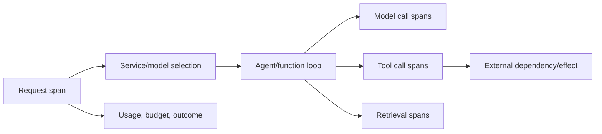
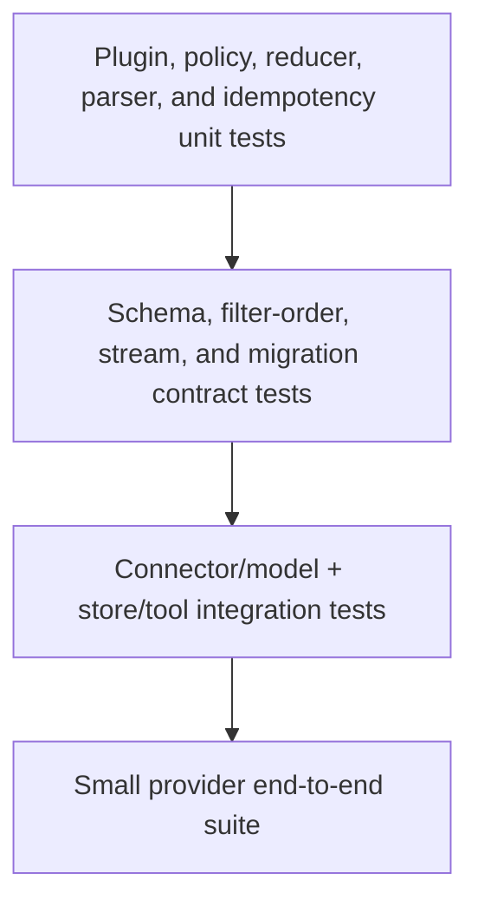

# Observability, Testing, and Debugging

> **Research date:** 2026-08-31
> **Principle:** Record decisions, versions, budgets, and effect boundaries. Keep prompts, completions, arguments, and results private by default.

## Observability model

Semantic Kernel emits OpenTelemetry-compatible logs, metrics, and traces in .NET and Python. Java does not have the same documented SK observability surface, so do not assume parity. The [official observability documentation](https://learn.microsoft.com/en-us/semantic-kernel/concepts/enterprise-readiness/observability/) also warns that generative-AI semantic conventions are evolving.



Use the application request/run ID as the root correlation point. Provider and SK spans are children, not the only record of the run.

## Telemetry contract

Record allowlisted metadata:

| Scope | Useful fields |
|---|---|
| Run | run/request ID, hashed tenant/actor class, workload, deadline, budget, outcome |
| Build | SK/package set, connector version, application version, runtime/language |
| Model call | service ID, provider, model/deployment, prompt/schema hash, attempt, latency, token usage, finish/refusal class |
| Tool call | qualified function, schema/version hash, tool-call ID, policy decision ID, idempotency key hash, attempt, latency, status, result bytes |
| Retrieval | store/collection/schema/embedding versions, filter class, top-k, latency, result count |
| Thread/resource | application conversation ID, provider/resource type, hashed provider ID, lifecycle operation |

Do not put secrets, credentials, full paths, raw retrieved documents, or unrestricted user/model content into span attributes.

## Sensitive-content switches

SK's experimental GenAI diagnostics can be enabled with environment/AppContext switches. Non-sensitive diagnostics and sensitive prompt/completion capture are separate controls. The documented environment names include:

```text
SEMANTICKERNEL_EXPERIMENTAL_GENAI_ENABLE_OTEL_DIAGNOSTICS=true
SEMANTICKERNEL_EXPERIMENTAL_GENAI_ENABLE_OTEL_DIAGNOSTICS_SENSITIVE=true
```

.NET provides corresponding `Microsoft.SemanticKernel.Experimental.GenAI.*` AppContext switches. Keep sensitive capture off in normal production. If enabled for an incident, scope it to a controlled environment and time window, apply access controls and retention limits, and document the data-processing impact.

Use a singleton or application-lifetime telemetry provider/export pipeline. Per-request providers lose batches and waste resources.

## Metrics that reveal system health

- request success, refusal, cancellation, and timeout rates;
- end-to-end and first-token latency distributions;
- model calls/tool calls/turns per run;
- token and monetary cost per successful task;
- tool failure, authorization-denial, approval, and repeated-call rates;
- connector/provider throttling and retry counts;
- stream disconnects and abandoned runs;
- hosted-resource creation/deletion backlog;
- retrieval latency, empty-result rate, and stale/unauthorized-result defects;
- process/orchestration terminal-state and stuck-run counts.

Alert on service objectives and security signals, not every model refusal.

## Test pyramid



### Deterministic unit tests

Test plugins without a model. Cover authorization, canonicalization, schema validation, idempotency, timeout/cancellation, result redaction, and error classification. Test filters for exact enter/exit order and skip behavior.

### Scripted loop tests

Use a fake/scripted chat service to emit:

- one valid tool call and final response;
- malformed/oversized arguments;
- excluded or unknown function;
- repeated identical calls;
- multiple parallel calls;
- tool failure followed by model retry;
- refusal or content-filter response;
- fragmented tool-call streaming and late stream error.

Assert run-wide budgets and terminal state, not natural-language prose.

### Connector adoption tests

Run against the exact provider/model/deployment used in production. Provider nondeterminism makes these contract tests, not brittle text snapshots. Assert tool identity, schema validity, event ordering, finish classes, and bounded usage.

### Security and adversarial tests

Inject instructions through user input, tool output, retrieved documents, filenames, URLs, OpenAPI descriptions, and MCP tool metadata. Verify they cannot expand the allowlist, cross tenant boundaries, access local files, trigger unapproved effects, or leak secrets.

## Debug by boundary

Classify before changing prompts:

| Symptom | Boundary | Evidence |
|---|---|---|
| Wrong/absent tool schema | Kernel/plugin composition | Registered function inventory and schema hash |
| Correct schema, wrong provider behavior | Connector/model | Raw allowlisted protocol metadata and adoption test |
| Tool selected but denied | Policy | Decision ID, trusted scope, normalized target |
| Tool ran twice | Retry/effect | Call ID, idempotency ledger, attempt tree |
| Conversation forgot state | Thread/history | Thread mapping, reducer version, event-store version |
| Output truncates or corrupts | Streaming | Ordered typed events and terminal reason |
| Retrieval is irrelevant | Data plane | Query, filters, collection/embedding versions, offline evaluation |
| Orchestration never terminates | Control loop | transition/turn count, repeated signature, runtime state |

## Release adoption workflow

1. Read release notes for every package in the lock/manifest, including extras and provider packages.
2. Compare public APIs and transitive dependencies.
3. Run unit, contract, connector, stream, security, and resource-lifecycle tests.
4. Shadow or canary representative workloads with strict budget caps.
5. Compare tool selection, denials, costs, latency, and terminal outcomes.
6. Promote gradually and retain a rollback-compatible state format.

Python 1.44.0/1.44.1 contained behavior marked breaking within the 1.x line, while .NET 1.79/1.80 included connector, path, dependency, and vector-provider changes. Exact pinning and adoption tests are required even without a major-version bump.

## Primary sources

- [Semantic Kernel observability](https://learn.microsoft.com/en-us/semantic-kernel/concepts/enterprise-readiness/observability/)
- [Semantic Kernel telemetry concepts](https://learn.microsoft.com/en-us/semantic-kernel/concepts/enterprise-readiness/observability/telemetry-with-app-insights)
- [Semantic Kernel releases](https://github.com/microsoft/semantic-kernel/releases)
- [OpenTelemetry semantic conventions for generative AI](https://opentelemetry.io/docs/specs/semconv/gen-ai/)

## Related guides

- [Kernel, services, and connectors](kernel-services-and-connectors.md)
- [Streaming, structured output, and multimodality](streaming-structured-output-and-multimodality.md)
- [Reliability, deployment, and operations](reliability-deployment-and-operations.md)
