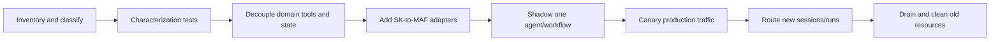

# Packages, Language Parity, and Migration

> **Research date:** 2026-08-31
> **Decision:** Pin and assess the exact package, language, provider, and API—not the Semantic Kernel brand or meta-package version. Move new agent/session/workflow work to Microsoft Agent Framework while retaining useful SK components behind adapters.

## Verified package snapshot

| Language | Stable core verified | Runtime baseline | Packaging model |
|---|---:|---|---|
| .NET | `Microsoft.SemanticKernel` 1.80.0 | Checked Core and Abstractions projects target .NET 10, .NET 8, and .NET Standard 2.0 | Modular NuGet packages plus a meta-package; agent/process/provider packages have independent maturity suffixes |
| Python | `semantic-kernel` 1.44.1 | Python 3.10+ | One PyPI distribution with many optional extras for providers, agents, vector stores, MCP, realtime, and data services |
| Java | `com.microsoft.semantic-kernel:semantickernel-api` 1.5.0 | Verify the current Maven POM/toolchain for the application | Separate `semantic-kernel-java` repository and modular Maven artifacts |

The registry is the source of truth for published artifacts. GitHub release pages can lag a registry—for example, Java's Maven stable version was newer than the latest GitHub release entry at this snapshot.

## Package maturity is granular

The checked .NET 1.80 source/package metadata showed this broad maturity map:

| Surface | Maturity at snapshot | Consequence |
|---|---|---|
| Kernel/core abstractions | Stable | Retainable with normal upgrade testing |
| `Agents.Abstractions` / `Agents.Core` | Stable packages | Individual extension APIs and provider behaviors still require inspection |
| Azure AI/OpenAI provider agent packages | Preview | Avoid assuming stable compatibility from `Agents.Core` |
| Agent orchestration and runtime | Preview | Do not make a new critical control plane without accepting preview risk |
| YAML agent definitions | Beta | Pin schema/package and validate at startup |
| A2A, Bedrock, Copilot agent packages | Alpha | Evaluation/adoption tests; strong exit boundary |
| Process abstractions/core/local/Dapr | Alpha | Experimental; do not infer durable production guarantees |

The checked Dapr Process runtime targets .NET 10, while Process Core, Abstractions, and LocalRuntime include .NET 10, .NET 8, and .NET Standard 2.0 targets. Verify the exact runtime package and target framework rather than inferring compatibility from Core.

Python's single stable distribution includes features at different maturity levels, so the absence of a package suffix is not proof that each agent, orchestration, process, or connector API is stable. Read decorators/warnings, API docs, release notes, and source tests for the exact surface.

## Language parity matrix

This matrix is deliberately conservative. “Available” does not mean behaviorally identical.

| Capability | .NET | Python | Java | Portability note |
|---|---|---|---|---|
| Kernel, services, native/prompt functions | Mature | Mature | Available | DI idioms, async models, and prompt APIs differ |
| Automatic function calling | Available | Available | Available | Provider and loop-control behavior differs |
| Function/prompt/auto-invocation filters | Available | Available | Do not assume equivalent surface | Filter order and direct-service bypass differ |
| Chat-completion agent | Available | Available | Available in separate agent module | Message/thread and package APIs differ |
| Broad provider-agent family | Multiple packages, mixed maturity | Multiple integrations in one distribution, mixed maturity | Narrower | Verify each provider and resource lifecycle |
| Agent orchestration patterns | Preview/experimental | Experimental | Not equivalent in checked modules | Not a portable production contract |
| Process Framework local/Dapr | Alpha/experimental | Experimental source | No equivalent checked module | Do not port orchestration by type name |
| Vector/data connectors | Moving to `Microsoft.Extensions.VectorData` / `CommunityToolkit.VectorData` | Many optional extras remain in SK | Separate data modules | Schema and connector ownership differ |
| OpenTelemetry integration | Documented | Documented | No equivalent SK surface verified | Instrument application/provider clients directly where absent |
| Prompt formats | SK/Handlebars; Liquid and other .NET-specific options | SK/Handlebars/Jinja2 and Python options | SK/Handlebars subset | Render and escaping behavior is executable portability risk |

If a row is critical, confirm it with the exact registry artifact and an executable contract test. Documentation feature matrices can lag source or package moves.

## Dependency discipline

### .NET

- Pin the meta-package only if every transitively selected component is intended.
- Prefer explicit package references for provider agents, vector connectors, process runtimes, and experimental features.
- Treat prerelease suffixes as deployment policy inputs.
- Inspect target frameworks of the exact package rather than inferring them from the repository quickstart.
- Centralize and audit transitive version overrides.

### Python

- Lock the base distribution and every selected extra/transitive dependency.
- Build separate environments/images when tool or vector extras create materially different privileges or native dependencies.
- Run import/startup tests for optional extras.
- Review release notes for `BREAKING` entries even within 1.x; 1.44.x included behavior-changing MCP/runtime work.

### Java

- Use Maven Central metadata/POMs and the separate Java repository.
- Do not copy .NET/Python API or maturity statements.
- Validate connector modules, reactive execution, serialization, and dependency convergence in the application's build.

## Release evidence to watch

Recent releases illustrate why package-level testing matters:

- .NET 1.80 corrected Gemini function-list behavior, changed OpenAPI HTTP defaults, and removed migrated vector providers.
- .NET 1.79 included UNC/path hardening, dependency vulnerability work, and vector-data migration changes.
- Python 1.44.0/1.44.1 hardened OpenAPI/MCP paths, tool exclusions, collisions, and approval behavior, with some changes marked breaking.
- The 2026 security advisories require at least Python 1.39.4 and, for the vulnerable .NET plugin, 1.71.0; current versions should still be reviewed for new advisories.

Never upgrade only the SDK while leaving model aliases, prompt assets, tool schemas, or vector schemas unrecorded. They form one behavioral release.

## Migration target map

The official [MAF migration guide](https://learn.microsoft.com/en-us/agent-framework/migration-guide/from-semantic-kernel/) frames MAF agents around direct agent/client construction and sessions. Exact APIs vary by language, but the responsibility mapping is stable:

| SK responsibility | Target responsibility | Migration note |
|---|---|---|
| `Kernel` as agent dependency | MAF agent/client plus application DI | Keep an SK kernel only where retained plugins/connectors need it |
| `ChatCompletionAgent` and provider agents | MAF `AIAgent`/provider agent | Characterize instructions, tools, response, streaming, and resource behavior |
| `AgentThread` | MAF session plus application mapping | Externalize provider IDs, retention, concurrency, and business state |
| Kernel plugin/function | MAF tool / `AIFunction` | Keep authorization in the underlying business capability |
| Python `KernelFunction` | `as_agent_framework_tool` adapter | Requires a compatible SK version; use for staged coexistence |
| Vector search function | MAF tool adapter over retained data plane | Preserve collection/schema/embedding versions |
| SK agent orchestration | MAF workflow/team pattern | Migrate topology, termination, messages, and state ownership |
| SK Process | MAF workflow or durable workflow system | Rebuild durability, checkpoints, effects, and recovery explicitly |
| SK filters | MAF middleware/interception plus tool policy | Reproduce order and bypass-path tests; no blind one-to-one assumption |

In .NET, MAF agent abstractions live under `Microsoft.Agents.AI` and message/tool conventions use `Microsoft.Extensions.AI`. In Python, compatibility methods such as `KernelFunction.as_agent_framework_tool` allow an incremental bridge.

## Staged migration

### 1. Inventory and freeze

Record package/provider/model versions, agents, thread types, plugins, filters and order, process topology, prompt/tool schemas, vector collections, hosted resource IDs, and effect boundaries. Stop adding new preview dependencies during the migration unless required for security.

### 2. Characterize behavior

Build tests for tool exposure, authorization, messages, streaming, structured output, history reduction, retries, cancellation, cost, resource cleanup, and terminal states. Natural-language snapshots alone are too brittle.

### 3. Decouple retained assets

Move business functions behind provider-neutral interfaces that accept trusted application context. Externalize domain state and idempotency. Version prompt/tool/vector assets independently of the agent class.

### 4. Bridge tools and retrieval

Use official adapters where they reduce risk, especially Python kernel-function/vector search adapters. Keep an adapter thin and temporary; do not recreate the entire SK kernel abstraction inside MAF.

### 5. Migrate one behavioral seam

Choose one provider agent or bounded workflow. Shadow representative inputs with effects disabled or routed to a safe double. Compare structured outcomes, tool calls, denials, latency, and cost.

### 6. Cut over new state

Route new sessions/runs to MAF while letting in-flight SK work drain under its pinned version. Do not mutate old process state into a new runtime without a tested state transformation.

### 7. Reconcile and remove

Delete or retain provider threads/files/vector resources according to policy, remove unused credentials/packages, keep audit mappings, and verify no old work remains before decommissioning.

## When not to migrate immediately

Delay a migration when an existing SK workload is stable, supported, fully tested, and changing it would add operational risk without a feature/security/lifecycle benefit. Still:

- stop coupling new domain logic to SK agent/thread types;
- pin packages and models;
- patch advisories;
- externalize state/effects;
- maintain a migration inventory and trigger.

## Alternatives

| Need | Best starting point | Trade-off |
|---|---|---|
| New Microsoft agent/session/workflow | Microsoft Agent Framework | Current strategic surface; still requires app-owned security and operations |
| Simple one-model tool call | Direct provider SDK or `Microsoft.Extensions.AI` abstraction | Less framework machinery; more provider/application integration work |
| Existing SK kernel/plugins/connectors | Retain focused SK core | Avoids unnecessary rewrite; lifecycle and connector testing remain |
| Long-lived, effectful business process | Established durable workflow engine, optionally calling MAF/SK activities | More infrastructure, stronger recovery/timer/operator semantics |
| Provider-hosted agent feature | Provider SDK/MAF provider integration | More provider coupling; clearer native resource lifecycle |

Do not add multiple agents, a process framework, or a compatibility layer unless the workload needs it. One model plus a small, authorized tool set and deterministic application workflow is often safer and cheaper.

## Migration exit criteria

- [ ] Required behavior passes target connector/provider contract tests.
- [ ] Tool allowlists and effect-time authorization are equivalent or stronger.
- [ ] Sessions, histories, resources, and retention have named owners.
- [ ] Domain state and effects are outside chat/runtime-local state.
- [ ] Budgets, cancellation, telemetry, and cleanup are verified.
- [ ] Old and new package/model/tool/vector versions are traceable.
- [ ] In-flight old runs are drained, pinned, or explicitly terminated.
- [ ] Rollback does not corrupt session/workflow state.
- [ ] Unused packages, secrets, permissions, and provider resources are removed.

## Primary sources

- [Semantic Kernel NuGet package](https://www.nuget.org/packages/Microsoft.SemanticKernel/)
- [Semantic Kernel PyPI package](https://pypi.org/project/semantic-kernel/)
- [Semantic Kernel Java Maven artifact](https://central.sonatype.com/artifact/com.microsoft.semantic-kernel/semantickernel-api)
- [Semantic Kernel Java repository](https://github.com/microsoft/semantic-kernel-java)
- [Semantic Kernel releases](https://github.com/microsoft/semantic-kernel/releases)
- [Semantic Kernel and Microsoft Agent Framework](https://devblogs.microsoft.com/agent-framework/semantic-kernel-and-microsoft-agent-framework/)
- [Microsoft Agent Framework 1.0](https://devblogs.microsoft.com/agent-framework/microsoft-agent-framework-version-1-0/)
- [Migration from Semantic Kernel](https://learn.microsoft.com/en-us/agent-framework/migration-guide/from-semantic-kernel/)
- [SK .NET migration samples](https://github.com/microsoft/semantic-kernel/tree/main/dotnet/samples/AgentFrameworkMigration)
- [MAF Python migration samples](https://github.com/microsoft/agent-framework/tree/main/python/samples/semantic-kernel-migration)

## Related guides

- [Ecosystem boundaries and lifecycle](ecosystem-boundaries-and-lifecycle.md)
- [AutoGen and Semantic Kernel migration](../autogen-and-semantic-kernel-migration.md)
- [Microsoft Agent Framework](../microsoft-agent-framework.md)
