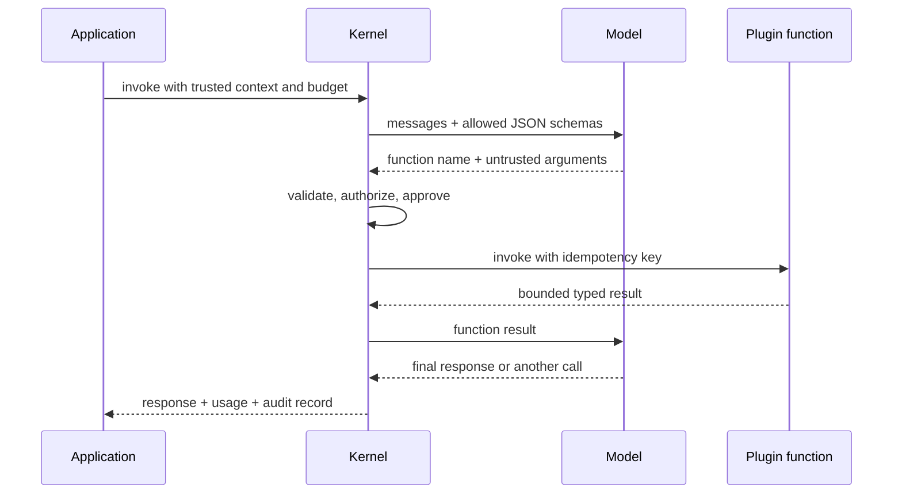

# Plugins, Functions, and Tool Calling

> **Research date:** 2026-08-31
> **Principle:** A plugin schema tells a model what it may request. Only trusted application code can decide what the caller may actually do.

## The execution loop

Semantic Kernel groups callable capabilities into plugins. Functions may be native code, prompt functions, OpenAPI operations, MCP tools, or adapter-backed search functions. During automatic function calling, SK serializes allowed function schemas, sends them to the model, receives tool selections, binds arguments, invokes functions, adds results to history, and continues until a final response or limit.



Every arrow can fail. Automatic invocation reduces boilerplate; it does not remove the need for budgets, policy, idempotency, or error handling.

## Design functions for models and operators

A good function is narrow, typed, deterministic where possible, and explicit about effects.

| Design property | Good practice | Avoid |
|---|---|---|
| Name | Stable verb and domain object: `get_order_status` | Generic `run`, overloaded names, implementation jargon |
| Description | Preconditions, effect, important exclusions | Marketing prose or instructions that conflict with policy |
| Arguments | Small schema, enums/ranges, required fields only | Arbitrary blobs, host paths, raw URLs, model-supplied tenant IDs |
| Result | Bounded typed facts with stable error codes | Full database rows, secrets, stack traces, unbounded documents |
| Side effects | Explicit effect class and idempotency key | Hidden writes in a function described as lookup/read |
| Authorization | Rechecked using trusted caller context | Inferring permission because the function was advertised |

Descriptions and schemas consume context tokens. Large plugin catalogs also increase selection ambiguity. Prefer a small task-specific allowlist.

## Trusted versus model-supplied inputs

Separate inputs structurally:

```text
trusted: user identity, tenant, roles, approved resource scope, request ID
untrusted: model-selected function, model-generated arguments, retrieved content
derived: policy decision, idempotency key, normalized target
```

Inject trusted values from the authenticated host context. If a tool accepts `tenant_id` from the model, treat it as a requested value and compare it with the authoritative tenant; do not use it directly for data access.

## Function choice and exposure

`FunctionChoiceBehavior` can advertise all or selected functions, require a call, allow the model to choose automatically, or disable invocation. Exact names differ slightly by language/connector, but three decisions must remain separate:

1. **Advertisement:** which schemas are visible in this model call?
2. **Selection:** which advertised function did the model request?
3. **Authorization:** may this authenticated caller execute this effect now?

An excluded function must remain unreachable even if a malicious response names it directly. Test this at the dispatcher boundary; connector fixes such as the .NET 1.80 Gemini allowlist correction and Python 1.44 MCP hardening show why schema visibility alone is insufficient.

## Automatic versus manual invocation

| Mode | Use when | Main obligation |
|---|---|---|
| Automatic invocation | Read-only or low-risk calls with deterministic policy and bounded loops | Enforce allowlist, arguments, per-tool authorization, attempts, cost, and time |
| Manual invocation | High-impact effects, external approvals, ambiguous targets, or custom transaction boundaries | Persist the requested action and resume only after an authenticated decision |
| No invocation | Classification, extraction, or response generation that requires no external capability | Ensure no connector fallback exposes tools |

Manual invocation should produce a durable proposed-action record rather than hold an HTTP request open:

```text
proposal ID + caller + normalized effect + target + arguments hash
policy result + required approver + expiry
approved/rejected identity and time
execution idempotency key + effect result
```

## Concurrency is two decisions

A model may select multiple functions in one response. SK may also be configured to invoke eligible calls concurrently. These are not the same capability.

- Parallel **selection** is a connector/model feature.
- Concurrent **execution** is an application safety decision.

Allow concurrent execution only when functions are read-only, commute safely, or implement their own concurrency control. Serialize writes that share a resource or business invariant. Never assume returned call order equals effect order.

## Bound the loop

Language implementations expose different automatic-invocation controls. Regardless of SDK defaults, enforce an application-wide budget:

```text
deadline
maximum model turns
maximum tool calls total and per tool
maximum parallel calls
token and monetary budget
maximum tool-result bytes
maximum consecutive failures or repeated call signature
```

Detect cycles by a normalized `(function, arguments, relevant state version)` signature. Do not merely increase the limit when a model repeats a failing action.

## OpenAPI and MCP tools

OpenAPI and MCP can import broad remote capabilities quickly. Their schemas and servers are supply-chain and runtime trust boundaries.

- Pin or hash reviewed OpenAPI documents and MCP server versions.
- Allowlist schemes, hosts, ports, redirect targets, and operations.
- Resolve and revalidate DNS/redirect destinations to reduce SSRF risk.
- Use separate credentials per server and least-privilege scopes.
- Reject duplicate/colliding tool names deterministically.
- Require explicit approval for newly discovered or high-impact operations.
- Bound response bodies and redact secrets before returning them to the model.
- Audit server identity, transport, tool schema hash, policy decision, and call result.

Recent Python SK releases added OpenAPI URL/path validation, MCP exclusion enforcement, collision handling, and approval callbacks. Pin the patched version and still keep application policy around imported tools.

## Planners are not required

The former Stepwise and Handlebars planners were deprecated and removed from supported .NET, Python, and Java flows. Use native function calling for model-selected execution. Handlebars remains a prompt-template format; it is not the removed Handlebars planner.

Contextual Function Selection can use vector search to advertise only relevant functions. It reduces context and ambiguity but is not authorization. The application must synchronize its function index when names, descriptions, schemas, or embeddings change.

## Failure matrix

| Failure | Cause | Control |
|---|---|---|
| Cross-tenant access | Tenant/resource scope accepted from model | Inject trusted scope and authorize in the tool |
| Duplicate write | Retry or replay invokes effect again | Stable idempotency key and effect ledger |
| SSRF through imported API | Model controls URL/redirect | Operation/host allowlist, egress policy, canonical validation |
| Tool loop consumes budget | Repeated error fed back without termination | Run-wide budgets and repeated-signature detection |
| Wrong tool executes | Name collision or connector ignores list | Qualified names, collision rejection, dispatcher allowlist test |
| Prompt injection reaches host capability | Retrieved/user text influences tool arguments | Treat all arguments as untrusted; isolate and approve effects |

## Primary sources

- [Plugins in Semantic Kernel](https://learn.microsoft.com/en-us/semantic-kernel/concepts/plugins/)
- [Function calling](https://learn.microsoft.com/en-us/semantic-kernel/concepts/ai-services/chat-completion/function-calling/)
- [Function choice behavior](https://learn.microsoft.com/en-us/semantic-kernel/concepts/ai-services/chat-completion/function-calling/function-choice-behaviors)
- [Planning and removed planners](https://learn.microsoft.com/en-us/semantic-kernel/concepts/planning)
- [Semantic Kernel Python releases](https://github.com/microsoft/semantic-kernel/releases)
- [Semantic Kernel 1.80.0 release](https://github.com/microsoft/semantic-kernel/releases/tag/dotnet-1.80.0)

## Related guides

- [Filters, middleware, and policy](filters-middleware-and-policy.md)
- [Security, permissions, and tool isolation](security-permissions-and-tool-isolation.md)
- [Reliability, deployment, and operations](reliability-deployment-and-operations.md)
