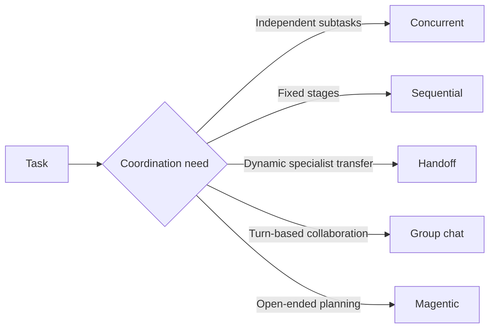
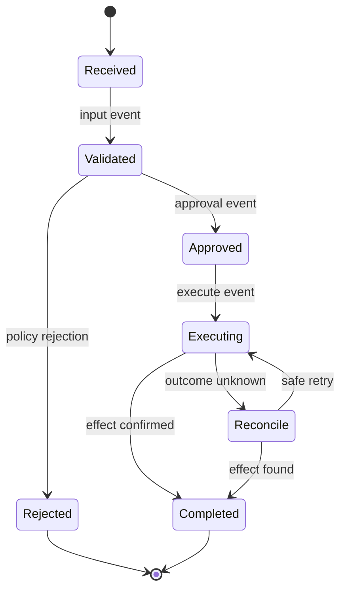

# Processes, Planning, and Orchestration

> **Research date:** 2026-08-31
> **Decision:** Use native function calling for model planning. Treat SK Process Framework and agent orchestration as experimental migration surfaces, not as unqualified durable production runtimes.

## Four different mechanisms

| Mechanism | Purpose | Current posture |
|---|---|---|
| Native function calling | Model selects among application functions | Recommended replacement for legacy planners |
| Legacy Stepwise/Handlebars planners | Generated multi-step plans | Deprecated and removed from supported language flows |
| Agent orchestration | Coordinate multiple agents with a pattern | Experimental/preview packages |
| Process Framework | Event-driven steps, functions, and process state | Experimental; current .NET packages are alpha |

Do not use one mechanism's maturity to justify another. Stable kernel/function calling does not make the Process packages stable.

## Native function calling replaces planners

The official [planning documentation](https://learn.microsoft.com/en-us/semantic-kernel/concepts/planning) directs users to native function calling. It lets the model select tools using the provider's supported protocol and avoids a separate generated-plan format.

Native function calling still needs deterministic controls:

- a task-specific function allowlist;
- automatic-invocation budgets;
- explicit authorization and approval;
- tool-result validation;
- cycle detection;
- an application state machine for business-critical sequences.

Handlebars prompt templates remain available. That does not revive the removed Handlebars planner.

## Agent orchestration patterns

SK documents Concurrent, Sequential, Handoff, Group Chat, and Magentic orchestration. These are communication/topology patterns, not reliability guarantees.

| Pattern | Primary risk | Required control |
|---|---|---|
| Concurrent | Cost/concurrency explosion, incompatible writes | Fan-out cap, read-only tasks or merge protocol |
| Sequential | Bad early output contaminates every stage | Typed stage contracts and validation gates |
| Handoff | Cycles and unclear ownership | Allowed transition graph and handoff limit |
| Group chat | Token growth, non-termination, speaker bias | Turn budget, deterministic manager, transcript reduction |
| Magentic | Open-ended planning cost and unsafe execution | Sandboxed tools, milestone budget, external termination |

The legacy `AgentGroupChat` API is no longer maintained in favor of newer `GroupChatOrchestration`, but the replacement is itself not the strategic destination for new systems. Microsoft Agent Framework is.

## Process Framework model

The [Process Framework overview](https://learn.microsoft.com/en-us/semantic-kernel/frameworks/process/process-framework) models event-driven processes composed of steps whose handlers are kernel functions. Events activate steps and process state can carry data between them.

The diagram is a production state machine the application must make durable. Declaring SK steps/events does not by itself provide exactly-once effects, an auditable approval record, or crash-safe reconciliation.

## Current runtime and documentation drift

At the research snapshot, the checked .NET source and packages expose Process abstractions/core plus local and Dapr runtimes, marked experimental/alpha. Python source also contains local and Dapr process runtimes with experimental status. A historical [Learn deployment page](https://learn.microsoft.com/en-us/semantic-kernel/frameworks/process/process-deployment) describes memory/file persistence and Orleans/Dapr deployment, but the current repository/package surface reviewed did not contain an Orleans runtime.

Use current package artifacts and source—not an older architecture page—as the adoption contract. Do not claim file or Orleans durability without verifying an exact supported package and recovery test.

## Durability boundary

An orchestration runtime is production-ready for a workload only if it can demonstrate the required guarantees:

| Requirement | Verification question |
|---|---|
| Crash recovery | Can a run resume after host/process loss without manual reconstruction? |
| Checkpoint compatibility | Are state schema and workflow version changes supported? |
| Effect safety | Can unknown outcomes be reconciled without duplicate writes? |
| Timers and approvals | Do they survive restarts and long delays? |
| Observability | Can operators locate, pause, retry, or terminate one run? |
| Scale | Are partitioning, backpressure, and concurrency semantics defined? |
| Security | Are step/tool credentials and tenant state isolated? |

If any required answer is no or unknown, put the durable state machine in a proven workflow/queue/database layer and use SK only inside bounded activities.

## Migration to MAF or another workflow runtime

Migrate topology and behavior, not class names:

1. draw the current event/state/effect graph;
2. identify persisted versus process-local state;
3. inventory timers, approvals, retries, and compensation;
4. add idempotency keys and an effect ledger;
5. characterize outputs and termination on representative runs;
6. implement the target workflow with versioned state;
7. drain or pin existing runs; route only new runs to the target;
8. retain reconciliation for old provider/process resources.

Official [MAF migration samples](https://github.com/microsoft/agent-framework/tree/main/python/samples/semantic-kernel-migration) compare SK Process and agent coordination with MAF workflows and show MAF checkpoint/resume concepts. Validate the exact GA feature set for the chosen language before depending on it.

## Failure modes

| Failure | Cause | Control |
|---|---|---|
| Duplicate effect after restart | Event replay has no idempotency boundary | Durable effect ledger and reconciliation |
| Run is stuck forever | No terminal budget or operator control | Deadline, transition/turn cap, cancel path |
| New worker cannot load old state | State schema changes without versioning | Versioned envelopes and migration policy |
| Preview package breaks deployment | Meta-package version hides maturity suffix | Pin exact orchestration/process packages |
| Team of agents costs more and performs worse | Topology added without measurable need | Prefer one agent + tools or deterministic workflow |

## Primary sources

- [Planning](https://learn.microsoft.com/en-us/semantic-kernel/concepts/planning)
- [Agent orchestration](https://learn.microsoft.com/en-us/semantic-kernel/frameworks/agent/agent-orchestration/)
- [Process Framework](https://learn.microsoft.com/en-us/semantic-kernel/frameworks/process/process-framework)
- [Historical Process deployment page](https://learn.microsoft.com/en-us/semantic-kernel/frameworks/process/process-deployment)
- [Semantic Kernel Process source](https://github.com/microsoft/semantic-kernel/tree/main/dotnet/src/Experimental/Process.Core)
- [Semantic Kernel .NET package source](https://github.com/microsoft/semantic-kernel/tree/main/dotnet/src/Experimental)
- [Microsoft Agent Framework migration samples](https://github.com/microsoft/agent-framework/tree/main/python/samples/semantic-kernel-migration)

## Related guides

- [Ecosystem boundaries and lifecycle](ecosystem-boundaries-and-lifecycle.md)
- [Reliability, deployment, and operations](reliability-deployment-and-operations.md)
- [Packages, language parity, and migration](packages-language-parity-and-migration.md)
