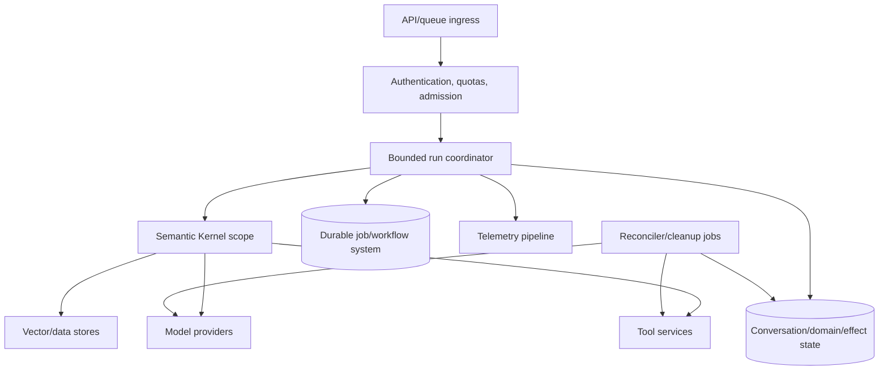
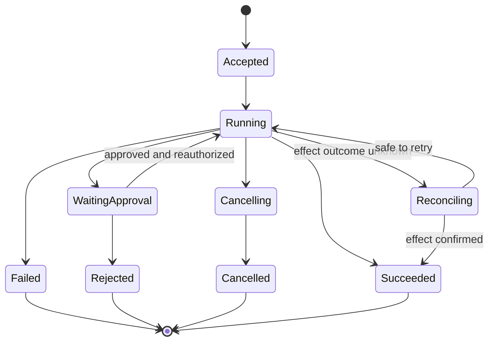

# Reliability, Deployment, and Operations

> **Research date:** 2026-08-31
> **Principle:** Deploy Semantic Kernel as a library inside an engineered service boundary. The host must supply durability, concurrency control, idempotency, budgets, and operational recovery.

## Runtime boundary



SK does not provide the ingress, state store, durable queue, effect ledger, or resource reconciler shown here.

## Choose the execution lane

| Workload | Lane | Why |
|---|---|---|
| Short read-only response | Synchronous request with strict deadline | Simple failure boundary and no long-lived effect |
| Tool loop with bounded low-risk calls | Synchronous or short durable job | Depends on latency and cancellation semantics |
| Writes, approvals, long waits, batch work | Durable job/workflow | Survives restarts and exposes operational state |
| Open-ended research/multi-agent run | Durable job with milestone budgets | Cost, time, and cancellation exceed request lifetime |

Do not keep an HTTP request open while waiting for a human approval or an unbounded agent team.

## Run state machine

Persist a small application-owned state machine:



Store run version, package/model/tool/prompt versions, budget consumption, thread/provider resource IDs, proposed effects, and terminal reason. Do not rely on a chat transcript to reconstruct this state.

## Timeouts, retries, and unknown outcomes

Use nested budgets:

```text
request/run deadline
  -> model call timeout and retry budget
  -> tool call timeout and retry budget
  -> dependency timeout
```

Each child timeout must leave time for cleanup and response. Coordinate SDK/provider automatic retries with application retries so attempts do not multiply unexpectedly.

Retry rules:

- Retry documented transient failures with bounded exponential backoff and jitter.
- Honor provider retry/rate-limit guidance.
- Do not retry policy, validation, schema, or deterministic tool errors.
- For an unknown write outcome, query by idempotency key or reconcile state before another attempt.
- Cap total model/tool attempts per run, not only per API call.

Exactly-once external effects are not supplied by SK. Aim for at-least-once delivery plus idempotent effects and reconciliation.

## Concurrency and backpressure

Apply limits at multiple levels:

- global and per-provider in-flight model calls;
- per-tenant and per-user runs;
- per-conversation single-writer lock/version;
- per-tool concurrency and rate limit;
- maximum parallel tool calls and agent fan-out;
- bounded queues and stream buffers.

Reject or queue excess work before paying model cost. Fair scheduling prevents one tenant or open-ended orchestration from exhausting capacity.

## State and resource ownership

Keep an inventory of:

- application run and conversation IDs;
- SK thread/history version;
- provider agent/thread/run/file/vector IDs;
- vector collection/schema/embedding versions;
- tool effect/idempotency records;
- approval records;
- deletion/cleanup state.

Write mappings atomically with the application state that depends on them. Background reconciliation should find provider resources with no live application owner, stale pending effects, expired approvals, and runs beyond their deadline.

## Deployment manifest

Make a release reproducible:

```text
application build and configuration revision
language/runtime version
SK core + every provider/agent/vector/process package version
provider API/deployment/model identifiers
prompt/template hashes
plugin/tool schema hashes
filter order and policy version
vector schema/chunker/embedding versions
feature flags and budget policy
```

Avoid floating model aliases for critical workloads unless an explicit provider-managed upgrade policy is accepted and tested.

## Health and readiness

Liveness should answer whether the host process/event loop is functioning. Readiness should check required configuration and dependency clients without invoking a billable model. Model capability belongs in a scheduled synthetic/canary test, not a high-frequency health endpoint.

Degrade explicitly:

- disable an unhealthy optional provider rather than silently route across policy boundaries;
- return a stable “temporarily unavailable” state for required tools;
- prevent a failed vector store from turning into unrestricted model guessing;
- stop accepting long jobs when the durable queue/state store is unavailable.

## Graceful shutdown

On shutdown:

1. stop admission;
2. mark/lease in-flight durable work for recovery;
3. allow bounded synchronous work to finish;
4. cancel provider streams and tool calls;
5. flush state/effect records before acknowledging work;
6. close MCP sessions, provider clients if owned, vector connections, and exporters;
7. release conversation/tool leases.

Never report success before the authoritative state and effect record are committed.

## Rollout and rollback

Canary upgrades by workload, tenant, or small traffic percentage. Compare success, refusal, tool selection, denials, iterations, cost, latency, stream errors, and resource cleanup. Retain state-schema compatibility across the rollback window.

Prompt, tool schema, model, connector, and package changes can each alter behavior. Change one dimension at a time when practical. Security patches may require a faster rollout; use the same bounded adoption suite and prioritize exposure reduction.

## Operational checklist

- [ ] Every run has deadline, token/cost, turn, tool-call, and concurrency limits.
- [ ] Writes have idempotency keys and an effect reconciliation path.
- [ ] Conversation/domain state is persisted outside process memory.
- [ ] Provider resources are inventoried and deleted by policy.
- [ ] Package/model/prompt/tool/vector versions are recorded per run.
- [ ] Retries are classified and bounded across all layers.
- [ ] Admission control and per-tenant fairness are enforced.
- [ ] Cancellation reaches providers, streams, and tools.
- [ ] Sensitive telemetry is off by default and exporters flush safely.
- [ ] Canary, rollback, cleanup, and incident procedures are tested.

## Failure modes

| Failure | Cause | Control |
|---|---|---|
| Restart loses conversation/run | Process memory treated as durable | External event/state store and resumable job |
| Model bill spikes | Nested retries or unbounded loop | Run-wide attempt/cost budget and admission control |
| Same email/payment sent twice | Unknown outcome blindly retried | Idempotency and provider reconciliation |
| Rollback cannot load state | State schema changed in place | Versioned envelope and backward-compatible rollout |
| Provider files accumulate | SDK abstraction hid lifecycle | Resource ledger, TTL, reconciled deletion |
| Health probes create cost/outages | Probe invokes model at high frequency | Cheap readiness plus scheduled synthetic checks |

## Primary sources

- [Semantic Kernel enterprise filters](https://learn.microsoft.com/en-us/semantic-kernel/concepts/enterprise-readiness/filters)
- [Semantic Kernel observability](https://learn.microsoft.com/en-us/semantic-kernel/concepts/enterprise-readiness/observability/)
- [Agent architecture and threads](https://learn.microsoft.com/en-us/semantic-kernel/frameworks/agent/agent-architecture)
- [Process Framework](https://learn.microsoft.com/en-us/semantic-kernel/frameworks/process/process-framework)
- [Semantic Kernel releases](https://github.com/microsoft/semantic-kernel/releases)

## Related guides

- [Agents, threads, and messages](agents-threads-and-messages.md)
- [Processes, planning, and orchestration](processes-planning-and-orchestration.md)
- [Observability, testing, and debugging](observability-testing-and-debugging.md)
