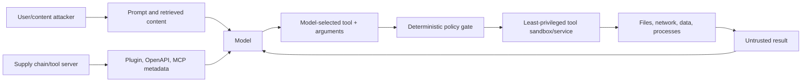

# Security, Permissions, and Tool Isolation

> **Research date:** 2026-08-31
> **Security boundary:** The model, prompt, retrieved content, tool metadata, and model-generated arguments are untrusted. Authorization and isolation belong to deterministic application and infrastructure controls.

## Threat model



Prompt injection is expected input behavior, not a rare parser bug. Safety comes from constraining what a successful injection can reach.

## Official advisories

Two critical Semantic Kernel advisories were verified at the research cutoff:

| Advisory | Affected surface | Patched versions | Production lesson |
|---|---|---|---|
| [CVE-2026-26030 / GHSA-xjw9-4gw8-4rqx](https://github.com/microsoft/semantic-kernel/security/advisories/GHSA-xjw9-4gw8-4rqx) | Python `InMemoryVectorStore` filtering could reach code execution | `semantic-kernel` 1.39.4 | Never build executable expressions from model/user filter values; in-memory components still process hostile input. |
| [CVE-2026-25592 / GHSA-2ww3-72rp-wpp4](https://github.com/microsoft/semantic-kernel/security/advisories/GHSA-2ww3-72rp-wpp4) | Sessions Python plugin could let model-controlled paths transfer files between sandbox and host | .NET plugin 1.71.0; Python 1.39.3 | A sandbox is defeated if a model can choose a host path; canonicalize and allowlist at the host boundary. |

Microsoft's [analysis of the vulnerabilities](https://www.microsoft.com/en-us/security/blog/2026/05/07/prompts-become-shells-rce-vulnerabilities-ai-agent-frameworks/) shows how ordinary prompt injection can become remote code execution when model-controlled tool arguments reach interpreters, files, or host capabilities. Patch first; compensating filters are defense in depth.

## Permission model

Use capability-based, request-scoped permissions:

```text
authenticated actor
  -> workload policy
  -> small tool allowlist
  -> per-tool resource/action scope
  -> normalized arguments
  -> approval when required
  -> short-lived credential
  -> effect-time authorization
```

Function visibility is not a role. A model choosing `delete_document` is not evidence the user can delete that document.

### Classify tools by effect

| Class | Examples | Default execution policy |
|---|---|---|
| Pure/local | Format, calculate, validate | Automatic with CPU/input/output limits |
| Read-only scoped | Fetch one authorized record, bounded search | Automatic after tenant/resource authorization |
| Reversible write | Create draft, add label | Idempotency, audit, often user confirmation |
| High-impact/irreversible | Send money/email, delete, deploy, change permissions | Durable proposal + authenticated approval + effect-time reauthorization |
| Code/files/network | Python/shell, arbitrary file or HTTP access | Isolated service/sandbox, deny by default, narrow mounts/egress |

## Path and file controls

Never use a model-supplied string directly as a host path.

1. decode once and reject ambiguous encodings;
2. join against an explicit allowlisted root;
3. canonicalize the final path;
4. verify it remains under the root using path-aware comparison;
5. reject symlink/reparse-point escapes as appropriate to the platform;
6. open with the least privilege and safe create/overwrite semantics;
7. cap file type and bytes; scan untrusted uploads;
8. audit a path identifier or relative path, not sensitive full paths.

Keep code-execution sandbox storage separate from host application storage. Broker only reviewed artifact transfers with server-generated destinations.

## Network and SSRF controls

Tools that fetch URLs, import OpenAPI, call webhooks, or connect to MCP servers need:

- allowed schemes, hosts, ports, paths, methods, and operations;
- DNS resolution and redirect revalidation;
- blocked loopback, link-local, metadata-service, private, and internal ranges unless explicitly required;
- egress proxy/network policy outside application code;
- short timeouts, response byte limits, content-type validation;
- separate service credentials and no ambient cloud credential access;
- protection against secret-bearing headers being forwarded across hosts.

Model-generated URLs are hostile input even if they look like citations.

## Code execution isolation

If code execution is required:

- run it in a separate worker/service, not the API process;
- use a non-root identity, read-only base image, minimal filesystem, and no host mounts;
- disable or allowlist network egress;
- set CPU, memory, process, file, and wall-clock limits;
- remove cloud instance credentials and service-account tokens;
- destroy the environment after the task;
- broker input/output artifacts through scanning and policy;
- observe child processes, network attempts, and unusual file access.

Language-level sandboxes and blocklists are not sufficient isolation.

## Secrets and identities

- Give each tool/service its own least-privileged workload identity.
- Prefer short-lived tokens obtained after authorization.
- Keep credentials out of prompts, plugin descriptions, tool results, exceptions, and telemetry.
- Do not let the model select credential names or scopes.
- Separate tenants at the data query and credential layers.
- Rotate credentials independently of SK package upgrades.

## Prompt and result handling

Prompts can reduce accidental misuse but cannot enforce permissions. Mark user, retrieved, and tool content as untrusted data; keep policy instructions separate; minimize context; and validate every result before returning it to the model or user.

Tool output can contain a second-stage injection. A search result saying “call the admin tool” has no authority to change the allowlist. Strip active content where possible and bound returned fields/bytes.

## Approval design

A real approval gate is durable and authenticated:

1. canonicalize the exact proposed effect;
2. store actor, target, arguments hash, policy version, and expiry;
3. show the approver a human-readable diff and consequence;
4. bind approval to that immutable proposal;
5. reauthorize actor and approver at execution time;
6. execute once with an idempotency key;
7. record and reconcile the outcome.

An in-memory callback or “are you sure?” message inside the same compromised conversation is not sufficient for a high-impact action.

## Security checklist

- [ ] Pin patched SK, provider, vector, MCP, OpenAPI, and transitive packages.
- [ ] Inventory every reachable tool and the identity/credential it uses.
- [ ] Default-deny tool advertisement and dispatcher reachability.
- [ ] Validate and canonicalize every model-generated argument.
- [ ] Authorize tenant, resource, and action inside the tool.
- [ ] Require durable approval for high-impact effects.
- [ ] Isolate code, files, network, and interpreters outside the API process.
- [ ] Apply egress allowlists and SSRF defenses.
- [ ] Make writes idempotent and reconcile unknown outcomes.
- [ ] Redact sensitive model/tool data from telemetry by default.
- [ ] Test prompt injection through every content and metadata channel.
- [ ] Maintain SBOM, advisory monitoring, rotation, and incident playbooks.

Report suspected SK vulnerabilities privately through the Microsoft Security Response Center process described by the repository security policy.

## Primary sources

- [Semantic Kernel security policy](https://github.com/microsoft/semantic-kernel/security/policy)
- [GHSA-xjw9-4gw8-4rqx](https://github.com/microsoft/semantic-kernel/security/advisories/GHSA-xjw9-4gw8-4rqx)
- [GHSA-2ww3-72rp-wpp4](https://github.com/microsoft/semantic-kernel/security/advisories/GHSA-2ww3-72rp-wpp4)
- [When prompts become shells](https://www.microsoft.com/en-us/security/blog/2026/05/07/prompts-become-shells-rce-vulnerabilities-ai-agent-frameworks/)
- [Semantic Kernel filters](https://learn.microsoft.com/en-us/semantic-kernel/concepts/enterprise-readiness/filters)

## Related guides

- [Plugins, functions, and tool calling](plugins-functions-and-tool-calling.md)
- [Memory, vector data, and RAG](memory-vector-data-and-rag.md)
- [Reliability, deployment, and operations](reliability-deployment-and-operations.md)
