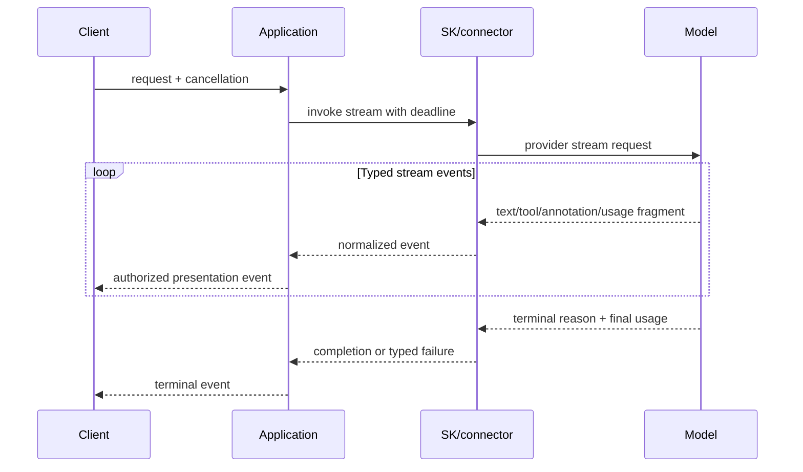
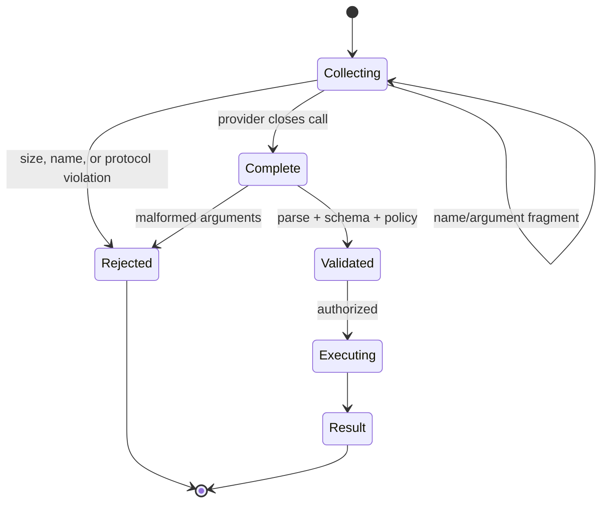

# Streaming, Structured Output, and Multimodality

> **Research date:** 2026-08-31
> **Principle:** Treat a stream as a typed event protocol and structured output as an untrusted schema instance—not as display text or trusted domain data.

## Streaming is a protocol

SK streaming APIs can emit text fragments, function-call fragments, function results, annotations, files/images, metadata, finish signals, and usage information. The [agent streaming documentation](https://learn.microsoft.com/en-us/semantic-kernel/frameworks/agent/agent-streaming) distinguishes complete message content from streaming content types.



Concatenating `str(chunk)` is acceptable for a demo, not for an audit log, tool dispatcher, or resumable UI.

## Normalize stream events

Define an application envelope independent of a connector's object model:

```text
run_id, sequence, timestamp
choice_index, content_index, role
event_type: text_delta | tool_call_delta | tool_result | annotation
          | usage | finish | error
tool_call_id, content_type, bounded payload
provider/model identifiers, trace ID
```

Preserve ordering within one provider stream. If multiple choices or tool calls interleave, aggregate by explicit choice/content/tool-call identifiers—not arrival timing alone.

## Tool-call fragments

Providers may stream a function name and JSON arguments across multiple chunks. Buffer by tool-call ID, enforce a maximum byte size, and wait for a complete terminal call before parsing and dispatching.



Never execute a partially parsed call. A valid JSON object is still untrusted input.

## Cancellation and backpressure

Cancellation must propagate from client to application, connector, provider request, automatic tool loop, and invoked tools. On disconnect:

1. stop accepting new tool calls;
2. cancel safe in-flight work;
3. reconcile any effect with unknown outcome;
4. dispose the stream/provider response;
5. finalize trace status and usage available so far;
6. persist a terminal application event.

Use bounded queues between provider and client. If a slow client cannot keep up, apply a defined coalescing policy for display-only text or cancel the run. Never buffer an unbounded response in memory.

## Structured output

SK exposes provider/connector-specific settings for response schemas or types. Python examples can use a Pydantic model as `response_format`; .NET connectors can accept response schemas/types through their execution settings. Support varies by connector and model.

A production pipeline has three validations:

```text
provider claims schema-constrained output
    -> parse and JSON/schema validation
    -> domain validation and normalization
    -> authorization/business rule validation
```

Schema validity does not prove that a date exists, a referenced resource belongs to the caller, a sum balances, or a proposed action is permitted.

Recommended schema properties:

- reject unknown fields where the language/model supports it;
- use enums and numeric/string bounds;
- distinguish optional from nullable;
- include a schema version outside model-controlled business fields;
- avoid polymorphic or deeply recursive schemas unless connector tests prove support;
- cap arrays and strings after parsing even if the provider cannot enforce every bound.

## Tools plus structured output

Some models/connectors can call functions and then return schema-constrained output; others have incompatible or subtly different modes. Verify:

- whether tool calls are allowed when `response_format` is active;
- whether strictness applies to the final response, tool arguments, or both;
- how refusals and content filters appear;
- whether streaming preserves valid incremental JSON;
- whether usage and finish reasons are reported after tool loops.

Do not assemble streamed JSON into a domain object until the response is terminal, unless using a parser specifically designed for partial documents and no effects depend on partial values.

## Multimodal content

Messages may contain images, audio, files, annotations, or provider references. Apply content-specific controls:

| Content | Minimum controls |
|---|---|
| Image/audio bytes | MIME sniffing, size/duration limits, malware scanning where applicable, metadata stripping |
| Remote URL | Scheme/host allowlist, redirect/DNS validation, egress proxy, byte/time cap |
| Provider file reference | Tenant/provider ownership check, expiry/retention tracking |
| Local file path | Canonicalize under an allowlisted root; never accept arbitrary model paths |
| Annotation/citation | Verify source ID and authorized source; do not render unsafe URLs directly |

## Prompt-template portability

SK prompt formats are not fully language-portable. The official feature matrix lists SK and Handlebars formats broadly, while Liquid is .NET-oriented and Jinja2 is Python-oriented; Prompty/YAML support also depends on language/package maturity. Treat template parsing, escaping, helpers, and variable behavior as executable code: pin the format, validate required inputs, and render-test before migration.

## Failure modes

| Failure | Cause | Control |
|---|---|---|
| Tool executes with truncated arguments | Dispatcher acts on partial stream | Buffer by call ID; dispatch only terminal validated call |
| Final usage/cost missing | Client stops after text | Consume/settle terminal metadata or record partial state |
| Memory grows with slow clients | Unbounded stream buffering | Bounded queue and cancel/coalesce policy |
| Schema-valid action is unsafe | Schema mistaken for authorization | Domain and policy validation after parsing |
| Cross-tenant file shown | Provider reference trusted | Resource ownership lookup before presentation/tool use |
| Streaming trace reports success after late error | Only stream creation instrumented | Wrap enumeration and terminal status |

## Primary sources

- [Agent streaming](https://learn.microsoft.com/en-us/semantic-kernel/frameworks/agent/agent-streaming)
- [Chat completion, including streaming APIs](https://learn.microsoft.com/en-us/semantic-kernel/concepts/ai-services/chat-completion/)
- [Structured outputs in Semantic Kernel](https://devblogs.microsoft.com/agent-framework/using-json-schema-for-structured-output-in-net-for-openai-models/)
- [Prompt template syntax](https://learn.microsoft.com/en-us/semantic-kernel/concepts/prompts/prompt-template-syntax)
- [Semantic Kernel supported languages](https://learn.microsoft.com/en-us/semantic-kernel/get-started/supported-languages)

## Related guides

- [Agents, threads, and messages](agents-threads-and-messages.md)
- [Filters, middleware, and policy](filters-middleware-and-policy.md)
- [Observability, testing, and debugging](observability-testing-and-debugging.md)
