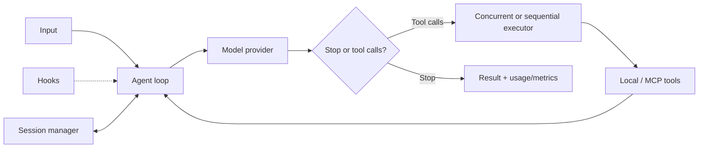
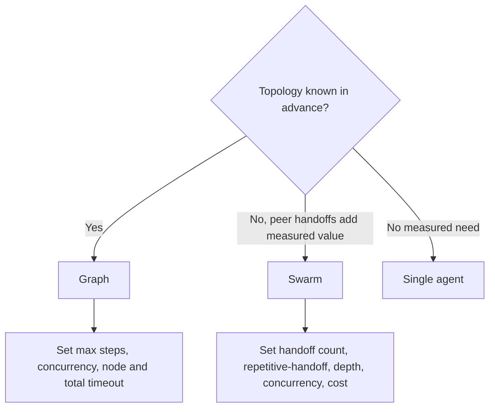

# Strands Agents in Production

**Research date:** 2026-08-31  
**Status:** Research-backed technology guide  
**Scope:** Current Python and TypeScript SDK concepts; Graph, Swarm, and AWS AgentCore are evaluated as distinct surfaces

## Bottom line

Choose Strands Agents when a compact model-driven loop, Python or TypeScript, provider choice, MCP, hooks, OpenTelemetry, and an optional AWS deployment path fit the platform. Its clear loop and cancellation documentation make behavior inspectable, but sessions are continuity—not durable effect recovery—and multi-agent semantics differ by language.

Keep business state, operation identity, authorization, hard limits, and effect reconciliation outside the session manager.

## Runtime model



Hooks are useful for lifecycle policy, telemetry, and customization. Do not make a hook the only authorization boundary if another execution path can bypass it.

## Concurrency is a semantic choice

The default executor may run independent tool calls concurrently. This improves latency only when calls are actually independent.

| Tool relationship | Executor choice | Required control |
|---|---|---|
| Read-only, disjoint resources | Concurrent | Per-provider and per-tenant concurrency limits |
| Write then read | Sequential | Stable ordering and version check |
| Multiple writes to one resource | Sequential or transactional service | Idempotency/compare-and-set |
| Expensive independent calls | Bounded concurrent | Cost and cancellation fan-out |
| Unknown model-generated dependencies | Sequential by default | Let workflow code expose safe parallel groups |

Never let the model's emission of parallel calls determine database correctness. Put ordering constraints in the tool/workflow layer.

## Cancellation is cooperative

Current Strands loop documentation specifies frequent cancellation checks, provider propagation, best-effort local cancellation for in-flight remote MCP work, and cooperative tool cancellation. A cancellation set before invocation may still allow the user message to enter session state and a model request to begin and then abort.

```mermaid
sequenceDiagram
    participant App
    participant Agent
    participant Tool
    participant Remote
    App->>Agent: invoke(deadline)
    Agent->>Tool: execute(cancel context)
    Tool->>Remote: effect(operation_id)
    App-->>Agent: cancel
    Agent-->>Tool: cooperative cancel
    Note over Tool,Remote: remote effect may still finish
    Remote-->>Tool: late success or unknown
    Tool-->>App: reconcile; do not commit to cancelled run blindly
```

Propagate deadlines to provider and tool clients, limit individual network calls, and stop accepting state commits after the run loses authority. If a write times out, query by operation ID before retrying.

## Session management is not workflow durability

Session managers can persist and restore messages and agent state through file, S3, or custom storage. This is useful for conversational continuity. It does not automatically provide:

- transactional coordination between state and an external effect;
- exactly-once delivery;
- leases and duplicate worker suppression;
- timers, schedules, compensation, or human-wait lifecycle;
- consistent concurrent writes across replicas;
- deterministic version migration.

Use a database or durable workflow as the business owner when those properties matter. Store large tool results as artifacts and keep references in the session.

## Graph and Swarm need a language-specific contract

Strands provides Graph for explicit topology and Swarm for model-driven peer handoffs. Current Python and TypeScript documentation differs in state sharing, global limits, handoff input, status mapping, cancellation, and repetitive-handoff behavior across resume. Some TypeScript Graph limits can be effectively unbounded unless configured.



Nested orchestrators may have their own timeout and limit scope. Pass a shared deadline and budget context downward. Define terminal statuses at the application boundary so a language/runtime change cannot silently reinterpret partial failure.

Start with a single-agent baseline. Add Graph when deterministic dependency structure improves quality or operations. Add Swarm only when decentralized handoffs beat a manager or ordinary routing on repeated evaluations.

## AgentCore is complementary

AWS Bedrock AgentCore supplies managed runtime, identity/gateway, memory, observability, evaluation, and related platform services. It is an optional deployment/operations choice, not a property of the open-source Strands loop.

Evaluate the combined system for runtime isolation, workspace persistence, credentials, egress, regional availability, quotas, retention, trace export, cold starts, deployment rollback, and pricing. The published OneAdvanced architecture shows more than 50 specialized agents can be organized in a UK-sovereign AWS environment; it is architecture evidence, not a universal quality or cost benchmark.

## Operational acceptance tests

- [ ] Cancel before invocation and inspect session/model side effects.
- [ ] Cancel every provider, local async/sync tool, and remote MCP tool.
- [ ] Crash between external effect, tool result, session write, and final response.
- [ ] Run concurrent calls against file, S3, and production session backends.
- [ ] Prove sequential behavior for dependent tool calls and bounded parallel behavior otherwise.
- [ ] Exercise Graph and Swarm step, handoff, concurrency, depth, and timeout ceilings.
- [ ] Compare Python and TypeScript terminal statuses and state transfer for the chosen topology.
- [ ] Propagate one total deadline into every nested orchestrator and tool.
- [ ] Verify hooks, logs, spans, sessions, and exceptions redact sensitive data.
- [ ] Replay old sessions and state after SDK and schema upgrades.
- [ ] Reconcile ambiguous writes without blind retry.

## Choose it when

- a lightweight, inspectable loop and hooks are preferable to a large graph abstraction;
- Python/TypeScript and the supported provider/MCP surface match the workload;
- the organization benefits from AWS/AgentCore alignment while keeping the agent code relatively portable;
- it can separately own durability, state consistency, and external effects.

## Prefer another shape when

- checkpointed state graphs and time travel dominate: compare LangGraph;
- strict Python type/validation integration dominates: compare Pydantic AI;
- TypeScript UI message streaming dominates: compare AI SDK;
- Graph/Swarm defaults or cross-language differences conflict with platform requirements;
- long-lived process recovery dominates: put the agent inside a durable workflow.

## Primary sources

- [Agent loop](https://strandsagents.com/docs/user-guide/concepts/agents/agent-loop/), [hooks](https://strandsagents.com/docs/user-guide/concepts/agents/hooks/), and [sessions](https://strandsagents.com/docs/user-guide/concepts/agents/session-management/)
- [Model providers](https://strandsagents.com/docs/user-guide/concepts/model-providers/), [Graph](https://strandsagents.com/docs/user-guide/concepts/multi-agent/graph/), and [Swarm](https://strandsagents.com/docs/user-guide/concepts/multi-agent/swarm/)
- [Production operations](https://strandsagents.com/docs/user-guide/deploy/operating-agents-in-production/) and [Python SDK releases](https://github.com/strands-agents/sdk-python/releases)
- [OneAdvanced production architecture](https://aws.amazon.com/blogs/machine-learning/how-oneadvanced-deployed-over-50-ai-agents-on-uk-sovereign-aws/)

See [independent framework selection](../comparisons/independent-agent-frameworks.md) and the [research packet](../research/packets/independent-agent-frameworks.md).
