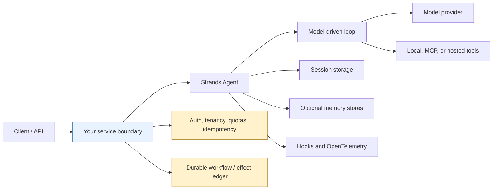
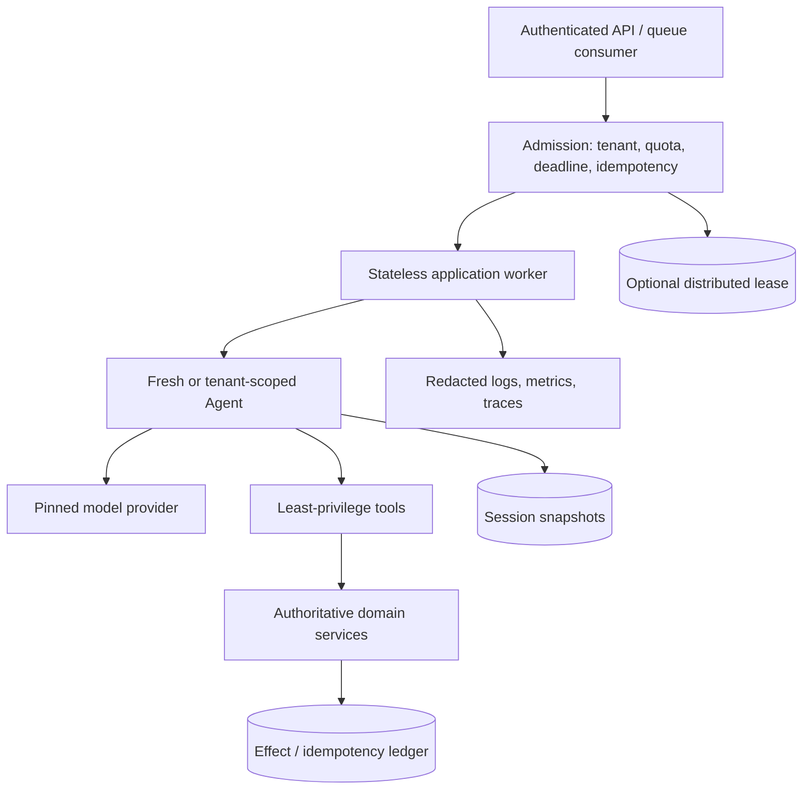

# Strands Agents: Production Engineering Guide

> Research date: **2026-08-31**
>
> Release snapshot: **`strands-agents` 1.54.0 (Python)** and **`@strands-agents/sdk` 1.14.0 (TypeScript)**
>
> Scope: the Strands Agents SDKs and their integration boundaries, not a generic agent tutorial or a promise of hosted workflow durability.

Strands Agents is an open-source, model-driven agent harness for Python and TypeScript. It runs inside an application process: the SDK owns an agent loop, normalizes model streams, dispatches tools, maintains conversation state, emits hooks and telemetry, and provides several orchestration patterns. It is **a library, not a hosted agent platform**. Deployment, request admission, tenant isolation, distributed coordination, durable side effects, and transport protocols remain application or platform responsibilities.

The safest mental model is:

Sessions can restore SDK state; they do not make tool side effects exactly once. A graph can order nodes; it is not automatically a crash-safe workflow engine. AgentCore can host an agent in isolated runtime sessions; it does not remove the need for application identity binding or durable business state.

## Guide map

| Guide | Primary production question |
|---|---|
| [Runtime loop and events](runtime-loop-and-events.md) | What does an invocation actually do, and where can it stop? |
| [Models, messages, and prompts](models-messages-and-prompts.md) | What is portable across providers, and what is provider-specific? |
| [Tools, ToolContext, and MCP](tools-tool-context-and-mcp.md) | How should capabilities, request context, and remote tools be exposed? |
| [Sessions, state, and memory](sessions-state-and-memory.md) | Which state belongs where, and what is genuinely durable? |
| [Streaming and event protocols](streaming-and-event-protocols.md) | How should SDK events cross an API or UI boundary? |
| [Hooks, telemetry, and observability](hooks-telemetry-and-observability.md) | Where can behavior be observed or changed safely? |
| [Graphs, swarms, and workflows](multi-agent-graphs-swarms-and-workflows.md) | Which orchestration pattern fits, and how do the SDKs differ? |
| [Guardrails, HITL, and security](guardrails-hitl-and-security.md) | How should authorization, approval, isolation, and content controls compose? |
| [Testing, evaluation, and debugging](testing-evaluation-and-debugging.md) | How do deterministic tests and probabilistic evaluation fit together? |
| [Reliability, retries, and cancellation](reliability-retries-and-cancellation.md) | What is retried or cancelled, and what must tools implement? |
| [Deployment, scaling, and cost](deployment-scaling-and-cost.md) | How should a Strands service be hosted and economically bounded? |
| [Language parity, versioning, and alternatives](language-parity-versioning-and-alternatives.md) | What is actually shared between Python and TypeScript? |

The supporting [research packet](../../research/packets/strands-agents-deep-dive.md) records the evidence base, version snapshot, disagreements, and refresh triggers used by these guides.

## The five boundaries to preserve

### 1. SDK versus model provider

Strands normalizes a common event loop, but provider capabilities remain uneven. Tool-schema support, parallel tool calls, multimodal blocks, prompt caching, reasoning content, guardrails, built-in server tools, usage accounting, cancellation, and stop reasons can differ. Pin a provider and model identifier in production and run a capability contract suite against every allowed combination.

### 2. Local tools versus MCP versus hosted tools

- A local tool is code running with the service process's authority unless a sandbox or separate service boundary is added.
- MCP is a protocol and transport boundary. It does not make a server trustworthy or authorize a caller automatically.
- Provider-hosted tools execute under that provider's contract; their approvals, outputs, citations, pricing, and retention behavior may not map fully into Strands.

Treat all three as distinct security and reliability surfaces.

### 3. Conversation context versus application state

Messages are model-visible context. Agent state is JSON-serializable application state and is not automatically sent to the model. Invocation state carries request-scoped objects. Sessions persist selected SDK state. Memory stores cross-session facts or searchable content. Mixing these categories causes privacy leaks, context bloat, and unreliable recovery.

### 4. Orchestration versus durable execution

Agents-as-tools, Graph, and Swarm coordinate model and tool work. They do not by themselves provide transactional checkpoints, distributed leases, exactly-once effects, compensations, or an immutable business audit log. Put irreversible operations behind idempotency keys and authoritative services. Use a durable workflow system when execution must survive arbitrary process loss without replay ambiguity.

### 5. SDK versus hosting platform

Strands can run in FastAPI, Express, Next.js, Lambda, containers, Kubernetes, or Amazon Bedrock AgentCore Runtime. AgentCore is complementary managed infrastructure with isolated runtime sessions, identity and observability integrations. It is not required by the SDK and should not be confused with Strands session storage or Bedrock Agents.

## Production invariants

Adopt these before expanding autonomy:

- Pin the SDK, provider integration, model ID, tool packages, MCP protocol expectations, and deployment image.
- Translate SDK events into an application-owned [state and event contract](../../runtime/agent-state-and-event-contracts.md) with stable identities, fenced terminal state, replay rules, and redacted projections.
- Create one tenant-bound execution context per request or conversation; never let the model choose a tenant namespace or principal.
- Set turn, token, wall-clock, concurrency, tool, and orchestration limits explicitly.
- Give every externally visible mutation an application-generated idempotency key and an authoritative result record.
- Keep authorization at the capability boundary. A system prompt, guardrail, or LLM classifier is not authorization.
- Default to no host shell, filesystem, or network access. Add narrowly scoped capability after threat modeling.
- Treat restored messages, snapshots, memory, MCP responses, tool output, and web content as untrusted input.
- Redact or suppress prompts, reasoning, tool arguments, tool results, and memory values in events, logs, and spans.
- Test cancellation at every blocking boundary; assume already-started concurrent work may finish.
- Use deterministic tests for contracts and controls, recorded or provider integration tests for stream behavior, and repeated evaluations for outcome quality.
- Roll out model, prompt, tool, and SDK changes behind versioned experiments and canaries.

## A minimal architecture that scales safely

An agent object is mutable: it owns messages, state, hooks, and often session behavior. The default safe service design avoids concurrent invocations on the same object. Either create an agent for the request, maintain an explicitly bounded per-session actor, or serialize access using an application lease. A durable store such as S3 does not make two simultaneous writers safe.

## Adoption path

1. Begin with one agent and a small tool allowlist.
2. Define typed tool inputs and deterministic service-side validation.
3. Add invocation limits, cancellation, telemetry redaction, and session policy.
4. Build contract tests and an evaluation set from real failure cases.
5. Add agents-as-tools when specialization measurably improves quality.
6. Use Graph for explicit topology or Swarm for justified peer handoffs.
7. Introduce durable workflow infrastructure only for business processes that need it.

More agents, more memory, and more context are not maturity signals. Lower variance, bounded authority, reproducible evaluation, and recoverable effects are.

## Snapshot and refresh policy

This area was checked on **2026-08-31** against the consolidated [`strands-agents/harness-sdk`](https://github.com/strands-agents/harness-sdk) repository at commit `9062527e`, the published Python and TypeScript packages, official Strands documentation, AWS AgentCore and Lambda documentation, security advisories, and a bounded set of maintainer issues.

Refresh this guide when any of the following occurs:

- either SDK moves to a new major version;
- Graph, Swarm, sessions, checkpoints, interventions, memory, or MCP Tasks leaves or enters experimental status;
- the official language feature matrix changes materially;
- default models, retry limits, event types, storage layouts, or cancellation semantics change;
- AgentCore Runtime lifecycle, protocol, quota, or pricing rules change;
- a security advisory affects the core SDK, vended tools, MCP stack, or provider integration;
- an application depends on a provider feature not covered by its contract tests.

## Primary sources

- [Official Strands Agents documentation](https://strandsagents.com/docs/)
- [Consolidated Strands Agents monorepo](https://github.com/strands-agents/harness-sdk)
- [Python package on PyPI](https://pypi.org/project/strands-agents/)
- [TypeScript package on npm](https://www.npmjs.com/package/@strands-agents/sdk)
- [Amazon Bedrock AgentCore developer guide](https://docs.aws.amazon.com/bedrock-agentcore/latest/devguide/what-is-bedrock-agentcore.html)
- [Strands Agents Tools security advisories](https://github.com/strands-agents/tools/security/advisories)
