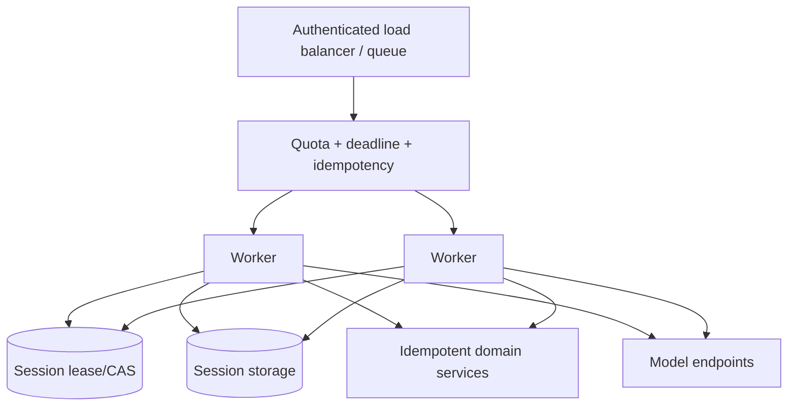

# Deployment, Scaling, and Cost

> Research date: **2026-08-31** · Release snapshot: Python 1.54.0 / TypeScript 1.14.0

Strands runs in your process. Hosting choice should follow invocation duration, streaming, isolation, state ownership, network access, and operational constraints—not an assumption that the SDK requires an AWS agent service.

## Deployment options

| Platform | Best fit | Principal trade-offs |
|---|---|---|
| Existing FastAPI/Express/Next service | short interactive runs, existing platform | share process resources carefully; mutable agents need ownership |
| Lambda | short bounded/bursty buffered work | 15-minute max, cold start, streaming/runtime constraints, ephemeral state |
| ECS/Fargate/App Runner | HTTP/SSE workers without cluster ops | container lifecycle, connection draining, task sizing |
| EKS/Kubernetes | existing cluster, custom scheduling/networking | highest operational complexity |
| EC2 | specialized host/control requirements | patching/scaling/tenancy ownership |
| AgentCore Runtime | managed agent-oriented isolated sessions, HTTP/WebSocket | AWS-specific protocol, quotas, lifecycle, pricing, service integration |

The official Strands deployment pages are useful starting examples, not production security templates. Replace broad IAM policies, mutable image tags, development servers, and console-oriented defaults.

## Stateless workers, explicit state

An agent object is mutable. Scale safely by making ownership visible:



Prefer a fresh agent per request/session activation, with heavyweight safe clients reused through dependency injection. If an in-memory agent remains active across turns, route one session to one actor and expire it deliberately. Never share one agent across simultaneous users.

Use a distributed lease/CAS when any replica can load the same session. Session storage alone is not concurrency control. Partition storage, memory, cache, traces, and quotas by trusted tenant identity.

## Container baseline

- pin an immutable image digest and lockfile;
- run as non-root with read-only root filesystem;
- remove shells/package managers when unnecessary;
- mount only task-scoped writable storage;
- restrict outbound network and metadata-service access;
- use workload identity and short-lived credentials;
- expose health/readiness separately from agent work;
- set CPU/memory/process/file limits;
- propagate termination to cancellation and drain;
- scan SDK, provider, MCP, and tools dependencies independently.

If code/file/shell tools are required, run them in a separate disposable sandbox boundary, not merely the same container user as the API.

## Lambda

AWS currently limits one Lambda invocation to 900 seconds. The official Strands Python example is buffered; Lambda can support response streaming through specific integrations, but Python requires a custom runtime or adapter and region/protocol constraints apply. A client disconnect does not automatically stop streamed execution or billing.

Lambda is suitable when runs comfortably fit the timeout and do not need a durable connection. Establish MCP connections per invocation first; warm reuse needs explicit tenant-safe connection semantics. Store sessions externally and treat `/tmp` and module memory as caches only.

Pin the exact SDK in a custom layer/image. The published Strands layer can lag the latest package, so verify its layer-to-SDK mapping. Package native dependencies for the target architecture. Reserve enough time for session save and effect reconciliation before Lambda timeout.

## Amazon Bedrock AgentCore Runtime

AgentCore is optional managed hosting, separate from the Strands SDK and Strands session manager. Current AgentCore Runtime provides isolated execution sessions and HTTP/WebSocket contracts. AWS documentation states that microVM sessions receive dedicated compute/memory/filesystem isolation and are sanitized after termination.

Important current semantics:

- the client/application must bind authenticated users to runtime session IDs; AgentCore does not enforce that mapping;
- session compute is ephemeral by default;
- default idle termination is 15 minutes and microVM maximum lifetime is 8 hours within current configurable limits;
- stopped sessions can activate on a later invocation, but in-memory/filesystem state is gone unless explicit session storage/memory is configured;
- concurrent lifecycle operations can return retryable HTTP 409 while provisioning/teardown is in progress;
- current quotas include new-session creation rate and WebSocket frame rate;
- the agent container must implement the selected protocol contract and health behavior.

AgentCore Memory, runtime session storage, Strands sessions, and a domain database are different stores. Decide which is authoritative for each datum. Use inbound IAM/OAuth, outbound identity, least-privilege runtime roles, private networking where appropriate, and redacted CloudWatch/OTel telemetry.

AgentCore also offers instance-backed compute for specialized/persistent resource needs; that has different lifecycle and pricing from consumption-based microVMs. Re-check current regional availability and quotas before choosing it.

## Scaling limits

Capacity-plan the amplification factor:

```text
model_calls_per_request
  = agent_turns
  + structured_output_repairs
  + model_retries
  + memory_extraction_calls
  + sum(child_agent_turns)
```

Then include parallel tools, MCP connections, guardrail calls, and judge/evaluation work. Limit per-tenant active sessions, total model calls, graph concurrency, and downstream connections. A new-session rate quota can become the bottleneck even when steady-state runtime capacity is adequate.

Use queue age and absolute deadline to discard stale work. Autoscaling on CPU alone misses external I/O saturation; include active runs, queue depth/age, model/tool semaphore utilization, throttles, memory, and connection counts.

## Cost model

Total cost per successful task includes:

```text
model input + model output
+ prompt-cache writes/reads
+ model retries and repair turns
+ child-agent / evaluator / memory-extractor model calls
+ hosted tools, guardrails, MCP and domain APIs
+ runtime CPU and peak memory
+ storage, telemetry ingestion/retention, and network
+ failed/cancelled work and human review
```

AgentCore microVM billing currently uses active CPU consumption and peak memory per second, including runtime overhead; exact rates vary and should be read from the dated official pricing page. Do not hard-code a price copied into design documentation. Store provider/service price catalog version with estimates and reconcile with billed cost/usage reports.

Optimize in this order:

1. improve success rate and remove loops/retries;
2. choose the smallest capable model per bounded task;
3. reduce irrelevant prompt/tool schemas and context;
4. use caching only where measured reuse beats write cost;
5. reduce unnecessary multi-agent calls;
6. cap tool output and memory injection;
7. right-size runtime and telemetry retention.

Report cost per **successful** task and by tenant/version, not only average tokens per request.

## Release and operations

- deploy immutable prompt/tool/model/policy/application versions;
- run provider and session migration tests;
- canary with strict budgets and automatic rollback signals;
- drain streams and persist terminal status on shutdown;
- monitor stop reasons, retries, throttles, tool errors, state conflicts, session-start failures, and cost;
- retain a rollback for model alias/config as well as code;
- rehearse provider outage, storage conflict, secret rotation, and region failure.

## Checklist

- [ ] Platform matches maximum duration and streaming/connection requirements.
- [ ] Agent instances and sessions have a single ownership model.
- [ ] External state, leases, and idempotency are multi-replica safe.
- [ ] Containers and powerful tools are least privilege and isolated.
- [ ] AgentCore user/session binding and ephemeral state are handled by the app.
- [ ] Quotas cover session starts, model calls, tools, connections, and telemetry.
- [ ] Cost includes loop amplification and non-token services.
- [ ] Deployment, model, prompt, policy, and tool versions can roll back independently.

## Sources

- [Operating agents in production](https://strandsagents.com/docs/user-guide/deploy/operating-agents-in-production/)
- [Deploy with Docker](https://strandsagents.com/docs/user-guide/deploy/deploy_to_docker/)
- [Deploy to Lambda](https://strandsagents.com/docs/user-guide/deploy/deploy_to_aws_lambda/)
- [Deploy to AgentCore](https://strandsagents.com/docs/user-guide/deploy/deploy_to_bedrock_agentcore/)
- [AgentCore isolated sessions](https://docs.aws.amazon.com/bedrock-agentcore/latest/devguide/runtime-sessions.html)
- [AgentCore quotas](https://docs.aws.amazon.com/bedrock-agentcore/latest/devguide/bedrock-agentcore-limits.html)
- [AgentCore pricing](https://aws.amazon.com/bedrock/agentcore/pricing/)
- [Lambda quotas](https://docs.aws.amazon.com/lambda/latest/dg/gettingstarted-limits.html)

