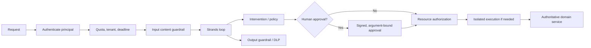

# Guardrails, Human-in-the-Loop, and Security

> Research date: **2026-08-31** · Release snapshot: Python 1.54.0 / TypeScript 1.14.0

Secure Strands systems compose deterministic authorization, least privilege, isolation, content controls, and human decisions. Prompts and model guardrails influence model behavior; they do not authorize external effects.

## Layered control model



No single layer replaces another:

- **System prompt:** task guidance, never a security boundary.
- **Provider guardrail:** filters/classifies model content; does not automatically inspect/authorize tool effects.
- **Intervention:** runtime checkpoint around model/tool lifecycle.
- **HITL:** obtains a decision; its binding and identity determine its value.
- **Cedar/domain policy:** deterministic principal/action/resource authorization.
- **Sandbox:** limits impact if code/tool execution is compromised.
- **Domain service:** enforces final authorization, validation, idempotency, and audit.

## Interventions

Current Strands interventions support typed outcomes such as proceed, deny, guide, confirm, and transform at before-invocation/tool/model and after-tool/model points.

- **Deny** should terminate a prohibited action with a stable safe reason.
- **Guide** supplies corrective feedback and can cause another model cycle. There is no reason to assume convergence; count guidance attempts in turn/time/token budgets.
- **Confirm** applies before tool execution and can interrupt for a decision.
- **Transform** changes model/tool data and must preserve schema/provenance.

Handlers have error modes. For authorization, DLP, spending controls, or high-risk tools, fail closed. A “proceed on policy error” option is suitable only for non-security guidance. Test direct tool calls and alternate invocation paths because not every path supports interrupts or traverses the same model lifecycle.

## Human approval that means something

The vended HITL intervention supports interrupt/resume, console and custom callbacks, allowlists, an optional model classifier, and trust state. A model risk classifier is advisory: an attacker can influence it and it lacks authoritative resource context.

Approval must bind to a canonical challenge:

```json
{
  "approval_id": "appr_...",
  "principal": "user_...",
  "tenant": "tenant_...",
  "tool": "transfer_funds",
  "normalized_args_hash": "sha256:...",
  "resource": "account_...",
  "operation_id": "op_...",
  "expires_at": "...",
  "policy_version": "..."
}
```

On resume, verify signer/principal, tenant, expiry, one-time use, exact arguments/resource, operation ID, and current policy. If the model changes any material argument, request a new approval. “Trust this tool” by name is too broad for resource-sensitive or variable-amount operations.

Interrupt payloads and responses must be JSON-serializable for persistence. Concurrent sibling tools may finish before an interrupt pauses the remaining batch. Direct tool calls do not support the normal interrupt path. Design approval before starting a batch of related mutations.

## Cedar and service authorization

The vended Cedar intervention models principal, action/tool name, resource, static context, invocation context, and session state. Its default-deny posture and engine-failure denial are appropriate for deterministic policy. Current TypeScript also exposes namespace-related support not identical to Python.

Still authorize again in the domain service. Tool name is not enough: `read_record` may be allowed for one record and forbidden for another. An in-agent call counter is also not a distributed rate limit across replicas. Use a centralized quota/rate service for global enforcement.

Validate policy/schema on deployment, apply updates atomically, and retain the previous valid policy when reload fails. Log policy decision ID and reason without sensitive context.

## Bedrock Guardrails

Bedrock Guardrails can cover configured input and output around the model request. Current Strands configuration offers choices such as input redaction and whether to assess output/latest user input. Provider role mapping means tool results can interact with input guardrails in surprising ways.

AWS's 2026 Strands security guidance explicitly shows that tool interactions require separate lifecycle validation. Use guardrails for content safety and DLP, then interventions and service policy for tool calls. Regression-test:

- malicious instructions in user, retrieved, MCP, and tool-result content;
- sensitive values in model output and tool arguments;
- false positives on valid tool results;
- guardrail outage/throttling and fail behavior;
- streaming output released before final assessment.

## Untrusted history and indirect injection

Treat complete messages, session snapshots, memory, documents, web pages, MCP output, and tool results as untrusted. Never allow a caller to forge assistant/tool-use roles. Separate data from instructions with structured content and clear provenance, but assume the model may still follow malicious embedded text.

Reduce impact rather than trying to “prompt away” injection:

- minimize available tools and scopes;
- separate read and write agents/credentials where useful;
- require deterministic validation/approval for mutations;
- isolate code/browser/file execution;
- restrict network egress and credential forwarding;
- bound retrieved content and strip active/irrelevant material;
- verify important claims against authoritative services.

## Dependency and tool security

Core SDK, provider clients, MCP, sandboxes, and community tools have different release/advisory streams. At research time, the core harness repository did not show a published GitHub advisory, while the separate `strands-agents-tools` package had recent high-impact fixes:

| Vulnerability | Fixed version | Control lesson |
|---|---:|---|
| Python REPL consent bypass, CVE-2026-78379 | 0.8.5 | prompt consent cannot secure host code execution |
| Memory namespace IDOR, CVE-2026-19111 | 0.8.3 | tenant scope must not be model input |
| HTTP proxy credential exfiltration, CVE-2026-18394 | 0.8.2 | constrain destinations and credential forwarding |
| Shell consent bypass, CVE-2026-18733 | 0.8.0 | isolate host execution and remove bypassable flags |
| Elasticsearch credential disclosure, CVE-2026-15746 | 0.7.0 | sanitize tool errors/results |

Those are minimum fixed releases for individual defects, not a declaration that powerful tools are safe. Upgrade to the latest reviewed release, scan images/locks, remove unused extras, and isolate execution.

## Security checklist

- [ ] External API accepts user content, not arbitrary assistant/tool history.
- [ ] Principal and tenant are derived from authentication and propagated outside model control.
- [ ] Every tool has resource-level authorization and least-privilege credentials.
- [ ] Provider guardrails and tool authorization are treated as separate layers.
- [ ] Policy/intervention failures fail closed for protected actions.
- [ ] Approvals bind exact normalized arguments, operation, principal, and expiry.
- [ ] Shell/code/file/browser tools are absent or strongly isolated.
- [ ] Outbound network and credential forwarding are allowlisted.
- [ ] Sessions, memory, logs, traces, and approval records have retention/access controls.
- [ ] Dependency advisories and model/provider changes trigger reevaluation.

## Sources

- [Interventions](https://strandsagents.com/docs/user-guide/concepts/agents/interventions/)
- [Human-in-the-loop intervention](https://strandsagents.com/docs/user-guide/concepts/agents/interventions/human-in-the-loop/)
- [Cedar authorization](https://strandsagents.com/docs/user-guide/concepts/agents/interventions/cedar-authorization/)
- [AWS: extend Bedrock Guardrails to tool interactions](https://aws.amazon.com/blogs/security/extend-amazon-bedrock-guardrails-to-tool-interactions-using-the-strands-agents-sdk/)
- [Strands Agents Tools advisories](https://github.com/strands-agents/tools/security/advisories)
- [AWS bulletin for CVE-2026-78379](https://aws.amazon.com/security/security-bulletins/2026-089-aws/)
