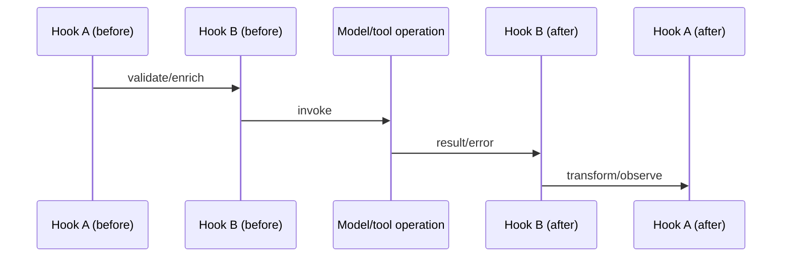

# Hooks, Telemetry, and Observability

> Research date: **2026-08-31** · Release snapshot: Python 1.54.0 / TypeScript 1.14.0

Hooks are synchronous control-plane extensions inside the agent lifecycle. OpenTelemetry is the diagnostic data plane. Both can expose sensitive prompts and tool data, affect latency, and change behavior; they need the same engineering discipline as request middleware.

## Hook lifecycle

Both SDKs provide before/after events around invocation, model calls, tool batches, individual tools, message additions, multi-agent invocation, nodes, handoffs, and results. TypeScript also uses typed events in its streaming surface.

Depending on the event, a hook can:

- cancel a model or tool path;
- change selected tool/input;
- replace or retry a result;
- deny, guide, or end a turn through integrated control paths;
- resume after an invocation;
- observe timing, state, usage, and errors.

This is intentionally powerful. Treat mutating hooks as part of runtime semantics, not “logging callbacks.”

## Ordering

Hooks have numeric order bands. Lower order runs earlier for before-events. After-events unwind in reverse registration order within their ordering semantics, like middleware cleanup. Named constants such as SDK-first/default/SDK-last are conventions, not absolute numeric barriers.



Register order explicitly and test it. Two hooks mutating the same tool input or result can be non-commutative. Avoid hidden dependencies between third-party hook providers.

## Failure policy

For each hook decide:

- **fail closed:** authorization, tenant binding, approval, DLP, budget enforcement;
- **fail open:** optional analytics or non-critical debug enrichment;
- **degrade:** emit a stable status and continue with a reduced feature.

Keep hook work bounded. Network calls in a hook are on the critical path unless explicitly decoupled. Apply a timeout and circuit breaker to remote policy/telemetry systems and make the security failure behavior explicit.

An after-invocation hook can resume the loop. This is useful for review or recovery but can create an autonomous unbounded cycle. Count resumes in the same overall turn/time/token budget.

Use first-class interventions or service-side authorization for critical decisions. A private hook that silently cancels a tool is easy to bypass in direct calls or future execution paths unless all entry points share it.

## Trace model

Current Strands telemetry builds a hierarchy roughly like:

```text
agent invocation
└── agent cycle
    ├── model invocation
    ├── tool invocation(s)
    └── subsequent cycle(s)
```

OpenTelemetry spans can include user messages, system prompts, assistant responses, tool arguments/results, model identifiers, latency, token/cache usage, and errors. This is high-risk data. Experimental semantic-convention opt-ins can add more attributes, including tool definitions.

Use an allowlist processor before export:

- hash or replace user/session identifiers;
- omit prompt/response bodies by default;
- strip credentials, headers, signed URLs, file content, and memory values;
- truncate tool names/results and error messages;
- route sensitive traces to restricted storage with short retention;
- sample successful high-volume runs while retaining bounded failure metadata;
- prevent a user-controlled value from becoming an unbounded metric label.

Do not rely only on dashboard masking; raw exporters, collectors, and local logs may already contain the data.

## Metrics that explain agent behavior

Collect distributions and ratios, not only totals:

| Area | Metrics |
|---|---|
| Admission | requests, rejects, queue delay, active sessions |
| Loop | turns/run, stop reasons, limit hits, cancellations |
| Model | TTFT, total latency, input/output/cache tokens, throttles, retries |
| Tools | selection rate, latency, error class, timeout, cancellation, output bytes |
| Orchestration | nodes/handoffs, fan-out, revisits, failed/cancelled nodes |
| State | load/save latency, conflicts, snapshot bytes, compaction |
| Memory | search/add/extraction latency, partial failures, flush backlog |
| Quality | deterministic pass rate, judge score distribution, human escalation |
| Cost | estimated and billed cost per successful task, tenant, version |

Token counts alone are not cost. Provider cache reads/writes, hosted tools, guardrails, memory extraction, runtime, storage, and telemetry all matter. Usage on a cancelled stream can also be incomplete; label estimates accordingly.

## Logs versus traces versus execution traces

- **Logs** should carry stable codes and small contextual fields for operations.
- **Distributed traces** connect API, model, tool, MCP, storage, and domain calls.
- **Agent execution traces/metrics** can be returned locally by the SDK and used for evaluation/debugging.

TypeScript result serialization deliberately omits some trace/metric internals. Python result rendering and callback behavior differ. Never return a raw result object from an API simply because its string form looked safe in a terminal.

## Correlation

Generate identifiers at trusted boundaries:

- request/run ID;
- tenant-scoped session ID;
- trace/span ID;
- model call ID;
- tool-use ID;
- external operation/idempotency ID;
- prompt/tool/model/deployment version.

The model must not choose any authorization or idempotency identifier. Propagate correlation through MCP/domain APIs in metadata that is not copied into model-visible content unless needed.

## Debug workflow

1. Reproduce with the exact model, prompt, tool schemas, session snapshot, and seed/settings if the provider supports them.
2. Inspect sanitized event order and stop reason.
3. Compare model/tool latency and retries.
4. Validate message/tool-use pairing and compaction.
5. Replay with a deterministic scripted provider to isolate runtime logic.
6. Run a provider contract test to isolate adapter behavior.
7. Convert the incident into a regression case and evaluation example.

Avoid enabling unrestricted debug logs in production. They can contain the very prompts, schemas, tool output, and credentials under investigation.

## Checklist

- [ ] Hook ordering, mutation ownership, timeout, and failure mode are documented.
- [ ] Resumes/retries count against one overall budget.
- [ ] Telemetry is redacted before export.
- [ ] Metric labels are bounded.
- [ ] Run, tool, session, effect, and deployment versions correlate.
- [ ] Dashboards show stop reasons, tool failures, state conflicts, quality, and cost.
- [ ] Raw SDK results/events never cross the API unfiltered.
- [ ] Debug configurations have access control, expiry, and safe sampling.

## Sources

- [Hooks](https://strandsagents.com/docs/user-guide/concepts/agents/hooks/)
- [Observability](https://strandsagents.com/docs/user-guide/observability-evaluation/observability/)
- [Traces](https://strandsagents.com/docs/user-guide/observability-evaluation/traces/)
- [Metrics](https://strandsagents.com/docs/user-guide/observability-evaluation/metrics/)
- [Current hook and telemetry source](https://github.com/strands-agents/harness-sdk)
