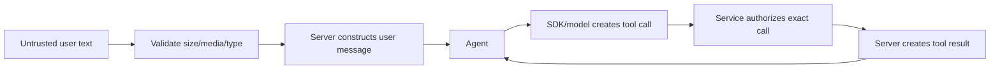

# Models, Messages, and Prompts

> Research date: **2026-08-31** · Release snapshot: Python 1.54.0 / TypeScript 1.14.0

Strands provides a common model interface, not uniform provider behavior. Production portability comes from a provider contract suite and explicit configuration—not from changing one constructor and assuming identical semantics.

## Provider boundary

Amazon Bedrock is the default provider. An AWS account is not required when another provider is configured. In the checked feature matrix, both SDKs support a shared group including Bedrock, Anthropic, Google, OpenAI Chat/Responses, OpenRouter, Fireworks, and custom providers, while Python has a substantially larger provider list and TypeScript has some unique integrations such as Vercel.

Evaluate each provider/model on the capabilities the application actually uses:

| Capability | Questions to contract-test |
|---|---|
| Tool use | Which JSON Schema subset? Parallel calls? Stable tool-call IDs? |
| Streaming | Which deltas and stop events? Usage on cancel? Error timing? |
| Structured output | Native strictness or tool-mediated? Repair attempts? |
| Multimodal | Accepted content blocks, size limits, media retention? |
| Reasoning | Is reasoning exposed, billed, or safe to persist? |
| Prompt caching | Cache-point rules, minimum tokens, TTL, read/write pricing? |
| Guardrails | Input/output coverage, tool-result behavior, redaction? |
| Hosted tools | Approval, citations, data handling, and result mapping? |
| Cancellation | Can an in-flight request really be aborted? |

Pin the provider adapter, model identifier, region/base URL, important inference parameters, and feature flags. Default model descriptions changed quickly during the research window; defaults are useful for quickstarts, not reproducible deployments.

## Message model and trust

Strands messages contain roles and content blocks such as text, images/documents, tool use, and tool results. Applications can invoke an agent with a string, content blocks, or complete message structures.

The last option is a privileged interface. If an untrusted client can submit assistant or tool-use history, it may be able to place a pending tool call into the conversation. If it can forge tool results, it can make the model believe an action or verification occurred. Therefore:

- accept plain user content at the external API;
- generate role, tool-use ID, tool result, and provenance server-side;
- validate restored history and reject orphaned or malformed tool pairs;
- label retrieved memory/web/MCP content as untrusted data, not instructions;
- do not let clients overwrite the system prompt or hidden policy context.

## System prompts are behavior, not control

A system prompt should define task, style, evidence expectations, and tool-use guidance. It should not carry the only copy of an authorization rule, tenant boundary, spending limit, or approval requirement. Models can misunderstand or be influenced by untrusted content; deterministic controls belong at admission, intervention, and tool/service boundaries.

Keep prompts versioned and observable without logging their sensitive content. A practical prompt record contains:

- immutable prompt/template version;
- model and inference configuration;
- available tool names and schema versions;
- retrieval/memory policy version;
- experiment or rollout cohort.

Changing tool descriptions can change behavior as much as changing the system prompt.

## Structured output

Python uses Pydantic models; TypeScript uses Zod schemas. Current Strands structured output is integrated with tool/schema mechanics, and a validation failure can cause the model to repair its answer. That improves ergonomics but adds turns, tokens, and latency.

Use structured output for a model-produced decision or extraction, then validate it again against domain rules. Do not treat schema validity as factual correctness or authorization.

Design schemas for the provider's supported subset:

- prefer shallow objects and clear descriptions;
- use bounded strings, enums, and numeric ranges where supported;
- avoid ambiguous unions and provider-unsupported constructs;
- make “unknown/not enough evidence” representable;
- cap repair attempts through loop limits;
- record validation failures as an evaluation signal.

Structured output becomes reliable only after integration testing on the exact provider/model. Bedrock strict tool schemas, for example, accept a restricted JSON Schema surface; a schema valid in an application library can still be rejected by the model API.

## Amazon Bedrock specifics

The Bedrock adapter normalizes streaming and non-streaming responses into Strands events. Production configuration should explicitly set:

- model ID and AWS Region;
- credential source/role;
- connect/read/total request timeouts;
- retry ownership (SDK versus AWS client);
- inference parameters;
- guardrail ID/version and input/output policy;
- prompt-cache points where supported.

Grant only the required `bedrock:InvokeModel` and/or `bedrock:InvokeModelWithResponseStream` actions on the allowed model resources. Avoid the broad permissions shown in quickstarts.

Python's AWS Region resolution follows constructor/session/environment precedence that can surprise deployments; validate the resolved region on startup without exposing credentials. The TypeScript adapter establishes a finite Bedrock request timeout in current defaults, but a custom request handler can change that behavior. Set and test the application's own deadline regardless.

Prompt caching is workload-specific. A cache write can cost more than uncached input and only pays off when later requests read the same stable prefix before expiry. Dynamic user or memory content placed before a cache point can destroy hit rates. Track cache-write tokens, cache-read tokens, hit ratio, latency, and net cost.

Bedrock Guardrails can inspect configured model input/output. They do not authorize tools and may see tool-result content through provider message roles. Regression-test tool results, especially when guardrail policy is strict.

## OpenAI Responses specifics

Python exposes a distinct Responses model; TypeScript uses the OpenAI model with Responses as its normal API and a selector for Chat. The Responses API can provide server-side web search, file search, code interpreter, remote MCP, and shell-like tools through provider parameters.

These are provider capabilities, not ordinary local Strands tools. Confirm:

- whether user approval can be surfaced; current remote-MCP guidance requires approval mode compatible with what the adapter exposes;
- which annotations/citations are retained in Strands output;
- which code/output blocks are mapped;
- provider retention and stateful-response policy;
- extra per-tool cost.

Stateful Responses chaining stores provider-side continuity using a previous response ID and changes local conversation management. In the checked implementation, it is incompatible with agent delegation. Do not mix stateful provider history, local session history, and child-agent delegation without an explicit ownership design.

## Custom providers

A custom provider must translate Strands messages, tool specifications, and system prompt into its API and yield the normalized stream-event grammar. It must also classify errors and usage accurately enough for retry and telemetry behavior.

Minimum contract tests:

1. text-only end turn;
2. one and multiple tool calls;
3. tool error and repair;
4. structured output success/failure;
5. mid-stream provider error;
6. throttling classification and retry;
7. cancellation at connection and stream phases;
8. usage and cache metrics;
9. unsupported content rejection;
10. stop-reason mapping.

## Sources

- [Model providers and language matrix](https://strandsagents.com/docs/user-guide/concepts/model-providers/)
- [Amazon Bedrock provider](https://strandsagents.com/docs/user-guide/concepts/model-providers/amazon-bedrock/)
- [OpenAI provider](https://strandsagents.com/docs/user-guide/concepts/model-providers/openai/)
- [Custom model providers](https://strandsagents.com/docs/user-guide/concepts/model-providers/custom_model_provider/)
- [Prompts and messages](https://strandsagents.com/docs/user-guide/concepts/agents/prompts/)
- [Structured output](https://strandsagents.com/docs/user-guide/concepts/agents/structured-output/)

