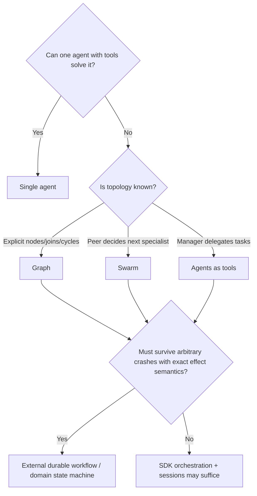
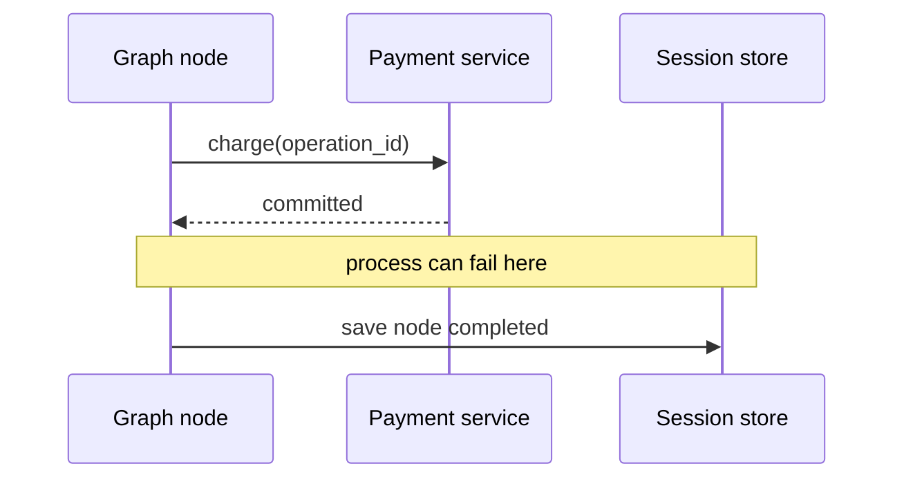

# Multi-Agent Graphs, Swarms, and Workflows

> Research date: **2026-08-31** · Release snapshot: Python 1.54.0 / TypeScript 1.14.0

Use multiple agents only when a measured specialization, topology, or trust boundary justifies the extra model calls and state. Strands provides several coordination patterns, but Python and TypeScript orchestration semantics are not identical and none is automatically a durable workflow engine.

## Pattern selection

| Pattern | Control plane | Use when | Avoid when |
|---|---|---|---|
| One agent | one model chooses tools | default; shared context is useful | authority/context must be isolated |
| Agents as tools | manager chooses specialist | central synthesis and clear delegation | direct deterministic routing is cheaper |
| Graph | code defines nodes/edges | dependencies, joins, cycles, custom nodes | topology is unknown or constantly improvised |
| Swarm | peers choose handoff | emergent collaboration is a requirement | bounded latency/cost and reproducibility dominate |
| A2A | remote agent protocol | separate deployment/ownership boundary | an in-process function/tool is enough |

“Workflow” is an architectural pattern here. The core SDK does not provide one uniform, cross-language, transactional workflow engine merely because Graph/Swarm can persist session state. A workflow helper in the separate Python tools package is a separate dependency and security surface.

## Agents as tools

A manager exposes specialist agents as tool-like capabilities. The manager retains top-level conversation and synthesis. Child context resets by default; preserving it is an opt-in with privacy and token consequences.

Use this pattern for a small number of specialists with distinct prompts/tools. Keep delegation inputs typed and minimal. Do not pass the full parent transcript by default. Set a child model/turn/token/tool budget and propagate deadline/cancellation.

Current delegation behavior is designed around a single delegated agent tool per turn. It also does not compose safely with every provider's stateful conversation mode. Test the exact adapter before combining stateful Responses-style history with delegation.

## Graph semantics

Graph supports agent, custom, nested multi-agent, and remote/A2A-like nodes with conditional edges and cycles. The similarity of the APIs hides important runtime differences.

### Python versus TypeScript Graph

| Concern | Python snapshot | TypeScript snapshot |
|---|---|---|
| Incoming dependencies | OR-like readiness from completed scheduling batches | AND join: all incoming dependencies |
| Scheduling | ready nodes execute in batches | individually ready nodes up to `maxConcurrency` |
| Revisited agent context | accumulates unless reset on revisit | snapshot/restored by default; preserve with option |
| Node failure | generally fail-fast/failed graph | node can be failed while parallel work settles |
| Cancellation status | represented as failed in current orchestrator result | distinct cancelled status |
| Step/timeout defaults | builder exposes node/execution limits; set explicitly | several defaults are `Infinity` |
| Limit breach | returned failed result in several paths | `maxSteps` can throw |

Do not translate a graph configuration mechanically between languages. Write topology tests that assert exact ready-node order, join behavior, state passed to each node, revisit context, failure propagation, cancellation status, and resume.

For TypeScript, explicitly set `maxSteps`, `maxConcurrency`, graph timeout, and node timeout. Current total-timeout propagation does not cover every nested orchestrator path, and node timeout does not uniformly govern a nested multi-agent node. Python also needs explicit maximum node executions, overall execution timeout, and node timeout.

Parallel graph nodes must not mutate shared references without synchronization. Prefer immutable node input/output and a reducer/commit phase.

## Swarm semantics

Swarm lets an agent hand off to a peer. It is more model-driven than Graph and therefore more sensitive to prompt/model changes.

Python currently uses a handoff tool and mutable shared context, provides rich receiver context, and has finite default handoff/iteration and time limits. TypeScript shapes each agent response as structured routing output with agent ID/message/context, serializes context between steps, and leaves major step/time defaults unbounded unless configured. Repetitive-handoff detection is not a universal default in either SDK.

Resume details also differ, including which repetition window or shared state is restored. Node failure and cancellation status are not identical across languages.

Use Swarm only after evaluation shows that model-selected routing outperforms a manager or explicit graph. Limit:

- allowed peer transitions;
- steps/handoffs and revisits;
- concurrent work;
- total and per-node time;
- tokens and tool calls;
- shared-context keys/bytes;
- mutation authority per agent.

## Sessions are not durable workflows

Consider a graph node that charges a card and then saves the orchestration snapshot. The process can die after the charge but before save. On resume, the node can run again. Session storage alone cannot make these steps atomic.

The correct design makes the payment service idempotent by `operation_id`; resume queries that operation and reconstructs the result. For multi-step business workflows, use an external workflow/state machine to own retries, timers, compensation, and durable checkpoints. Let a Strands invocation perform bounded reasoning inside a workflow activity.

## Interrupts and human steps

Graph/Swarm can persist interrupt state and resume. Concurrent siblings may already have completed when one node interrupts. Hooks and tools can be re-entered on resume, so side effects must be idempotent.

The open [deterministic resume issue #2796](https://github.com/strands-agents/harness-sdk/issues/2796) documents a current edge: resolving an interrupt can still feed the answer back through the model even when application routing is deterministic. Account for the extra model latency/cost or route deterministic approvals in application/workflow code.

## Evaluation gates

Compare a proposed multi-agent design against the single-agent baseline on:

- task success and factual correctness;
- correct tool and agent selection;
- latency percentiles;
- total model/tool calls and cost;
- loop/limit/failure rate;
- context leakage across specialists;
- resume and cancellation correctness;
- human escalation rate.

Require a material improvement. Extra architectural elegance is not a production metric.

## Checklist

- [ ] Single-agent baseline exists.
- [ ] Pattern and language semantics are documented.
- [ ] All step, handoff, node, concurrency, token, and time limits are explicit.
- [ ] Node inputs/outputs are bounded and tenant-scoped.
- [ ] Shared mutations are serialized or delegated to authoritative services.
- [ ] Sessions have one writer; child-agent session ownership follows official guidance.
- [ ] Every external effect is idempotent and recoverable after snapshot failure.
- [ ] Topology, resume, failure, cancellation, and cross-language behavior have tests.
- [ ] A durable workflow owns processes requiring transactional recovery.

## Sources

- [Multi-agent patterns](https://strandsagents.com/docs/user-guide/concepts/multi-agent/multi-agent-patterns/)
- [Agents as tools](https://strandsagents.com/docs/user-guide/concepts/multi-agent/agents-as-tools/)
- [Graph](https://strandsagents.com/docs/user-guide/concepts/multi-agent/graph/)
- [Swarm](https://strandsagents.com/docs/user-guide/concepts/multi-agent/swarm/)
- [A2A](https://strandsagents.com/docs/user-guide/concepts/multi-agent/agent-to-agent/)
- [Current orchestration source and tests](https://github.com/strands-agents/harness-sdk)
