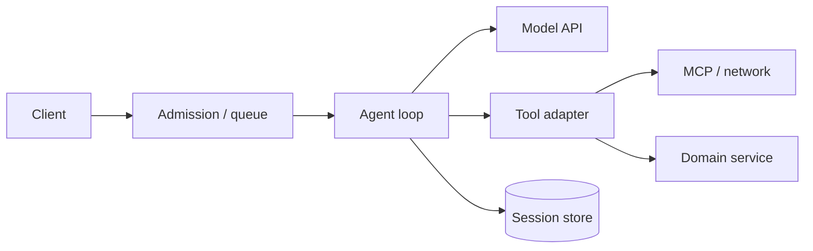

# Reliability, Retries, and Cancellation

> Research date: **2026-08-31** · Release snapshot: Python 1.54.0 / TypeScript 1.14.0

Reliable agents do not retry everything. They assign a deadline and retry policy to each boundary, make mutations idempotent, propagate cancellation, and represent uncertain outcomes explicitly.

## Failure boundaries



Each arrow needs its own timeout and error contract. Retrying the entire graph because a session save failed can repeat every preceding tool and model decision.

## Built-in model retries

Current default retry behavior targets model throttling. Both SDKs use up to six total model attempts and begin around a four-second delay in the checked snapshot. Backoff APIs and maximum delay differ by language/version: TypeScript exposes exponential, linear, and constant strategies with jitter options; Python provides its model retry strategy and custom strategy/hook paths.

Important constraints:

- it is a model-call retry inside a turn, not a whole-invocation retry;
- non-throttling errors are not automatically safe to retry;
- retry-strategy instances carry per-turn state and must not be shared across concurrent turns;
- a custom after-model hook must add its own delay if it asks for a retry;
- retry delays count against the user's overall deadline even if the SDK does not enforce that deadline for you.

Configure the installed version explicitly instead of depending on a mutable default maximum delay. Use full jitter for a fleet hitting one provider limit, respect provider retry hints, and cap by remaining request time.

## Retry matrix

| Operation | Retry? | Required condition |
|---|---|---|
| Model throttle before response | yes, bounded | deadline remains; SDK strategy |
| Model stream fails after partial content | usually new turn/request only | discard provisional output; provider semantics known |
| Read-only tool timeout | maybe | idempotent and total deadline remains |
| Mutation returns explicit pre-commit unavailable | maybe | service guarantees no commit or accepts operation ID |
| Mutation outcome unknown | no blind retry | query by operation ID/reconcile |
| Session CAS conflict | reload/reconcile | single semantic owner, bounded attempts |
| Invalid tool schema/input | model repair at most bounded times | error is model-actionable |
| Auth/permission denied | no | configuration or caller decision required |
| Guardrail/policy deny | no | terminal policy result |

Never let the model decide whether an uncertain payment/email/deletion should be replayed.

## Idempotent tool effects

For every mutation, generate an operation ID at the trusted application/workflow boundary. The model cannot set or alter it. The domain service stores `(principal, operation_id, normalized request hash, status, result)` atomically.

On duplicate:

- same principal and request hash: return the existing/pending result;
- different hash: reject as an idempotency conflict;
- pending/unknown: query or resume service-owned work;
- completed: reconstruct the tool result without repeating the effect.

This also repairs the session gap: if the effect committed but the agent snapshot did not, resume discovers the committed outcome by operation ID.

## Cancellation semantics

Python 1.54.0 added an external `threading.Event` cancellation signal. The SDK checks it during model streaming and around tool execution, forwards it through nested agents, and makes a best effort to cancel MCP work. A normal Python tool must poll/forward it; blocking code cannot be preempted safely. Bedrock streaming can be closed when control reaches a stream checkpoint, but connection establishment or non-streaming operations may not abort immediately.

TypeScript uses `AbortSignal` and passes `context.cancelSignal` to tools. It checks the signal around model and tool boundaries and can compose parent/child signals. A tool must pass it to `fetch`, SDK clients, timers, or subprocess logic.

For both:

- cancellation prevents future work more reliably than it stops current work;
- concurrent siblings already launched can finish;
- remote cancellation is advisory unless the remote API guarantees it;
- cancellation is not compensation;
- final usage may be incomplete.

An already-set Python signal can still allow initial message/session bookkeeping and the beginning of a model request before the first streaming checkpoint. Reject expired requests at the application boundary before invoking the agent.

## Deadline propagation

Carry one absolute deadline, not a fresh timeout at each layer.

```text
remaining = deadline - monotonic_now
model_timeout = min(configured_model_timeout, remaining - settlement_reserve)
tool_timeout  = min(tool_policy_timeout, remaining - settlement_reserve)
```

Reserve time to persist/reconcile the terminal state. A Graph or Swarm node must receive the parent's deadline; do not assume every nested orchestrator timeout propagates in the checked SDK.

Timeout a blocking operation at its real boundary. An outer coroutine timeout that abandons a thread does not stop the thread or its side effect.

## Backpressure and admission

Retries worsen overload unless admission is bounded. Apply:

- per-tenant and global concurrent-run limits;
- bounded queues with age/deadline checks;
- model/tool-specific semaphores;
- token/cost budgets;
- circuit breakers for persistently failing dependencies;
- load shedding before constructing an agent/session;
- rate-limit feedback and retry-after to callers.

In multi-agent systems, budget fan-out. A graph with ten parallel nodes can turn one request into ten simultaneous model calls and multiple tool calls.

## Graceful shutdown

On deployment termination:

1. stop accepting new work;
2. signal cancellation for work that cannot finish within the drain window;
3. allow bounded tool/domain settlement;
4. persist terminal/interrupt state where valid;
5. flush memory extraction and telemetry;
6. close MCP/model/storage clients;
7. record unresolved operation IDs for reconciliation.

Do not persist “cancelled with no effects” unless domain services confirm that state.

## Chaos cases

Test process loss at every boundary:

- before and after model retry;
- while parallel tools run;
- after mutation commit but before tool result;
- after tool result but before session save;
- during S3/local snapshot replacement;
- during interrupt persistence and resume;
- on client disconnect;
- while memory extraction/telemetry flushes;
- during multi-agent node completion.

Assertions should inspect authoritative domain state, not only agent text.

## Checklist

- [ ] One absolute deadline propagates through model, tools, MCP, and children.
- [ ] Built-in retry scope is understood and configured.
- [ ] Strategy instances are not shared across concurrent turns.
- [ ] Every mutation has service-enforced idempotency and reconciliation.
- [ ] Tools observe/forward cancellation and bound blocking work.
- [ ] Concurrent sibling effects are expected after cancellation.
- [ ] Admission and fan-out limits prevent retry storms.
- [ ] Shutdown drains, flushes, and records unresolved operations.
- [ ] Chaos tests cover effect/snapshot gaps.

## Sources

- [Retry strategies](https://strandsagents.com/docs/user-guide/concepts/agents/retry-strategies/)
- [Cancellation](https://strandsagents.com/docs/user-guide/concepts/agents/agent-loop/#cancellation)
- [Invocation limits](https://strandsagents.com/docs/user-guide/concepts/agents/agent-loop/#invocation-limits)
- [Python 1.54.0 changelog](https://strandsagents.com/changelog/harness/python-v1.54.0/)
- [Current retry/cancellation source and tests](https://github.com/strands-agents/harness-sdk)
