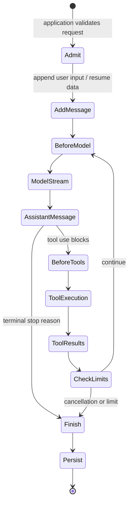

# Runtime Loop and Events

> Research date: **2026-08-31** · Release snapshot: Python 1.54.0 / TypeScript 1.14.0

The Strands runtime is a model-driven loop, not a single model request. One invocation can include several model calls, concurrent tools, retries, hooks, persistence writes, and a final result. Reliability and cost controls must therefore wrap the whole loop and each expensive boundary inside it.

## Invocation lifecycle

The model can end its turn, request tools, hit a model limit, trigger a guardrail, or be cancelled. Tool results are appended to the conversation and normally sent back to the model. A tool exception usually becomes an error-shaped tool result so the model can recover; infrastructure and invariant failures can still fail the invocation.

The final `AgentResult`/result object is richer than displayed text. It includes a stop reason and execution/usage information, and may include structured output, interrupts, or telemetry summaries. Branch application behavior on the typed stop reason—not on stringified assistant text.

## Stop reasons are control flow

The exact enum spelling differs by language and release, but current runtime paths cover:

- normal end of turn;
- tool use while the loop is still active;
- external or internal cancellation;
- turn, total-token, or output-token limit;
- model maximum tokens or stop sequence;
- filtered content or provider guardrail intervention;
- interrupt/checkpoint paths where enabled.

Model maximum-token responses can be surfaced differently from a normal limit stop and may raise at the provider layer. Test each allowed provider. Never interpret “a final event arrived” as “the requested business action succeeded.” Check domain results separately.

## Invocation limits

Both SDKs expose per-invocation limits for turns, total tokens, and output tokens. They are necessary but not hard real-time governors.

Limits are checked at loop boundaries. Consequently:

1. one model response can push usage beyond a token threshold;
2. tools requested by the preceding model turn may finish before the next limit check;
3. usage reporting depends on the provider and can be incomplete for interrupted streams.

When more than one limit is exceeded at the same checkpoint, current priority is turn limit, total-token limit, then output-token limit. Counters reset for each invocation even when the agent object is reused.

Use a layered budget:

| Layer | Control |
|---|---|
| Request | absolute deadline and cancellation signal |
| Agent loop | turn and token limits |
| Model | provider request timeout and maximum output tokens |
| Tool | per-call timeout, payload cap, result cap, and retry policy |
| Multi-agent | node/step/handoff/concurrency and total time limits |
| Domain mutation | idempotency key and authoritative status |

## Tool execution and ordering

The default executor in both SDKs can run multiple tool calls concurrently when the model emits them in one response. A sequential executor is available when order matters.

Concurrent execution has three consequences:

- events from different tools can interleave even though each tool's own event order is preserved;
- two tools can race on shared agent state, a file, a session, or an external record;
- cancelling the batch does not undo a sibling that already committed an effect.

Prefer concurrent execution for independent, read-only calls. Prefer sequential execution for dependent calls, mutations, non-thread-safe clients, rate-limited systems, or tools that share process state. Better still, combine dependent mutations behind one transactional domain API rather than relying on model-selected order.

Custom executor support is not a stable cross-language extension point in the checked release line. Use the documented executors unless the installed release explicitly supports more.

## Agent object concurrency

An agent instance owns mutable messages, state, hooks, session wiring, and invocation bookkeeping. Current Python and TypeScript reject overlapping invocations on the same instance by default. Python also exposes an `unsafe_reentrant` mode; its name is accurate—it skips the safety lock without promising coherent state.

Python additionally supports an idempotency token for identical in-flight requests. It deduplicates waiting callers onto the original invocation and returns that final result. This is not a durable idempotency ledger: it is in-process, applies to the live invocation, and does not make external tool effects exactly once. TypeScript has no equivalent in the checked snapshot.

Safe service patterns are:

- construct an agent per request and restore explicit session state;
- maintain a single-threaded actor per active session;
- acquire an application/distributed lease for a session before loading and saving it.

Do not assume an S3 session manager prevents two containers from simultaneously loading, mutating, and overwriting the same session.

## Event ownership

There are three related but distinct event surfaces:

1. **model stream events**, normalized from a provider;
2. **agent streaming events**, exposed to the caller;
3. **hook events**, dispatched inside the runtime and sometimes mutable.

Python emits dictionary-shaped streaming events. TypeScript exposes typed event objects. Neither should be forwarded directly as a permanent public protocol. The application owns versioning, serialization, redaction, backpressure, resumption, and compatibility.

## Failure taxonomy

| Failure | Expected handling |
|---|---|
| Model throttling | bounded model retry strategy |
| Model auth/schema error | fail fast; configuration or compatibility defect |
| Tool validation error | safe tool error result; model may repair once |
| Tool dependency timeout | bounded tool result or fail invocation, based on semantics |
| Domain conflict/idempotency replay | return authoritative existing outcome |
| Cancellation | stop new work; cooperating work exits; reconcile completed effects |
| Session conflict | reject/retry through an application lease or CAS strategy |
| Token/turn limit | terminal bounded result; do not silently continue in another process |

Avoid retrying the whole invocation automatically. It can repeat model choices and side effects. Retry only the failed boundary whose semantics are known.

## Production checklist

- [ ] Pin a model and provider configuration.
- [ ] Set turn, token, request, model, and tool deadlines.
- [ ] Choose concurrent versus sequential tool execution deliberately.
- [ ] Never invoke one mutable agent instance concurrently by accident.
- [ ] Record a stable run ID, tenant ID, session ID, model ID, prompt/tool version, and stop reason.
- [ ] Give mutations idempotency keys outside model control.
- [ ] Test every stop path, including cancellation during model streaming and tool execution.
- [ ] Reconcile domain effects after cancellation or transport disconnect.

## Sources

- [Agent loop](https://strandsagents.com/docs/user-guide/concepts/agents/agent-loop/)
- [Invocation limits](https://strandsagents.com/docs/user-guide/concepts/agents/agent-loop/#invocation-limits)
- [Tool executors](https://strandsagents.com/docs/user-guide/concepts/tools/executors/)
- [Streaming](https://strandsagents.com/docs/user-guide/concepts/streaming/)
- [Current runtime source and tests](https://github.com/strands-agents/harness-sdk)
