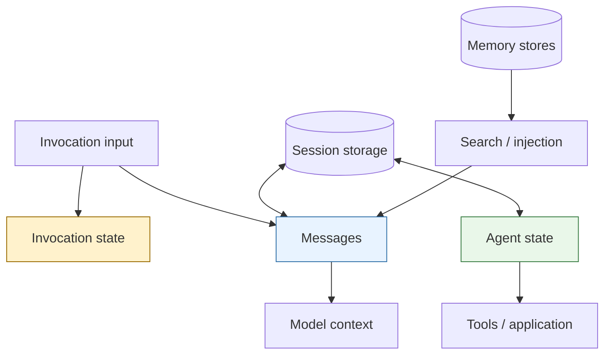
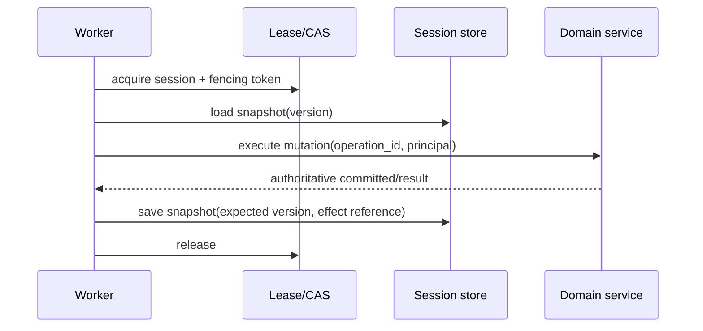

# Sessions, State, and Memory

> Research date: **2026-08-31** · Release snapshot: Python 1.54.0 / TypeScript 1.14.0

State problems become tractable when model context, application state, persistence, and memory are kept separate. Strands offers primitives for each, but none is a universal database or workflow log.

## State planes

| Plane | Visibility | Lifetime | Constraints |
|---|---|---|---|
| Messages | model-visible | current conversation/session | token-limited, untrusted after restore |
| Agent state | tools/application; not automatically model-visible | agent and optional session | JSON-serializable |
| Invocation state | request/tool context | one invocation | may hold clients, identity, deadline |
| Conversation manager | controls message window | agent/session | trimming/summarization may be lossy |
| Session manager | restores SDK snapshot/history | backend-defined | not an effect transaction |
| Memory manager/store | searched or injected | cross-session | tenant scope, extraction consistency |

Secrets and authoritative identity belong in request-scoped dependencies, not messages or durable model memory.

## Sessions: what they guarantee

Strands session facilities persist and restore framework state such as messages, agent state, interrupts, and multi-agent orchestration snapshots. Exact fields, write triggers, and storage layout differ by language and manager generation.

Current storage abstractions include in-memory, local-file, S3, and custom backends. A local-file backend can make an individual file replacement atomic. S3 makes bytes durable and distributed. Neither automatically provides:

- a distributed lock around read-modify-write;
- compare-and-swap versioning for concurrent writers;
- an atomic commit with a tool's external side effect;
- exactly-once replay;
- compensation after partial failure.

Therefore use **one live writer per `(tenant, session, agent-or-orchestrator ID)`**. In a multi-replica service, enforce that with routing, a lease, or a database transaction/CAS layer. Include a fencing token when a stale worker might continue after losing a lease.

### Python and TypeScript differences

The session APIs are converging but not interchangeable. TypeScript's current snapshot manager records immutable, time-ordered UUIDv7 snapshots and can retain history. Python has a newer snapshot session manager while classic Python `SessionManager` implementations are on a deprecation/migration path and do not use every newer `Storage` abstraction.

Do not point two languages at the same prefix and assume they can read one another's records. Build an application-owned interchange format if cross-language takeover is required.

Current persistence triggers can occur at invocation, message, node, or explicit snapshot boundaries depending on manager/configuration. A crash between an external effect and the next save always remains possible.

## Safe resume protocol

If saving fails after the domain mutation, the next run queries the domain service by operation ID and reconstructs the tool result. It does not blindly repeat the mutation.

Session payloads are untrusted deserialization inputs. Validate type, schema version, tenant binding, size, message/tool pairing, and allowed model/tool configuration. Encrypt sensitive data and restrict storage IAM. Never restore executable callbacks or credentials from model-controlled JSON.

## Multi-agent sessions

Attach the session manager to the orchestrator. Official guidance warns against independently session-managing children inside Graph or Swarm. The multi-agent session manager persists orchestrator state and results; it does not imply every child agent has an independently complete, durable conversation history.

This is enough for many conversational resumes. It is not enough for a regulated or money-moving process that needs immutable checkpoints, deterministic routing, compensation, and a complete effect ledger. Use a durable workflow engine or domain state machine for that class of process.

## Conversation management

Long conversations must fit provider context limits. Strands includes sliding-window, null, summarizing, and offloading strategies.

- **Sliding window** is simple and predictable but discards old detail.
- **Summarization** retains a compressed narrative but is model-generated and lossy.
- **Offloading** can move large context out of the main prompt and retrieve it later, adding storage/retrieval dependencies.
- **No management** is only safe for bounded conversations with preflight token checks.

Do not use conversation summary as the authoritative record of customer consent, a transaction, a diagnosis, or a compliance fact. Keep source records in domain storage and inject only the minimum needed reference.

Test compaction using long, adversarial transcripts: tool-call/result pairing, recent constraints, unresolved tasks, entity identifiers, permissions, and citations are common casualties.

## Memory

Strands memory separates stores, extraction, search/add tools, and injection. It can retain cross-session facts, but asynchronous extraction changes its consistency model.

In the checked implementation:

- extraction can run periodically (the default documented cadence is several turns) or through store-native message ingestion;
- background writes are at least once and duplicates are possible;
- successful high-water marks avoid re-extracting committed ranges;
- search may skip/log individual store failures while add aggregates failures;
- Python synchronous calls flush after an invocation, while Python async/streaming applications must flush during shutdown;
- TypeScript requires explicit flush rather than automatic end-of-invocation flushing.

A hard crash can therefore lose the newest extraction buffer. Design memory as eventually consistent enrichment, not a transaction log.

### Tenant isolation

Compute the namespace from authenticated application identity. Never expose it as a model-controlled tool parameter. A 2026 advisory in the separate community tools package demonstrated why syntactic validation of a namespace is not authorization.

Memory entries should carry:

- tenant/user scope;
- source and provenance;
- created/updated time;
- schema and extractor version;
- sensitivity/retention class;
- confidence or verification state;
- deletion/tombstone support.

Before injecting memory, enforce scope, filter sensitive or stale values, limit count/tokens, and label it as possibly incorrect. Give users a correction/deletion path.

## Choosing the right primitive

| Need | Use |
|---|---|
| Continue a chat after restart | session manager + conversation manager |
| Pass authenticated identity to tools | invocation state |
| Store a small durable UI/workflow preference | agent state or domain DB, based on authority |
| Recall preferences across chats | tenant-scoped memory with provenance |
| Execute a payment exactly once | domain transaction/idempotency ledger |
| Resume a multi-hour regulated workflow | durable workflow engine/domain state machine |
| Reduce prompt size | window/summarization/offloading, with source records elsewhere |

## Checklist

- [ ] State planes and data classification are documented.
- [ ] One live writer owns each session identity.
- [ ] Snapshot schemas and migrations are versioned and tested.
- [ ] External effects have durable operation IDs independent of session saves.
- [ ] Conversation compaction has regression cases.
- [ ] Memory namespaces come from trusted identity and support deletion.
- [ ] Async/streaming processes flush memory on graceful shutdown.
- [ ] Crash recovery tests cover every gap between effect and snapshot.

## Sources

- [Session management](https://strandsagents.com/docs/user-guide/concepts/agents/session-management/)
- [Agent state](https://strandsagents.com/docs/user-guide/concepts/agents/state/)
- [Conversation management](https://strandsagents.com/docs/user-guide/concepts/agents/conversation-management/)
- [Memory](https://strandsagents.com/docs/user-guide/concepts/memory/overview/)
- [Storage and session source](https://github.com/strands-agents/harness-sdk)
- [Memory namespace advisory](https://github.com/strands-agents/tools/security/advisories/GHSA-mpxq-953j-42m4)
