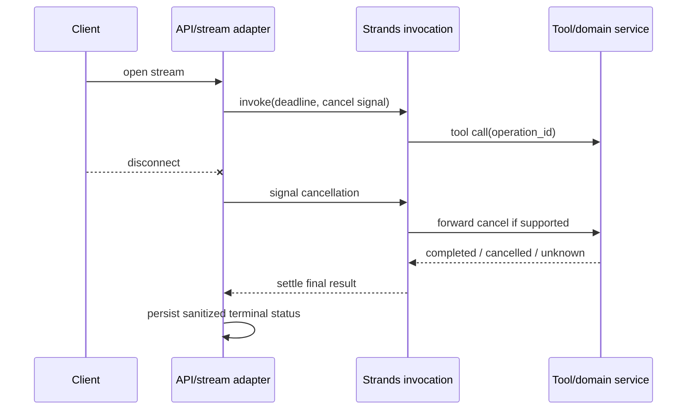

# Streaming and Event Protocols

> Research date: **2026-08-31** · Release snapshot: Python 1.54.0 / TypeScript 1.14.0

Strands streaming is an in-process observation API. Turning it into SSE, WebSocket, queues, or a browser protocol requires an application-owned envelope and lifecycle. Forwarding raw SDK events creates compatibility, privacy, and recovery problems.

## Language event surfaces

Python's asynchronous stream yields dictionaries. Events can indicate initialization, model deltas, reasoning, tool-use accumulation, tool streaming, complete messages, force-stop conditions, multi-agent activity, and a final result. Key presence often identifies the shape.

TypeScript yields typed, hookable event class instances with a `type` discriminator. Its taxonomy has lifecycle, model/content, tool, interrupt, result, and multi-agent classes. Events expose `toJSON()`; the serializer omits runtime-only references and mutable hook controls, and serializes errors conservatively.

These are **not wire-compatible schemas**. Python does not supply the same automatic serialization filtering. Cross-language clients need a common application event model.

## Recommended wire envelope

```json
{
  "protocol": "agent-stream.v2",
  "run_id": "run_...",
  "event_id": 42,
  "time": "2026-08-31T10:00:00Z",
  "type": "tool.completed",
  "visibility": "user",
  "payload": {},
  "terminal": false
}
```

Include:

- a protocol version independent of the SDK version;
- run and monotonically increasing event IDs;
- a small stable event enum;
- visibility/data-classification metadata;
- bounded, redacted payloads;
- one terminal event with a typed status and resumability hint.

Do not serialize the entire SDK event/result and then try to redact it downstream.

## A portable event vocabulary

Most clients need only:

| Event | Safe public meaning |
|---|---|
| `run.started` | request accepted with public metadata |
| `message.delta` | assistant-visible text fragment |
| `tool.started` | optional safe label, not raw arguments |
| `tool.progress` | allowlisted, bounded progress |
| `tool.completed` | safe status/summary, not raw output |
| `approval.required` | signed approval challenge and display data |
| `orchestration.progress` | node/agent label and safe state |
| `run.completed` | stop category, public result, usage class |
| `run.failed` | stable error code and retry guidance |
| `run.cancelled` | cancellation acknowledged; effects may require reconciliation |

Reasoning tokens, hidden prompts, memory records, raw tool arguments/results, provider request IDs, exception stacks, and credentials should be internal by default.

## Backpressure and buffering

Model token generation can outrun a slow client. Tool progress can be noisy. An unbounded queue makes one disconnected browser a memory leak.

Use:

- a bounded per-connection buffer;
- coalescing for text deltas and progress updates;
- non-droppable lifecycle/approval/terminal events;
- a maximum event and aggregate response size;
- slow-consumer timeout or disconnect;
- metrics for queue depth, dropped/coalesced events, and send latency.

Never block the model/tool loop indefinitely on UI delivery. If the client requires a complete replay, persist a sanitized application event log separately.

## Disconnect and cancellation



A disconnect is not a rollback. Python and TypeScript cancellation are cooperative, and already-started tools can finish. Lambda response streaming explicitly notes that client disconnect does not stop billed function execution. Always settle the invocation and reconcile external operations even when there is no client to receive the final event.

Wrap iteration in `try/finally`, signal cancellation, close the iterator/transport, and await bounded cleanup. Test early consumer break; historical stream-lock bugs are a useful reminder that abandoned iterators are a real lifecycle path even when fixed in current releases.

## Resume and replay

SSE `Last-Event-ID` or a reconnecting WebSocket does not make the agent invocation resumable. Choose one of three semantics:

1. **Live-only:** reconnect retrieves final run status, not missed deltas.
2. **Sanitized replay:** persist application events and replay after an event ID.
3. **Execution resume:** persist a framework/domain checkpoint and start a new invocation through a defined resume path.

Do not replay old SDK events into the runtime as if they were checkpoints. A client event log and an execution snapshot solve different problems.

## Structured output and streams

Token deltas are provisional text. Structured output is trustworthy only after the final schema validation/repair path completes. A UI may show progress, but downstream automation must wait for the terminal typed result.

Similarly, a tool-use delta is not an authorized call, and a tool-started event is not evidence that a mutation committed. Use domain operation status for that assertion.

## Transport choices

| Transport | Good fit | Watch for |
|---|---|---|
| SSE | server-to-browser text/progress | reconnect semantics, proxies, one-way control |
| WebSocket | bidirectional voice/events/approval | authentication renewal, frame limits, lifecycle |
| Buffered HTTP | short tasks, simplest contract | time to first byte and gateway timeout |
| Queue + status API | long/offline work | ordering, dedupe, user notifications |

AgentCore Runtime supports HTTP streaming and WebSocket contracts, but the application still defines the payload protocol and binds authenticated users to runtime session IDs.

## Checklist

- [ ] Public event protocol is versioned independently of Strands.
- [ ] Only an allowlist of redacted event fields leaves the service.
- [ ] Buffers are bounded and slow consumers cannot stall execution.
- [ ] Disconnect triggers cooperative cancellation and bounded settlement.
- [ ] Terminal status is persisted even if delivery fails.
- [ ] Replay semantics are explicit and tested.
- [ ] Structured automation consumes only final validated output.
- [ ] Python and TypeScript adapters pass the same wire-protocol contract suite.

## Sources

- [Async iterator streaming](https://strandsagents.com/docs/user-guide/concepts/streaming/async-iterators/)
- [Streaming overview](https://strandsagents.com/docs/user-guide/concepts/streaming/)
- [Current event types and tests](https://github.com/strands-agents/harness-sdk)
- [AgentCore WebSocket runtime](https://docs.aws.amazon.com/bedrock-agentcore/latest/devguide/runtime-get-started-websocket.html)
- [Lambda response streaming](https://docs.aws.amazon.com/lambda/latest/dg/configuration-response-streaming.html)

