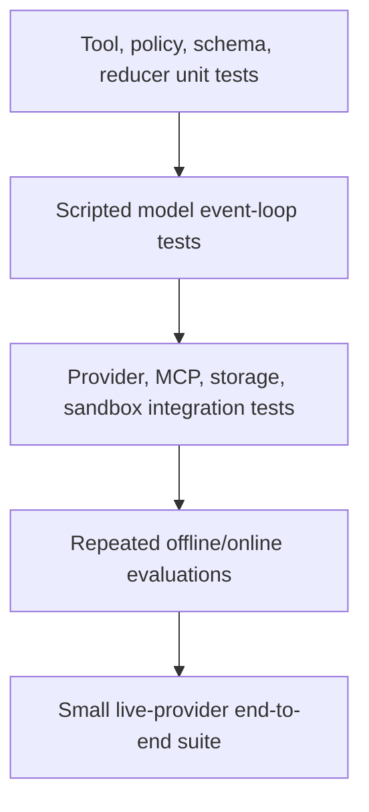

# Testing, Evaluation, and Debugging

> Research date: **2026-08-31** · Release snapshot: Python 1.54.0 / TypeScript 1.14.0

Agent quality is probabilistic, but most runtime and safety properties are deterministic. Test the two separately: ordinary automated tests enforce contracts and controls; repeated evaluations estimate behavior under model variability.

## Test pyramid

Keep the broad base fast and deterministic. A large live-model test suite is slow, expensive, rate-limited, and flaky; it is a poor substitute for testing authorization, idempotency, joins, or serialization directly.

## Deterministic loop tests

The official monorepo tests show the key seam:

- Python uses a scripted `MockedModelProvider` fixture that yields a predefined sequence of messages/events and optional usage.
- TypeScript exposes `TestModelProvider` fixtures for precise `ModelStreamEvent` sequences.

These are contributor/test helpers and may not be stable public APIs. Applications can implement a small test provider against the documented custom-model contract or vendor a test fixture deliberately.

Test scenarios should drive:

1. text end turn;
2. one tool call and result;
3. parallel tool calls and interleaved events;
4. invalid tool input, safe error, and model repair;
5. tool exception, timeout, cancellation, and uncertain outcome;
6. throttling and exhaustion of model retries;
7. turn/token/total-token limit priority and overshoot;
8. interrupt, persistence, and resume;
9. hook ordering/mutation/failure;
10. structured output validation and repair;
11. conversation compaction/tool-pair preservation;
12. final stop reason and telemetry fields.

Assert exact tool inputs after server-side normalization, but avoid brittle assertions on full natural-language output.

## Tool and policy tests

Every tool deserves ordinary software tests independent of a model:

- schema boundaries, normalization, and output cap;
- trusted identity overriding/ignoring model-supplied tenant fields;
- resource authorization and denial;
- idempotent replay and concurrent duplicate operation IDs;
- timeout/cancel forwarding;
- upstream partial failures and safe error mapping;
- redaction of secrets in result, logs, events, and traces;
- sandbox and egress constraints.

Use property-based or fuzz testing for path/URL parsing, filters, schemas, and canonical approval hashing. Use fault injection around “effect committed, session save failed.”

## Provider contract suite

Run the same bounded suite against every allowed provider/model/configuration in a non-production account. Verify tool schemas, streaming event order, structured output, multimodal content, guardrails, caching, cancellation, stop reasons, usage, and error classification.

Provider tests should tolerate natural-language variance but fail on contract differences. Record provider/model IDs and response metadata. Re-run on model aliases, adapter upgrades, region changes, and new inference features.

## Strands Evaluation SDK

`strands-agents-evals` is a separate Python package in the checked snapshot. It supports:

- deterministic equals/contains/tool-called/state evaluators;
- output, correctness, relevance, helpfulness, safety, and instruction evaluators;
- trajectory, tool-selection, tool-parameter, and interaction evaluation;
- OpenTelemetry trace mapping and remote trace providers;
- multi-turn user and tool simulation;
- experiment generation/serialization, CLI gates, detectors, chaos testing, and red teaming.

This is not evidence of TypeScript feature parity. TypeScript applications can send a language-neutral case/trace format to a Python evaluation job or use another evaluation harness.

### Evaluation case design

Each case should contain:

- stable case and dataset version;
- input plus trusted environment/setup;
- expected facts, forbidden behaviors, and acceptable alternatives;
- required/forbidden tools and argument constraints;
- expected domain state/effects;
- risk/category/difficulty metadata;
- deterministic checks and optional judge rubric.

Mine production failures, support tickets, security threats, long-session compaction, provider incompatibilities, and cancellation races. Do not generate the entire test set with the same model being evaluated.

### LLM-as-judge limits

Judge scores are measurements with noise and bias. A judge can prefer its own style, miss subtle authorization failures, be influenced by candidate content, and drift after a model update.

- calibrate against blinded human labels;
- use a strong, pinned judge and versioned rubric;
- randomize candidate order for pairwise comparisons;
- require structured reasons but do not treat them as ground truth;
- repeat borderline cases and report confidence/distribution;
- keep deterministic security/business assertions outside the judge;
- track judge token/cost separately from agent cost.

## Multi-agent tests

For Graph, assert exact readiness/join behavior, node order where deterministic, state/reducer results, maximum executions, timeout, failure and cancellation propagation, session resume, and repeated-node context. Maintain different expected contracts for Python and TypeScript where semantics differ.

For Swarm, evaluate routing/handoff loops statistically and enforce deterministic transition allowlists and limits. Test repetitive transfers, malformed structured routing, unavailable peers, shared-context size, and resume.

## Debugging without data leakage

Capture a reproducibility bundle by reference, not raw secrets:

- deployment, SDK, provider, model, prompt, tool-schema, and policy versions;
- sanitized input/content hashes and session snapshot version;
- event sequence with timestamps and stable error codes;
- tool/effect IDs and authoritative domain outcomes;
- limits, retry counts, stop reason, usage, and trace ID.

Then isolate the failing layer:

1. replay runtime with scripted provider events;
2. run the live provider contract without domain mutations;
3. call tool/domain service directly with the recorded operation ID;
4. load the snapshot in an isolated test and validate history;
5. compare hooks/interventions and rollout versions.

Convert every resolved incident into the lowest-level reliable regression test and an evaluation case when model behavior contributed.

## Release gate

- [ ] Unit/loop/integration suites pass.
- [ ] Provider contract passes on every allowed model.
- [ ] Safety and high-risk deterministic checks have zero regression tolerance.
- [ ] Quality metrics meet predeclared thresholds with confidence ranges.
- [ ] Latency, tool calls, tokens, and cost stay within budgets.
- [ ] Long-session, cancellation, resume, and partial-failure cases pass.
- [ ] Canary exposes no stop-reason, error, or policy drift.
- [ ] Rollback covers model alias, prompt, tools, SDK, and policy.

## Sources

- [Strands Evaluation quickstart](https://strandsagents.com/docs/user-guide/evals-sdk/quickstart/)
- [Evaluation SOP](https://strandsagents.com/docs/user-guide/evals-sdk/eval-sop/)
- [Chaos testing](https://strandsagents.com/docs/user-guide/evals-sdk/chaos_testing/)
- [Red teaming](https://strandsagents.com/docs/user-guide/evals-sdk/red-teaming/)
- [Official Python testing guide](https://github.com/strands-agents/harness-sdk/blob/main/strands-py/docs/TESTING.md)
- [Official TypeScript testing guide](https://github.com/strands-agents/harness-sdk/blob/main/strands-ts/docs/TESTING.md)
