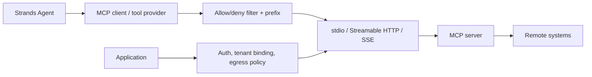

# Tools, ToolContext, and MCP

> Research date: **2026-08-31** · Release snapshot: Python 1.54.0 / TypeScript 1.14.0

A tool is a capability grant. Whether implemented as a local function, an MCP call, a provider-hosted tool, or another agent, its security properties come from authority, validation, isolation, and effect semantics—not from its description to the model.

## Tool construction

Python builds tools from annotated functions, classes, modules, and explicit specifications. TypeScript provides a `tool()` helper with Zod or JSON Schema and class-based tools. Zod-backed TypeScript tools validate at runtime and infer callback input types; a plain JSON Schema tool leaves the callback input effectively untrusted and must validate explicitly.

Tool names are restricted to a portable identifier form and length. Keep names stable, action-oriented, and unambiguous. A model sees the name, description, and input schema, so all three are prompt surface.

A production tool should have:

- a narrow action rather than broad command execution;
- a strict input schema and normalized domain validation;
- trusted identity/tenant data from invocation context, never model input;
- an explicit timeout and cancellation path;
- bounded output size and a safe error taxonomy;
- an idempotency strategy for mutations;
- resource-level authorization in the domain service;
- redacted audit events.

## ToolContext and state placement

Python exposes context through an explicitly marked tool parameter; TypeScript passes it as an optional second callback argument. Current context includes the agent, tool-use identity/input, invocation state, cancellation, and interrupt functionality.

Place data according to who may control or see it:

| Data | Correct place | Why |
|---|---|---|
| Search query or requested date | tool input | model needs to reason about it |
| Tenant ID, user principal, authorization token | invocation state / server dependency | model must not choose it |
| Long-lived API client | tool object or application container | process resource, not prompt data |
| Durable task status | domain database | authoritative and recoverable |
| Conversation preference | agent state or tenant-scoped memory | distinct visibility/lifetime policy |
| Cancellation/deadline | ToolContext / request context | propagates control without exposing it to model |

Invocation state can contain arbitrary request-scoped objects and is not automatically sent to the model. Agent state is JSON-serializable and can be session-persisted. Class/tool instance state is process-local unless separately persisted.

## Direct tool calls

Applications can call a registered tool directly, bypassing model selection. Current behavior records the call in conversation history by default, with an opt-out. This is useful when a deterministic application step should still be visible to later reasoning.

Direct calls have sharp edges:

- they do not gain authorization simply because the tool is registered;
- direct tool calls do not support the ordinary interrupt flow;
- recording a direct call during an active invocation can conflict with the agent lock/history; TypeScript requires opting out in this scenario;
- an untrusted caller must not choose arbitrary registered tool names and inputs.

Prefer calling the underlying domain service directly unless conversation provenance is genuinely required.

## MCP architecture

Both SDKs support MCP servers through standard transports, multiple server connections, filtering, tool-name prefixes, and elicitation. Python also exposes OAuth/client-credential patterns and AWS SigV4 integration examples; authentication depends on the transport/server. Current Python has progress-notification support not present in TypeScript.

An MCP prefix prevents name collisions inside one agent; it does not change the remote name or create an authorization namespace. A filter reduces which tools are registered. Rejection should win when allow and deny rules overlap, but the remote server must still enforce its own principal/resource policy.

### Connection lifecycle

- Establish and close clients deterministically.
- Do not reuse stateful connections across tenants unless the server and client are explicitly designed for multiplexed isolation.
- Bound connect, list-tools, call, and shutdown times independently.
- Cache tool metadata only with a version/TTL and a failure path for schema changes.
- Validate remote tool output size and content before adding it to model context.
- Treat remote cancellation as best effort and reconcile uncertain outcomes.

For Lambda, the official guidance starts with one connection context per invocation. Reusing a warm connection can reduce latency but can leak state across users if the MCP server associates connection state with a conversation.

### MCP Tasks

The checked Python source contains experimental MCP Tasks support aligned with the 2025-11-25 protocol revision. It requires client opt-in, server task capability, and tool support, and introduces polling/TTL behavior. It was not present in TypeScript and was less prominent than stable MCP documentation.

Treat it as a version-gated integration:

- negotiate capability rather than assuming it;
- make task IDs tenant-bound and opaque;
- set overall poll/deadline policy;
- persist remote task identity outside volatile model context;
- handle “accepted but final result unknown” explicitly;
- do not equate an MCP task with an application durable workflow.

## Sandboxing and powerful tools

Without a configured sandbox, local shell/file/code tools run with the host process's privileges. Strands sandbox integration can route compatible vended operations to Docker or SSH-backed execution, but it does not move the agent runtime itself into an untrusted zone.

Use defense in depth:

1. avoid registering general shell/code tools;
2. expose purpose-built domain APIs;
3. use a non-root, read-only, network-restricted execution environment;
4. mount only task-scoped data;
5. issue short-lived credentials scoped to the exact action;
6. cap CPU, memory, processes, files, bytes, and time;
7. discard the environment after the task;
8. authorize again at every external service.

The separate `strands-agents-tools` package is community tooling, not the core SDK. It has had multiple 2026 security advisories involving host execution, credential disclosure, proxy behavior, and memory namespace isolation. Pin and scan it independently, upgrade beyond all fixed versions, remove unused tools, and do not make a patched version your only boundary.

## Tool errors and retries

Return a concise model-actionable error without secrets:

- `invalid_input`: model may repair once;
- `not_found`: model may ask or choose another path;
- `permission_denied`: terminal for that capability;
- `conflict`: return existing authoritative status when idempotent;
- `rate_limited`/`temporarily_unavailable`: retry only in the tool's bounded policy;
- `uncertain_outcome`: stop mutation retries and reconcile by operation ID.

Do not return raw exceptions, request headers, SQL, filesystem paths, tokens, or full upstream bodies to the model.

## Checklist

- [ ] Every tool has a named owner and threat model.
- [ ] Principal, tenant, and credentials come from trusted invocation context.
- [ ] Mutations use operation IDs outside model control.
- [ ] Tool results are bounded, redacted, and marked as untrusted content.
- [ ] Concurrent tools do not race on shared mutable resources.
- [ ] MCP transport auth, server authorization, egress, and connection tenancy are tested.
- [ ] Shell/file/code tools run in a disposable least-privilege boundary—or are absent.
- [ ] Core, provider, MCP, and community-tool dependencies are versioned separately.

## Sources

- [Custom tools](https://strandsagents.com/docs/user-guide/concepts/tools/custom-tools/)
- [ToolContext](https://strandsagents.com/docs/user-guide/concepts/tools/custom-tools/#toolcontext)
- [Direct tool calls](https://strandsagents.com/docs/user-guide/concepts/tools/#direct-method-calls)
- [MCP tools](https://strandsagents.com/docs/user-guide/concepts/tools/mcp-tools/)
- [Sandbox](https://strandsagents.com/docs/user-guide/concepts/sandbox/)
- [Strands Agents Tools advisories](https://github.com/strands-agents/tools/security/advisories)
- [CVE-2026-78379 AWS bulletin](https://aws.amazon.com/security/security-bulletins/2026-089-aws/)
