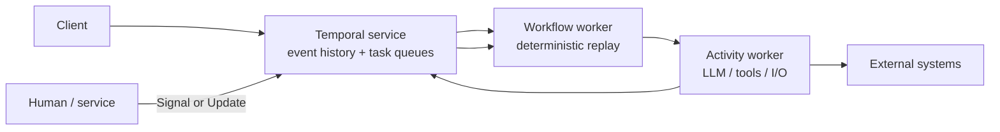
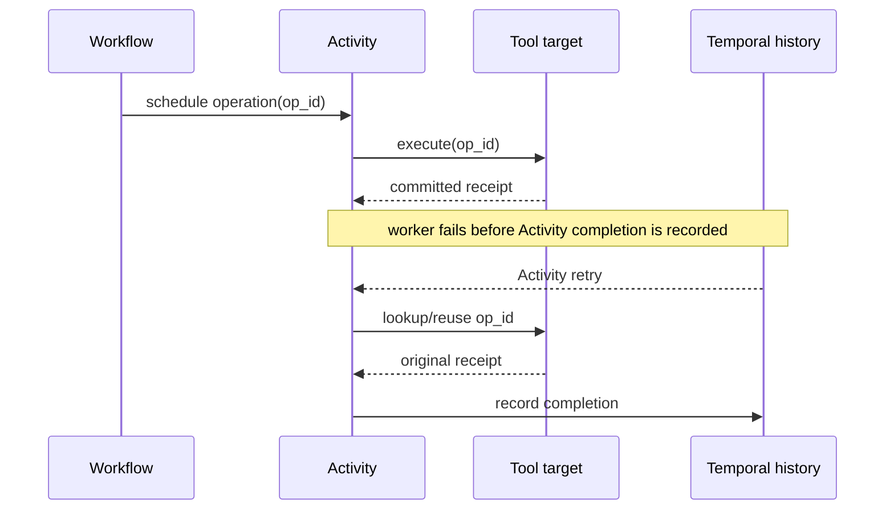
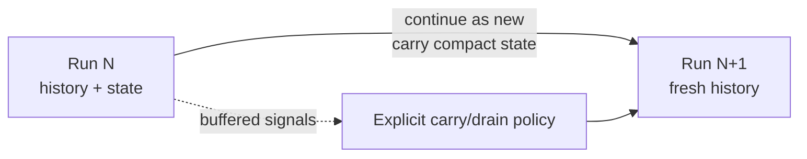

# Temporal for Agent Workflows

**Research date:** 2026-08-31  
**Status:** Research-backed technology guide  
**Scope:** Temporal Server/Cloud, current Workflow/Activity semantics, interaction, versioning, recovery, security, and agent integration boundaries

## Bottom line

Choose Temporal when long-lived agent work needs a mature, dedicated, cross-language durable workflow platform with explicit event history, timers, interactions, worker routing, replay tooling, and operator visibility. Put deterministic coordination in Workflows and every model call, tool call, database/network access, local clock/random value, and uncontrolled agent loop behind a recorded Activity or tested integration boundary.

Temporal preserves progress; it does not make an agent correct or an external effect exactly once. Activity idempotency, operation reconciliation, history budgets, sensitive-payload controls, and code-version operations remain application responsibilities.

## Execution model

The service persists history and schedules tasks; workers execute user code. A Workflow replays recorded events to reconstruct local state. An Activity may perform arbitrary I/O and can be retried. A worker crash does not serialize its stack: a compatible worker replays history and continues from the next command.

## Boundary map

| Concern | Temporal primitive | Application obligation |
|---|---|---|
| Nondeterministic work | Activity, child Workflow, Nexus operation | Timeout, retry class, operation ID, idempotency/reconciliation |
| Long delay | Durable timer | Deadline semantics and business expiry |
| Fire-and-forget input | Signal | Deduplication/order policy and completion visibility |
| Tracked interactive mutation | Update | Validation, authorization, concurrent-handler coordination |
| Read-only inspection | Query | No side effects; tolerate stale/unavailable worker behavior |
| Decomposition | Child Workflow | Parent close policy, cancellation, fan-out/history budget |
| Rollover | Continue-as-New | Carry state and buffered input intentionally |
| Release | Worker Deployment Versioning or patching | Retain/drain old code and replay-test histories |

## Model and tool calls

Never call a model or remote tool directly from Workflow code. Model output is inherently nondeterministic and provider I/O is forbidden in replayable coordination. Use Activities with:

- schedule-to-close and start-to-close timeouts;
- bounded retries for transport, rate-limit, and provider 5xx failures;
- non-retryable classification for invalid auth, policy denial, malformed input, and exhausted budgets;
- a total agent deadline outside the Activity retry window;
- a stable request/operation ID where the provider or tool supports it;
- external artifact storage for large prompts, files, and outputs.

One Activity for an entire hour-long agent loop minimizes history but creates a coarse recovery and observability boundary. One Activity per token or tiny internal action creates excessive history and overhead. Prefer semantic units: model turn, tool effect, deterministic validation, and artifact commit.

## Effects are at-least-once

Activity completion and an arbitrary target commit are not one transaction. Design the Activity to reconcile before repeating. Heartbeat long-running work with progress so retries can resume a chunk, and remember that heartbeat details are progress hints—not a commit record for the target.

## Interaction and human approval

Use a Signal for asynchronous input that need not return an accepted result. Use an Update when the caller needs tracked validation/completion. Handlers can run concurrently with each other and the main Workflow, so guard shared state and ensure handlers finish before completion or Continue-as-New.

A durable approval record should include run/workflow ID, action/tool name, canonical arguments, proposal digest, tenant/resource, requester/approver identity, issue/expiry time, policy version, and decision. On resume, reauthorize the exact action against current resource state. Approval does not reserve the target; use commit-time preconditions.

## Cancellation and timeouts

Cancellation is cooperative. For non-local Python Activities, the current SDK requires a heartbeat timeout and heartbeats for the Activity to receive cancellation. A synchronous activity or external process may keep running after Temporal marks it cancelled or timed out. Treat late effects as expected distributed behavior and reconcile them.

Child cancellation depends on the awaited handle and parent-close policy. Test:

- cancel before Activity dispatch;
- cancel during a model request;
- cancel after target commit but before completion;
- cancel parent with in-flight children;
- worker shutdown versus workflow cancellation;
- repeated cancel request after Workflow code swallows the first.

## History, fan-out, and Continue-as-New

History grows with Workflow tasks, timers, Activities, retries, Signals, Updates, and child events. Large histories slow replay and approach service limits. Monitor both event count and bytes. Use Continue-as-New before limits, not in response to a production failure.

Do not Continue-as-New while handlers or unaccounted children are active. For enormous fan-out, use bounded batches or trees of child Workflows; a single parent history is not a million-item queue.

## Safe code evolution

The current official guidance prefers Worker Deployment Versioning when the deployment system can run versioned workers. Pinned Workflow types stay on one deployment version. Auto-upgrade types can move and therefore must remain replay-safe with patches.

| Lifetime | Practical strategy |
|---|---|
| Shorter than deploy interval | Pin and drain old version |
| Spans several deploys | Auto-upgrade plus patching, or retain pinned versions |
| Months/years with rollover | Pin each run; upgrade at Continue-as-New |
| No versioned deployment capability | Patching plus production-history replay tests |

Replay a representative corpus of open and closed production histories in CI. Include concurrent Signals/Updates and local Activities: current SDK issue reports demonstrate that exotic handler/concurrency orderings can reveal version-specific nondeterminism.

## Operations and scaling

Monitor:

- task-queue schedule-to-start latency by Workflow and Activity type;
- worker poller health, slots, sticky-cache behavior, and deployment version reachability;
- Activity retry/timeout/heartbeat failure rates;
- Workflow-task failures and nondeterminism;
- history count/bytes and Continue-as-New rate;
- open/blocked/approval age and child fan-out;
- per-tenant model/tool cost and queue fairness.

Self-hosting means operating the frontend, history, matching, worker, persistence, visibility, backup, upgrades, and multi-region/DR choices. Temporal Cloud removes much of that service operation, not worker/application operations or effect correctness.

## Security and data

Workflow and Activity inputs/results are stored as payloads in history. Encrypt sensitive payloads client-side with a Data Converter/Payload Codec, limit UI/CLI/namespace access, set retention deliberately, and keep large artifacts in object storage. Never store short-lived credentials in Workflow history; persist a reference and obtain scoped credentials in the Activity.

The Python Workflow sandbox catches nondeterministic APIs but explicitly is not a security boundary. Tool containment still needs separate process/container/VM and resource authorization.

## Adoption tests

- [ ] Replay sampled oldest histories on every Workflow-code or SDK change.
- [ ] Crash before and after every model/tool Activity result is recorded.
- [ ] Prove target-side idempotency and an `OUTCOME_UNKNOWN` repair path.
- [ ] Exercise Signal/Update races, duplicate input, and handler completion.
- [ ] Cancel long async/sync Activities and reconcile late effects.
- [ ] Continue-as-New with buffered input and no lost children/handlers.
- [ ] Ramp, roll back, drain, and retire Worker Deployment Versions.
- [ ] Load-test history, payload, fan-out, task queue, and worker saturation.
- [ ] Verify encrypted history and restricted codec/UI access.
- [ ] Reconnect the UI from durable semantic events, not token stream memory.

## Choose something else when

- the work is a short read-only request;
- Postgres-embedded durability is the decisive simplification;
- keyed durable service objects match the domain better than Workflow/Activity separation;
- a Python data orchestration plane or an existing Dapr platform dominates;
- the team cannot operate Temporal or accept Cloud and cannot enforce replay/version discipline.

## Primary sources and failure-test leads

- [Temporal documentation](https://docs.temporal.io/), [Python SDK](https://github.com/temporalio/sdk-python), and [server repository](https://github.com/temporalio/temporal)
- [Worker Versioning](https://github.com/temporalio/documentation/blob/main/docs/production-deployment/worker-deployments/worker-versioning.mdx) and [Event History](https://github.com/temporalio/documentation/blob/main/docs/encyclopedia/event-history/python.mdx)
- [OpenAI Agents integration](https://github.com/temporalio/sdk-python/blob/main/temporalio/contrib/openai_agents/README.md) and [AI security](https://go.temporal.io/platform-hub/ai-engineering/ai-security)
- Regression leads: [concurrent local-activity replay #1578](https://github.com/temporalio/sdk-python/issues/1578), [cold-start handler ordering #1591](https://github.com/temporalio/sdk-python/issues/1591), and [multiprocess Activity cancellation #1048](https://github.com/temporalio/sdk-python/issues/1048)

See [durable-runtime selection](../comparisons/durable-agent-workflow-runtimes.md) and the [research packet](../research/packets/durable-agent-workflow-runtimes.md).
