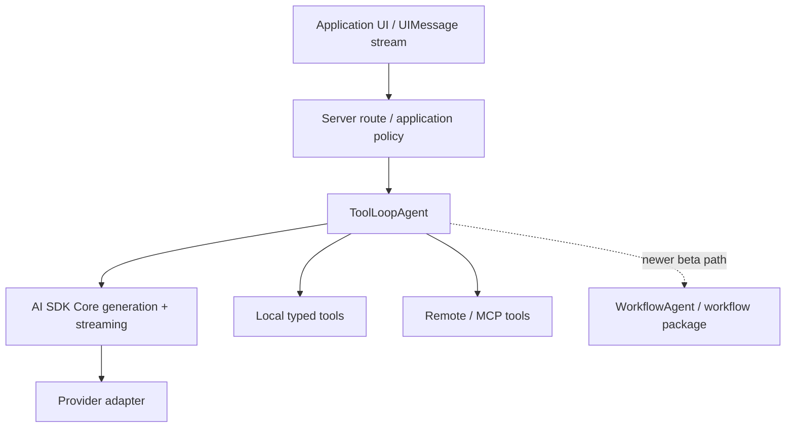
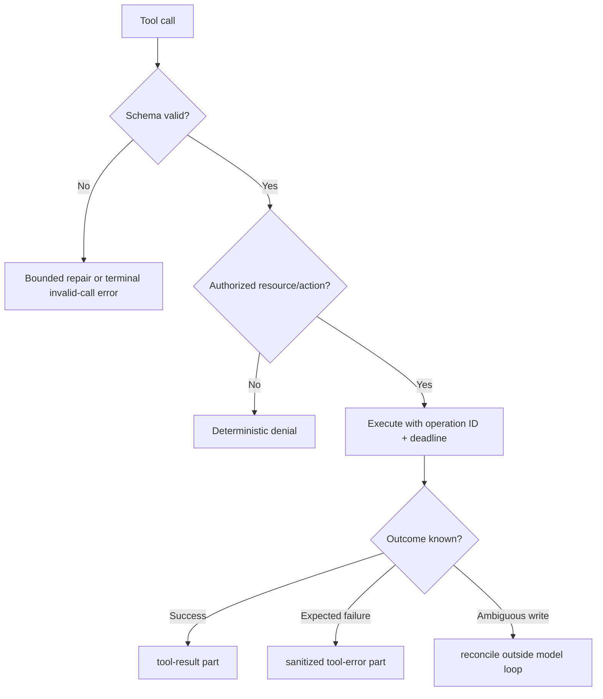
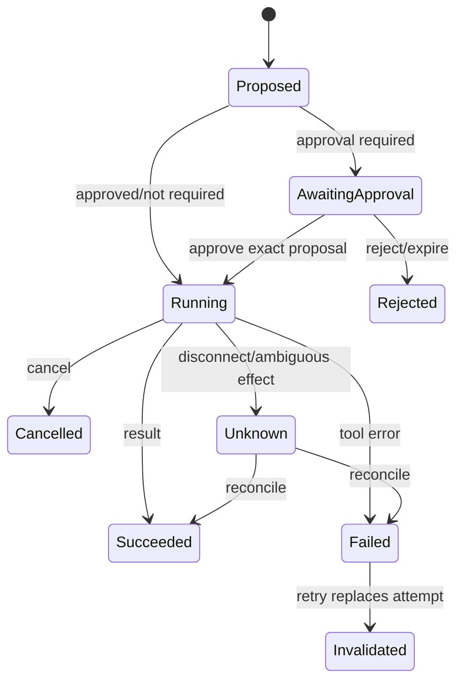

# Vercel AI SDK in Production

**Research date:** 2026-08-31  
**Status:** Research-backed technology guide  
**Scope:** AI SDK Core and `ToolLoopAgent`; `WorkflowAgent` is treated as beta at this research snapshot

## Bottom line

Choose Vercel AI SDK when TypeScript, web streaming, typed tools, UI message state, and a broad provider adapter ecosystem are central. `ToolLoopAgent` is a practical bounded loop over AI SDK Core; it does not make provider behavior identical or turn UI messages into durable business state.

Adopt the newer `WorkflowAgent` only after validating its beta support posture and the combined Core, agent, provider, UI, and workflow package set.

## Stack model

These layers release and fail independently. Pin and test them as one compatibility profile.

## Loop control

`ToolLoopAgent` packages repeated model/tool steps. Current documentation provides a default stop after 20 steps, `stopWhen` conditions, `prepareStep`, approval, timeouts/abort signals, and lifecycle callbacks.

Use `prepareStep` to make each step intentional:

- restrict tools to the current workflow phase;
- select a model using state and budget rather than model preference;
- project or compact messages before they exceed the context budget;
- force or disable tool choice only when the state machine requires it;
- attach stable trace/run/tenant identities.

A step count alone is insufficient. Enforce wall-clock deadline, maximum model requests, cumulative tokens/cost, tool attempts, parallel calls, result bytes, and nested-agent depth. The application—not the model—owns the terminal state.

## Tools and failure handling

Local tools can derive TypeScript types from Zod or JSON Schema. Dynamic tools support runtime-discovered schemas but give up some static inference. In multi-step execution, expected tool failures can become model-visible `tool-error` parts, while invalid calls and repair failures have distinct error classes.

Prefer local tools when low latency, application-owned deployment, and static control matter. Use MCP or remote tools when dynamic discovery, separate ownership, or isolation justifies protocol and network complexity. In both cases enforce resource authorization at execution time.

Abort signals propagate only as far as downstream code honors them. A local tool must forward the signal to `fetch` or its client; a remote effect may commit after cancellation. Pair cancellation with operation identities and late-result suppression.

## The UI stream is a replicated state machine

A streamed assistant message is assembled across server, network, browser reducer, tool execution, approval, reconnect, and retry. Model it explicitly:

Give each call and attempt a stable ID. Persist the authoritative server event, not just the rendered message. On retry, invalidate superseded parts; on approval, bind the decision to exact arguments, resource version, actor, policy version, and expiry; on reconnect, reduce events idempotently. Current issue history around provider-executed approvals, sibling tool results while paused, timeout accounting, callback forwarding, and retry-invalidated UI parts demonstrates why the whole stream path needs tests.

## Provider abstraction boundary

AI SDK makes common provider operations pleasant, but provider-neutral syntax is not provider-equivalent behavior. Maintain a capability profile for:

| Surface | Differences to prove |
|---|---|
| Structured output | Native grammar vs tool emulation, repair, refusal |
| Tools | Parallelism, call identifiers, hosted/provider-executed tools |
| Approval | Provider-native parts, pause/resume support, transcript requirements |
| Reasoning | Part types, visibility, retention, redaction |
| Streaming | Ordering, finish reasons, partial JSON, disconnect recovery |
| Usage | Cache/reasoning/tool tokens and price attribution |
| Errors | Retry class, provider request ID, raw diagnostic preservation |

Keep provider/model identity and raw request evidence. Evaluation—not adapter availability—determines whether a swap is safe.

## WorkflowAgent adoption gate

AI SDK 7 introduced `WorkflowAgent` as a durable agent direction, while the workflow package remained on a beta release line at this snapshot. Before adoption, demonstrate pause/resume, stream replay, approval, cancellation, activity retry, effect reconciliation, large artifact handling, and deployment-version migration. Decide which product owns run admission, timers, queues, retention, and operator repair.

Do not infer workflow stability from AI SDK Core stability.

## Operational acceptance tests

- [ ] Exhaust every stop condition and confirm one terminal application state.
- [ ] Cancel during model stream, local async tool, CPU/sync work, remote tool, and committed write.
- [ ] Disconnect/reconnect before and after every UI tool-part transition.
- [ ] Retry after partial text, a sibling tool result, an approval request, and a failed tool.
- [ ] Compare constructor and per-call timeout precedence.
- [ ] Run the same fixture across every supported provider capability profile.
- [ ] Bound schema/result sizes and redact telemetry before export.
- [ ] Replay persisted UI/workflow events across package upgrades.
- [ ] Reconcile an ambiguous write without asking the model to guess.
- [ ] Test tenant/user/tool identity at both the route and resource boundary.

## Choose it when

- TypeScript and web streaming are first-class platform requirements;
- typed tools and UI message integration remove meaningful custom work;
- provider experimentation is useful and capability differences can remain explicit;
- the application can own business state, effects, authorization, and total budgets.

## Prefer another shape when

- state graphs, checkpoint inspection, and time travel dominate: compare LangGraph;
- typed Python services dominate: compare Pydantic AI;
- the run is a long-lived business process and beta workflow infrastructure is unacceptable: use a mature durable engine around bounded AI SDK activities;
- no loop is needed: use AI SDK Core generation directly.

## Primary sources and failure-test leads

- [Agents](https://ai-sdk.dev/docs/agents), [loop control](https://ai-sdk.dev/docs/agents/loop-control), and [`ToolLoopAgent`](https://ai-sdk.dev/docs/reference/ai-sdk-core/tool-loop-agent)
- [Tools and tool calling](https://ai-sdk.dev/docs/ai-sdk-core/tools-and-tool-calling) and [telemetry](https://ai-sdk.dev/docs/ai-sdk-core/telemetry)
- [AI SDK 7 announcement](https://vercel.com/blog/ai-sdk-7) and [workflow changelog](https://github.com/vercel/ai/blob/main/packages/workflow/CHANGELOG.md)
- Adoption tests from [callback forwarding #15864](https://github.com/vercel/ai/issues/15864), [long-running tool timeout #17310](https://github.com/vercel/ai/issues/17310), and [retry-invalidated UI parts #18481](https://github.com/vercel/ai/issues/18481)

See [independent framework selection](../comparisons/independent-agent-frameworks.md) and the [research packet](../research/packets/independent-agent-frameworks.md).
