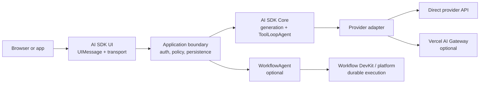

# Vercel AI SDK Engineering Guide

> Production guidance for AI SDK 7, researched on **2026-08-31**. This area complements the existing framework overview; it does not replace it.

The Vercel AI SDK is an open-source TypeScript toolkit, not a complete agent platform. It gives an application normalized model calls, tool loops, structured output, streaming protocols, UI state, provider adapters, middleware, and testing primitives. The application still owns identity, authorization, tenant isolation, persistence, budgets, idempotency, reconciliation, evaluation, and operational policy.

The most important architectural distinction is this one:

Neither AI Gateway nor Vercel deployment is required to use the SDK. A string model ID such as `openai/gpt-5-mini` resolves through AI Gateway by default, while a model instance from `@ai-sdk/openai`, `@ai-sdk/anthropic`, or another provider package calls that provider directly. `WorkflowAgent` is a separate package and runtime integration, not a property of every agent loop.

## Choose the smallest execution model

| Need | Starting point | Why |
| --- | --- | --- |
| One model call or explicitly coded sequence | `generateText` / `streamText` | The control flow stays visible and testable. |
| Reusable bounded tool loop in one process | `ToolLoopAgent` | Packages model, tools, loop controls, and callbacks. |
| Deterministic multi-stage business flow | Core calls inside application orchestration | Branches, compensation, and state transitions remain explicit. |
| Work that must survive process loss or long approval pauses | `WorkflowAgent` plus Workflow DevKit | Adds checkpoints, durable steps, replay, and reconnectable streams. |
| Provider routing, spend controls, or managed fallback | AI Gateway, if its operational model fits | This is a platform decision, separate from Core. |

Prefer a normal function until process loss, long waits, or durable human interaction are actual requirements. Durability increases correctness obligations: step inputs must serialize, retryable effects need idempotency, and deployments must remain compatible with in-flight runs.

## Guide map

1. [Architecture, generation, and the agent loop](architecture-core-and-agent-loop.md)
2. [Messages, prompts, models, and providers](messages-prompts-models-and-providers.md)
3. [Tools, structured output, and approvals](tools-structured-output-and-approvals.md)
4. [Streaming, data, and UI protocols](streaming-data-and-ui-protocols.md)
5. [Chat state, persistence, and stream resumption](chat-state-persistence-and-resume.md)
6. [Workflows, durability, and background execution](workflows-durability-and-background-execution.md)
7. [Middleware, telemetry, and observability](middleware-telemetry-and-observability.md)
8. [Testing, debugging, and evaluation](testing-debugging-and-evaluation.md)
9. [Abort, retries, errors, and rate limits](reliability-abort-retries-errors-and-rate-limits.md)
10. [Deployment, runtimes, and scaling](deployment-runtimes-and-scaling.md)
11. [Security and tenant boundaries](security-and-tenant-boundaries.md)
12. [Packages, migration, limitations, and alternatives](versions-migration-limitations-and-alternatives.md)

The supporting [research packet](../../research/packets/vercel-ai-sdk-deep-dive.md) records the source snapshot, version matrix, maintainer issue evidence, contradictions, and refresh triggers.

## Production baseline

- Pin a compatible AI SDK package family and lockfile. Pin exact versions for experimental or beta surfaces.
- Map SDK/UI events into an application-owned [state and event contract](../../runtime/agent-state-and-event-contracts.md) with stable identity, explicit terminal outcomes, replay, and redacted projections.
- Use Node.js 24 LTS or another currently supported Node version meeting AI SDK 7's `>=22` requirement. All v7 packages are ESM-only.
- Validate untrusted `UIMessage` objects before `convertToModelMessages`.
- Put authorization inside every tool and every chat, stream-resume, workflow, and approval endpoint.
- Bound steps, total time, per-step time, tokens, spend, tool attempts, result sizes, and nested depth.
- Make mutating tools idempotent and reconcile ambiguous timeouts; a timeout does not prove an external write failed.
- Treat a UI stream as an ordered replicated state machine. Preserve IDs and test chunk reduction, reconnect, retry, and duplicate delivery.
- Record provider/model, request IDs, warnings, finish reason, usage, step/tool timings, policy decisions, and terminal state without recording secrets or sensitive prompt content by default.
- Run deterministic protocol tests, provider contract tests, workflow replay tests, and a separate live-model evaluation suite.

## Stability labels used here

- **SDK guarantee**: documented behavior in current AI SDK 7 source or official documentation.
- **Provider-dependent**: normalized by the SDK but still varies by model or adapter.
- **Platform-dependent**: supplied by AI Gateway, Vercel Functions, or Workflow infrastructure.
- **Application responsibility**: must be implemented outside the SDK.
- **Experimental/beta**: may change outside a major release; exact pinning and adoption gates are appropriate.

## Primary sources

- [AI SDK documentation](https://ai-sdk.dev/docs/introduction)
- [Vercel AI repository](https://github.com/vercel/ai)
- [AI SDK 7 migration guide](https://ai-sdk.dev/docs/migration-guides/migration-guide-7-0)
- [Vercel AI Gateway documentation](https://vercel.com/docs/ai-gateway)
- [Vercel Workflow documentation](https://vercel.com/docs/workflow)
- [Vercel Functions runtimes](https://vercel.com/docs/functions/runtimes)
