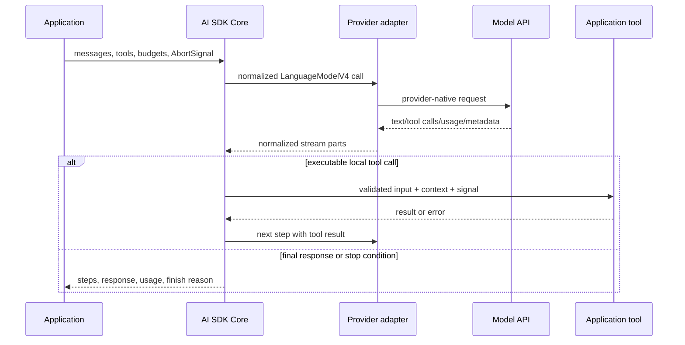
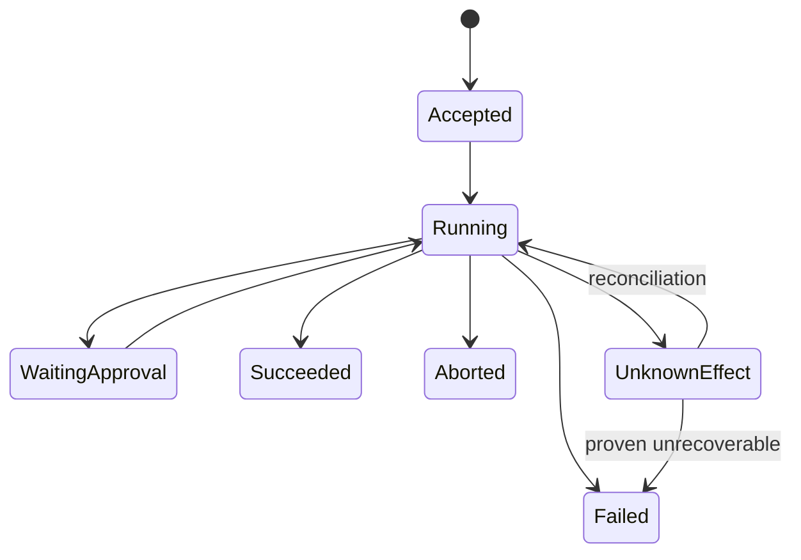

# Architecture, Generation, and the Agent Loop

> Research date: **2026-08-31** | Applies to AI SDK 7.

AI SDK Core is best understood as a set of composable inference primitives. `generateText` and `streamText` can make one model call or continue through tool steps. `ToolLoopAgent` packages the same concerns into a reusable in-memory agent. Neither is a durable job runner, authorization system, state store, or business transaction coordinator.

## The execution boundary



The adapter translates protocol shapes; it cannot make providers behaviorally identical. The tool runs in application code, so its effects and security inherit the application's guarantees.

## Select the right primitive

Use `generateText` when the caller needs the completed answer and can afford to wait. Use `streamText` when progressive output matters. Its production is lazy: consume a result stream, return a stream response, or explicitly call a consumption method. Failing to consume a stream can prevent completion callbacks and resource cleanup.

Use `ToolLoopAgent` when the same instructions, models, tools, call preparation, and callbacks are reused across entry points. Use Core functions directly when each step has domain-specific branching, transactions, or compensation. A visible ten-line workflow is often easier to reason about than a generic agent loop.

## Loop semantics

`ToolLoopAgent` defaults to `isStepCount(20)`. The loop normally stops when the model produces no tool call, calls a tool without an `execute` function, requests approval, hits a configured stop condition, aborts, times out, or fails.

Do not replace the default with `isLoopFinished()` alone in production. That condition deliberately removes the maximum and lets the model continue until it naturally stops. Combine natural completion with independent limits:

```ts
const agent = new ToolLoopAgent({
  model,
  tools,
  stopWhen: isStepCount(12),
  timeout: {
    totalMs: 120_000,
    stepMs: 30_000,
    toolMs: 20_000,
  },
});
```

A step count is only one budget. Also enforce maximum input/output tokens, estimated or actual spend, wall-clock duration, per-tool attempts, tool result bytes, recursion/nested-agent depth, and user or tenant quotas. Stop conditions run after completed steps, so preflight reservations are still needed when one additional step could exceed a hard budget.

## Per-call and per-step control

`prepareCall` runs once for a call. `prepareStep` runs before each model step and can change the model, instructions, messages, active tools, tool choice, provider options, `runtimeContext`, and `toolsContext`. Good uses include:

- selecting a cheaper model for classification and a stronger one for synthesis;
- exposing only tools allowed by the current state;
- compacting messages before context overflow;
- ending or narrowing behavior as a budget approaches.

Treat these hooks as policy code. Make them deterministic from explicit state, log the effective model/tool set, and test every branch. Never use prompt instructions as the only tool authorization mechanism.

`runtimeContext` is shared call context available to preparation and lifecycle callbacks. `toolsContext` can be validated per tool with `contextSchema`, and each tool receives only its own declared context. These improve typing and separation; they are not trust boundaries. Pass stable IDs and policy facts, then re-load and re-authorize protected resources inside the tool.

## Concurrent tool calls

When a model emits multiple executable tool calls in one step, current `generateText` execution uses `Promise.all`. Therefore two tools may overlap and may observe stale shared state. Avoid mutable request-global accumulators and implicit ordering. If tools touch the same resource:

- serialize them explicitly, or make the model expose only one mutation tool at that state;
- use database transactions, version checks, or idempotency keys;
- return conflict results the loop can handle safely;
- never depend on tool declaration order as execution order.

## State and failure ownership

An in-process loop can lose its local progress on crash or runtime eviction. Persist authoritative domain state around effects, not merely after the final answer. A robust turn uses a run record with an owner, request idempotency key, status, budget reservation, current step, and terminal outcome.



`UnknownEffect` matters. If a remote write times out, the provider may have committed it. Blind retry can duplicate the action.

## Production checklist

- [ ] The chosen primitive matches the required durability and control flow.
- [ ] Every loop has independent step, time, token, spend, result-size, and depth limits.
- [ ] Tool concurrency is explicit and mutating effects are idempotent.
- [ ] The full stream is consumed and terminal callbacks are tested.
- [ ] Preparation hooks are deterministic, observable, and covered by tests.
- [ ] Process loss leaves a recoverable run record rather than an unknowable user experience.

## Sources

- [Building agents](https://ai-sdk.dev/docs/agents/building-agents)
- [Loop control](https://ai-sdk.dev/docs/agents/loop-control)
- [`ToolLoopAgent` reference](https://ai-sdk.dev/docs/reference/ai-sdk-core/tool-loop-agent)
- [`generateText`](https://ai-sdk.dev/docs/reference/ai-sdk-core/generate-text)
- [`streamText`](https://ai-sdk.dev/docs/reference/ai-sdk-core/stream-text)
- [AI SDK source](https://github.com/vercel/ai/tree/main/packages/ai/src)

