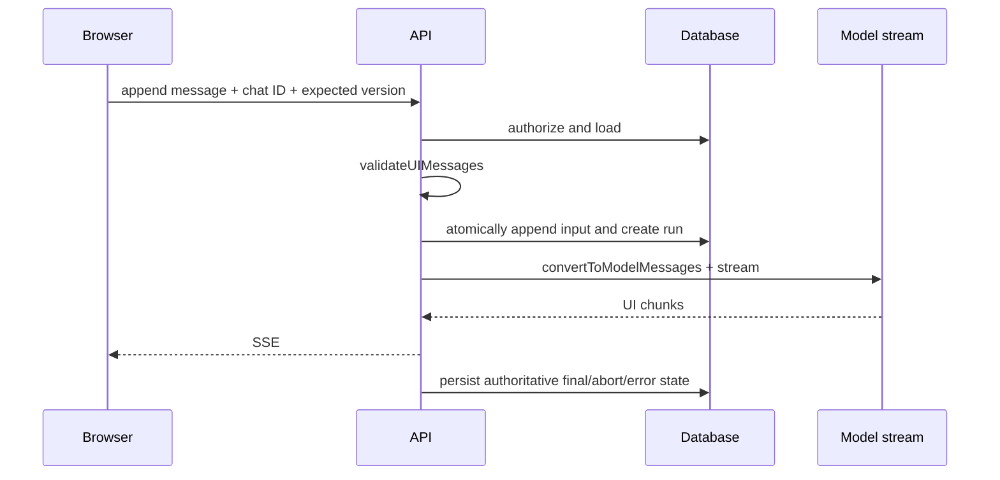

# Chat State, Persistence, and Stream Resumption

> Research date: **2026-08-31** | Applies to AI SDK 7 and AI SDK UI 4.

Persist `UIMessage` as versioned application state. Do not treat the browser's message array, a provider prompt, or an active HTTP connection as the authoritative conversation record.

## Recommended records

Use separate records for conversation, message, and run state:

| Record | Minimum fields |
| --- | --- |
| Conversation | opaque ID, tenant, owner/access policy, schema version, created/updated time |
| Message | conversation ID, stable message ID, role, parts, metadata, sequence/version |
| Run | run ID, request idempotency key, input version, active stream ID, status, budgets, terminal reason |
| Approval | actor, exact tool call/arguments digest, decision, expiry, consumed time |

The official persistence example deliberately omits authorization and production error handling. Add both. Every read, append, resume, stop, approval, and workflow-stream endpoint must derive the actor from authenticated server context and authorize the requested conversation/run.

## Write path

Use optimistic concurrency or a per-conversation sequence. Two tabs can submit against the same history; last-write-wins can silently erase a turn. Options include rejecting a stale expected version, branching explicitly, or serializing active runs per conversation.

Generate assistant message IDs on the server when persistence and client rendering must agree. Persist final messages from the server's `onEnd`/terminal path, including aborted or failed status. Client callbacks can enhance UX but cannot guarantee storage.

## Validate on every boundary

Before `convertToModelMessages`, run `validateUIMessages` against the current tools, metadata schema, and data-part schema. Validation applies both to browser input and data loaded from storage. When old messages no longer validate, run an explicit migration or quarantine the conversation. Silently replacing invalid history with an empty array can cause confusing or unsafe behavior.

Stored messages can contain obsolete tool calls or approvals. Never replay a historical approval as authority for a new tool call. Tool execution must bind to the current call ID, arguments, actor, and resource state.

## Resumable UI streams

The standard resume pattern needs three durable references:

1. persisted messages;
2. a conversation-to-`activeStreamId` mapping;
3. a resumable stream store/pub-sub layer, such as the official example's Redis-backed `resumable-stream` context.

With `useChat({ resume: true })`, the client performs a GET against the resume endpoint when mounted. The endpoint loads the authorized conversation, finds its active stream, and returns 204 when none exists. Clear the mapping conditionally: a finishing old stream must not erase a newer run's ID.

Resumption means the server keeps generation alive after the original connection disappears. Consequently, a disconnect is not cancellation. Current guidance separates explicit cancellation into a dedicated stop endpoint. Bind the stop request to the exact run/stream ID and clear state with compare-and-set semantics.

## Delivery and deduplication

Assume chunks and completion notifications can be delivered more than once. Use stable message/part IDs and monotonic sequence or cursor values. On reconnect, reduce from the last acknowledged cursor or replay idempotently. Persist the final message with a unique run/message constraint.

Never expose storage keys as authorization tokens. Treat conversation, stream, and Workflow run IDs as opaque identifiers, URL-encode them, validate their format, and authorize them independently.

## Retention and privacy

- Set retention separately for raw messages, attachments, provider metadata, traces, and approval audits.
- Delete or redact embeddings and derived caches when policy requires it; deleting only visible messages is incomplete.
- Encrypt sensitive content at rest and keep tenant identifiers in every lookup key.
- Avoid logging entire `UIMessage` arrays during validation failures.
- Preserve enough immutable audit data for high-impact tool effects without retaining irrelevant model content.

## Recovery checklist

- [ ] A crash after an external effect but before message persistence can be reconciled.
- [ ] A stale tab cannot overwrite a newer conversation version.
- [ ] Resume and stop are authorized and bound to the current run.
- [ ] Old stored schemas have migrations and fixture tests.
- [ ] Duplicate chunks and duplicate completion callbacks are harmless.
- [ ] Terminal status is written for success, error, abort, and ambiguous effect.

## Sources

- [Chatbot message persistence](https://ai-sdk.dev/docs/ai-sdk-ui/chatbot-message-persistence)
- [Chatbot stream resumption](https://ai-sdk.dev/docs/ai-sdk-ui/chatbot-resume-streams)
- [Troubleshooting abort and resumable streams](https://ai-sdk.dev/docs/troubleshooting/abort-breaks-resumable-streams)
- [`validateUIMessages`](https://ai-sdk.dev/docs/reference/ai-sdk-core/validate-ui-messages)
- [`convertToModelMessages`](https://ai-sdk.dev/docs/reference/ai-sdk-ui/convert-to-model-messages)
