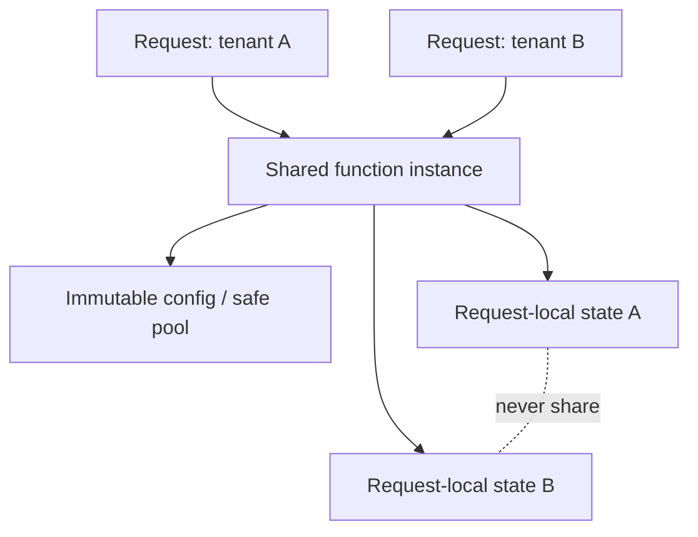

# Deployment, Runtimes, and Scaling

> Research date: **2026-08-31** | AI SDK is deployable beyond Vercel; platform limits change, so verify current plan documentation.

AI SDK uses Web APIs and provider packages, but runtime compatibility depends on every adapter, middleware, tool, telemetry exporter, and storage client in the request path. Choose runtime from those dependencies and the workload—not from the word “streaming.”

## Node, serverless, and edge

AI SDK 7 requires Node.js 22 or later and is ESM-only. Its migration guide recommends a currently maintained release such as Node.js 24 LTS rather than an end-of-maintenance minimum.

On Vercel, Node.js is the default and supports the full Node API surface. Vercel's current Edge documentation recommends migrating to Node.js for improved performance and reliability. Edge has a restricted API set and tighter bundle/runtime constraints; it can still suit small, dependency-light, latency-sensitive routes after compatibility testing.

For any platform, verify:

- runtime and ESM support for every provider and transitive dependency;
- streaming is not buffered by framework, proxy, CDN, or compression;
- maximum duration, initial-response deadline, memory, bundle, body, and log limits;
- request cancellation semantics;
- outbound network, DNS, proxy, and private-egress controls;
- region availability and data residency;
- background-work lifetime after the response.

Do not copy numeric platform limits into architecture decisions without checking the current project and plan. Vercel has changed duration limits over time.

## Vercel Functions and Fluid compute

Fluid compute allows multiple invocations to share one physical instance/global process concurrently. This can improve utilization for I/O-heavy model calls, but invalidates the assumption that one warm process handles one request at a time.

Safe global state:

- immutable configuration;
- a concurrency-safe connection pool or provider client;
- bounded caches whose keys include every tenant/policy dimension;
- telemetry exporters designed for concurrent use.

Unsafe global state:

- current user, tenant, chat, model, tool context, or AbortController;
- mutable arrays of stream chunks or messages;
- per-request counters and budgets;
- unkeyed caches containing prompt or tool data.

Concurrency also changes capacity math. Limit simultaneous generations per tenant and per instance, provider connections, DB pool size, and memory held by active streams. Backpressure or queue work before latency collapses.

## Streaming path

Test the deployed path with a real slow stream. Confirm the first response byte arrives within platform deadlines, SSE is not buffered, keepalive/idle behavior matches requirements, errors after headers remain parseable, and client disconnect reaches the provider when cancellation is enabled.

Vercel request cancellation is currently Node-only and opt-in through `supportsCancellation`. Pass `request.signal` to AI SDK calls and downstream tools. Closing a response is otherwise not proof the billed/provider work stopped.

## State and scaling

Local memory and local files are not durable multi-instance storage. Persist chat/run state, idempotency records, active stream pointers, and rate-limit reservations in infrastructure with atomic operations. Use region-aware storage; placing compute close to users but far from state or provider endpoints can increase total latency.

Serverless autoscaling does not protect downstream systems. Cap concurrency before model providers, vector stores, databases, and third-party tools. Honor provider rate headers where meaningful, but keep application quotas authoritative.

## AI Gateway and deployment independence

AI Gateway is optional. Direct provider instances work on Vercel or elsewhere. Conversely, Gateway can be used without making it the application's authorization, tenant budget, or correctness layer. If Gateway routing/fallback is enabled, record actual providers and ensure the allowed set meets region, retention, capability, and compliance policy.

## Long-running work

Use a normal request for work that reliably fits the runtime lifetime and user interaction. `waitUntil` is appropriate for bounded post-response completion, not indefinite durable execution. Use a queue or Workflow for work that must survive eviction, wait on timers/humans, or be inspected and resumed independently. Workflow is a separate runtime/platform concern; see [workflows and durability](workflows-durability-and-background-execution.md).

## Deployment checklist

- [ ] Package engines, ESM, native dependencies, and provider adapters pass in the exact runtime.
- [ ] Stream, abort, error-after-header, and idle-gap behavior pass through the production proxy/CDN.
- [ ] No request or tenant state lives in process globals.
- [ ] Storage writes and rate-limit reservations are atomic across instances.
- [ ] Concurrency is bounded at application and downstream-resource levels.
- [ ] Region, provider routing, retention, and secret policy are documented.
- [ ] Current plan limits are checked during each release, not assumed from this guide.

## Sources

- [AI SDK installation and Node requirement](https://github.com/vercel/ai)
- [AI SDK Vercel deployment guide](https://ai-sdk.dev/docs/advanced/vercel-deployment-guide)
- [Vercel Node.js runtime](https://vercel.com/docs/functions/runtimes/node-js)
- [Vercel Edge runtime](https://vercel.com/docs/functions/runtimes/edge)
- [Vercel Fluid compute](https://vercel.com/docs/fluid-compute)
- [Vercel Functions API and cancellation](https://vercel.com/docs/functions/functions-api-reference)
- [Vercel Functions usage and pricing](https://vercel.com/docs/functions/usage-and-pricing)

