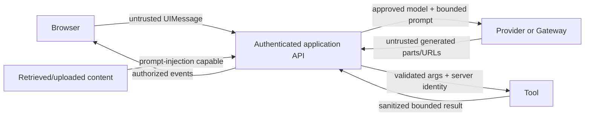

# Security and Tenant Boundaries

> Research date: **2026-08-31** | Security controls must be verified against the exact packages and deployment.

The model, browser, retrieved content, tool results, provider metadata, and remote MCP catalog are untrusted inputs. The application server is the policy enforcement point.

## Trust-boundary map

The SDK validates shapes; the application validates authority and meaning.

## Tenant isolation

Every chat, run, message, attachment, stream, Workflow run, approval, tool resource, cache entry, trace, and rate-limit key must include a server-derived tenant boundary. Do not trust tenant or user IDs from messages, tool arguments, URL parameters, or `runtimeContext` without comparing them to authenticated context.

Apply authorization on every operation, including read/resume/stop/status endpoints. Opaque IDs reduce guessing but do not replace authorization. URL-encode dynamic IDs and validate format before using them in paths, URLs, storage keys, or logs.

For Fluid compute or other concurrent servers, never place current-tenant state in module globals. Shared caches require tenant/policy/model/version keys and bounded eviction.

## Prompt injection and tool policy

Retrieved pages and tool outputs can instruct the model to exfiltrate secrets or misuse another tool. Delimit untrusted content, minimize available tools with `activeTools`, and state that embedded instructions are data—but do not rely on prompting as the control.

Each tool must:

- derive actor and tenant from server context;
- authorize the exact resource and action at execution time;
- expose minimum capability and data;
- validate inputs and domain invariants;
- enforce egress and destination allowlists where relevant;
- use approval for high-impact effects and idempotency for mutations;
- sanitize output before returning it to the model or UI.

An approval authorizes one exact effect, not a tool name indefinitely. Bind it to arguments, resource version, actor, expiry, and one-time consumption.

## Secrets and providers

Keep provider/API credentials server-side. Separate credentials and provider accounts by environment and, where risk warrants it, by tenant or data class. Do not put secrets in messages, tool descriptions, provider options received from clients, telemetry attributes, custom data parts, or error text.

Allowlist application model aliases. An arbitrary client model string could route to an expensive, non-compliant, or differently retained provider. Gateway fallback must stay within an approved provider/region/account set.

## Server-side URL fetching and SSRF

Some provider packages fetch URLs returned by provider responses, such as generated media or polling endpoints. Current AI SDK provider utilities automatically reject non-HTTP schemes and private, loopback, link-local, CGNAT, multicast, `.local`, and localhost destinations; revalidate redirects; strip risky headers; and drop credentials across origins. On Node, the default path also validates and pins DNS at connection time.

Important boundaries:

- a configured same-origin provider base URL is exempt because the application explicitly selected it;
- injecting or globally replacing `fetch` makes that fetch responsible for equivalent DNS validation and connection pinning;
- non-Node runtimes may lack DNS/socket hooks, so network egress controls are required;
- application tools that fetch model- or user-supplied URLs need their own equivalent policy.

Use network-layer egress denial for metadata/private/loopback networks in addition to library checks.

## Message, stream, and error security

Validate browser and stored `UIMessage` values with current tool/metadata/data schemas before conversion. Reject forged assistant/tool/approval parts. Treat resumable stream and Workflow run IDs as protected resources; prevent cross-tenant stream replay and stop.

Map stream and tool errors to a generic message plus correlation ID. Provider-executed tool errors can follow a different path than local tool errors, so test their sanitization. Apply normal web protections: authenticated sessions, CSRF protection for cookie-authenticated mutations, origin policy, secure cookies, request-size limits, upload scanning, and CSP appropriate to the UI.

## Telemetry and retention

AI SDK 7 telemetry records inputs and outputs by default after an integration is registered. Disable both for sensitive workloads and add reviewed, redacted attributes. DevTools stores generations in plain text and must remain local-only.

Classify and set retention for prompts, responses, attachments, embeddings, provider request/response bodies, tool arguments/results, approvals, and traces. Provider or Gateway retention is a separate policy decision from application retention.

## Current vulnerability evidence

The repository security page listed 2026 advisories for separate Harness packages, not a blanket vulnerability in Core, UI, providers, or Workflow. Track advisories by exact installed package.

Maintainer issue #18187 documented hardening observations, but its author stated no current exploit was demonstrated. Useful defensive lessons are to avoid unsafe dynamic key assignment, URL-encode chat/run IDs, sanitize provider-executed tool errors, and validate dynamic/MCP tool names. Treat the issue as hardening evidence, not proof of an exploitable current SDK vulnerability.

Report suspected SDK vulnerabilities through Vercel's documented HackerOne process rather than a public issue.

## Sources

- [Secure URL fetching](https://ai-sdk.dev/docs/advanced/secure-url-fetching)
- [Tool approvals](https://ai-sdk.dev/docs/agents/tool-approvals)
- [Message persistence and validation](https://ai-sdk.dev/docs/ai-sdk-ui/chatbot-message-persistence)
- [AI SDK telemetry](https://ai-sdk.dev/docs/ai-sdk-core/telemetry)
- [Vercel AI security policy](https://github.com/vercel/ai/security/policy)
- [Vercel AI security advisories](https://github.com/vercel/ai/security/advisories)
- [Hardening issue #18187](https://github.com/vercel/ai/issues/18187)

