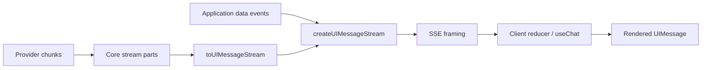

# Streaming, Data, and UI Protocols

> Research date: **2026-08-31** | Applies to AI SDK 7 and AI SDK UI 4.

AI SDK streaming is an event protocol, not just text arriving incrementally. Tool input, approval, reasoning, files, sources, custom data, errors, steps, and completion all have lifecycle semantics. Treat the client as a reducer over an ordered event log.

## Core streams and UI streams

`streamText().stream` carries normalized model-call parts. `toUIMessageStream` converts those parts into `UIMessageChunk` values. `createUIMessageStream` can merge custom application events with one or more model streams, and `createUIMessageStreamResponse` frames them for HTTP.

The UI message protocol uses Server-Sent Events and the response header `x-vercel-ai-ui-message-stream: v1`. The plain-text protocol carries text only and is unsuitable for typed data, tool lifecycles, approvals, reasoning, or message metadata.

## Lifecycle invariants

Text and reasoning use start/delta/end events. Tool calls move through input streaming, input available, optional approval, output available, output error, or denial. A step start/finish and message start/finish delimit higher-level state. Custom `data-*` parts can be transient or persisted depending on how the application builds the final message.

Enforce these invariants in tests:

- every delta references a known part ID and correct type;
- IDs remain stable across retries and reconnects;
- no event updates a terminal part;
- a message has at most one authoritative terminal event;
- replaying already acknowledged chunks does not duplicate rendered state;
- `reset-step` removes partial output from a failed Workflow model step before retry output is reduced.

Do not derive business state by scraping assistant text. Emit typed data parts with an application schema and version.

## Error channels

Errors thrown before streaming begins can become normal HTTP failures. After headers and chunks are sent, errors usually travel as stream parts. `createUIMessageStream`/`toUIMessageStream` provide error mapping hooks; return a generic client message and log a correlation ID server-side.

Provider-executed tool errors and provider metadata deserve explicit regression tests because they may take different paths from local `execute` failures. Never serialize raw provider response bodies, stack traces, SQL messages, or tool credentials into an error part.

## Backpressure and consumption

Web streams apply backpressure, but application buffering can defeat it. Avoid accumulating the full response before writing. Bound custom data-part size and frequency, and store large artifacts out of band.

Always consume or pipe the Core stream. On servers where the HTTP response can detach from background work, use the documented consumption hook and platform lifetime primitive so completion, persistence, and telemetry are not abandoned.

Measure:

- request accepted to provider request;
- time to first content-bearing chunk, not merely any protocol frame;
- inter-chunk gaps;
- tool input complete to tool start/end;
- final model chunk to message persistence;
- client disconnect, abort propagation, and terminal status.

## Client callbacks are not an audit log

`useChat` exposes lifecycle callbacks such as `onData`, `onError`, and `onFinish`. They are presentation conveniences. Browsers disconnect, callbacks can run twice during retries, and a tab may close before completion. Persist authoritative run/tool/approval state on the server.

A bounded open maintainer issue in July 2026 reported that `useChat` lacks a general client callback for every server-executed tool lifecycle. Do not depend on such a callback: represent tool state in `UIMessage` parts and keep execution observability server-side.

## Protocol compatibility

Version the application-specific metadata and data parts inside the v1 UI protocol. During rolling deployments, old clients, new servers, and stored messages can overlap. Add tolerant readers for additive fields, reject unsafe unknown tool/approval shapes, and run fixture tests across supported client/server versions.

If a reverse proxy buffers SSE, transforms content, compresses poorly, or imposes an idle timeout, the SDK cannot fix that. Test the deployed path with slow tools, long inter-chunk gaps, cancellation, and reconnect—not only local development.

## Sources

- [AI SDK UI stream protocol](https://ai-sdk.dev/docs/ai-sdk-ui/stream-protocol)
- [Streaming custom data](https://ai-sdk.dev/docs/ai-sdk-ui/streaming-data)
- [Reading UI message streams](https://ai-sdk.dev/docs/ai-sdk-ui/reading-ui-message-streams)
- [`createUIMessageStream`](https://ai-sdk.dev/docs/reference/ai-sdk-ui/create-ui-message-stream)
- [`toUIMessageStream` source](https://github.com/vercel/ai/blob/main/packages/ai/src/ui-message-stream/to-ui-message-stream.ts)
- [`useChat`](https://ai-sdk.dev/docs/reference/ai-sdk-ui/use-chat)
- [Maintainer issue #17357](https://github.com/vercel/ai/issues/17357)
