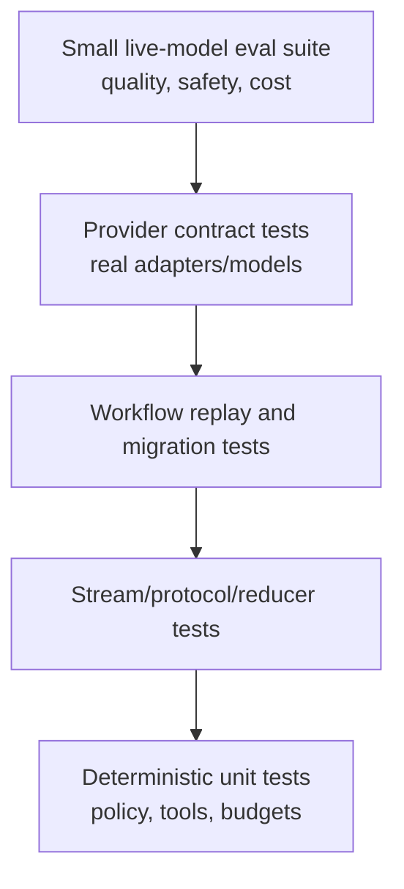

# Testing, Debugging, and Evaluation

> Research date: **2026-08-31** | Applies to AI SDK 7.

The most reliable test suite separates deterministic protocol correctness from probabilistic model quality. Live model tests alone are slow, costly, flaky, and poor at reproducing stream or retry edge cases.

## Test pyramid

AI SDK 7 exports `MockLanguageModelV4`, `simulateReadableStream`, `mockId`, and `mockValues` through `ai/test`. Use the v4 name; older indexed pages and examples can still show v3.

## Deterministic tests

Test `generateText` and `streamText` with scripted model results:

- text-only success and no-content finish;
- one and multiple tool calls, including concurrent calls;
- invalid, repaired, denied, approved, timed-out, and failed tools;
- structured output success, invalid final output, and partial streaming;
- stop conditions and every budget boundary;
- abort before request, during model stream, and during tool execution;
- retryable and non-retryable provider errors;
- lifecycle callback ordering and exactly-once terminal persistence.

Use deterministic IDs so UI stream snapshots are meaningful. For stream tests, vary delays and split tokens/tool JSON at awkward boundaries. Assert semantic parts and state transitions rather than a single provider's raw chunk boundaries.

## UI protocol tests

Feed `UIMessageChunk` fixtures through the same reducer used by the client. Cover duplicate chunks, reconnect from each cursor, errors after headers, `reset-step`, incomplete text/tool parts, approval response, and a finish event arriving twice.

Keep golden fixtures for every supported app schema version. Validate persisted messages with current schemas and run migrations against real anonymized shapes. Verify that hostile client messages cannot forge tool results, metadata, approvals, tenant IDs, or roles.

## Provider contract tests

For each approved provider/model, run a small real suite that proves only required capabilities:

| Contract | Assertions |
| --- | --- |
| Text | non-empty content, finish reason, usage, IDs |
| Stream | ordered lifecycle, first content, terminal usage/error |
| Tools | valid/invalid args, parallel calls if used, hosted tools if used |
| Output | exact schema features and strictness used by the app |
| Abort | provider and runtime actually stop observable work |
| Gateway | routing/fallback metadata matches policy |

Store provider/package/model versions with fixtures. A closed AI SDK issue for v7 OpenAI-compatible streaming once reported text disappearing while tool events remained; this is a good regression shape, not evidence of a current universal bug.

## Workflow tests

Kill execution after each durable boundary and verify replay does not duplicate effects. Test a failure after the external effect commits but before result persistence. Verify approval across redeploy, old serialized state after schema change, retry exhaustion, fatal errors, stream reconnect, cursor validation, and `reset-step` cleanup.

## Evaluation

AI SDK supplies model calls, telemetry, mocks, and local DevTools; it is not a complete evaluation system. Keep a versioned dataset with scenario, expected constraints, scorer version, and provenance. Evaluate:

- task outcome and factual/grounding requirements;
- tool selection and argument correctness;
- authorization/safety policy adherence;
- structured-output validity and domain invariants;
- latency, tokens, provider attempts, and monetary cost;
- user-visible stream correctness and recovery.

Use deterministic programmatic scorers where possible, human review for high-impact or subjective cases, and LLM judges only with calibration, blinded comparisons, and disagreement sampling. Gate releases on regression bands, not a single aggregate score.

## Debugging order

1. Reproduce with a mock at the Core/UI protocol boundary.
2. Capture sanitized normalized stream parts and effective model/tool configuration.
3. Bypass middleware, Gateway routing, and provider fallback one layer at a time.
4. Reproduce against the direct provider with a minimal prompt.
5. Pin exact package versions and compare changelogs/source.
6. Only then attribute the defect to SDK, adapter, provider, runtime, or application.

## Sources

- [Testing](https://ai-sdk.dev/docs/ai-sdk-core/testing)
- [AI SDK test helpers source](https://github.com/vercel/ai/tree/main/packages/ai/src/test)
- [AI SDK DevTools](https://ai-sdk.dev/docs/ai-sdk-core/devtools)
- [Provider specification](https://github.com/vercel/ai/tree/main/packages/provider/src)
- [OpenAI-compatible streaming regression #16408](https://github.com/vercel/ai/issues/16408)

