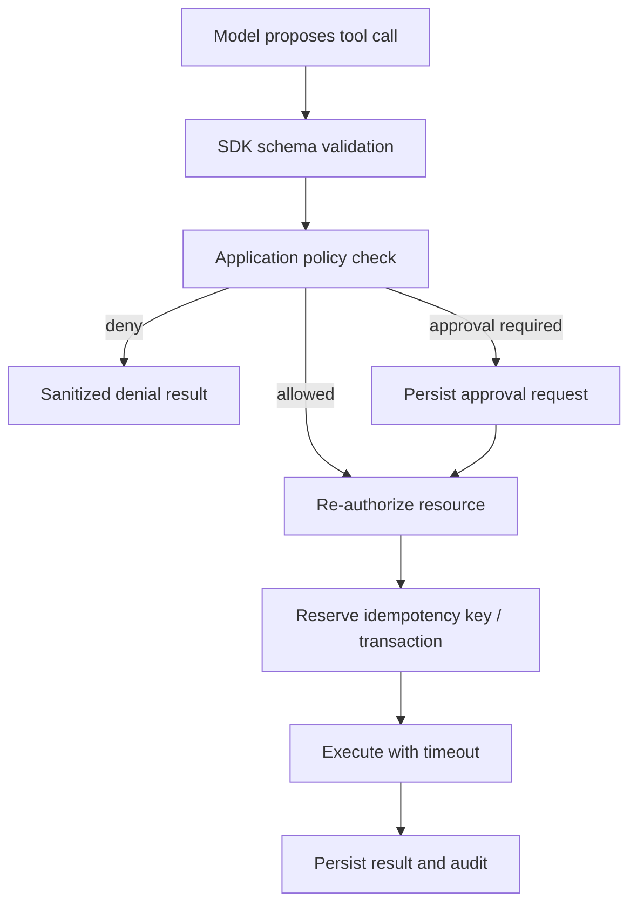

# Tools, Structured Output, and Approvals

> Research date: **2026-08-31** | Applies to AI SDK 7.

A tool schema makes model output parseable; it does not authorize the action. A safe tool is a narrow application API with validated input, server-derived identity, resource authorization, bounded execution, idempotency, and sanitized output.

## Tool boundary

Define static tools with `tool` and an `inputSchema`. `dynamicTool` is appropriate for runtime-discovered capabilities such as MCP, but trades away compile-time discrimination. Provider-executed tools run at the model provider; local tools run in the application. Record which execution mode applies because it changes error, approval, credential, and data-boundary semantics.

Inside `execute`:

- ignore client-supplied tenant, role, price, owner, or approval claims;
- load the actor and resource from trusted IDs;
- authorize the exact operation immediately before the effect;
- use an operation ID for mutations and store the result;
- bound input, output, network calls, and elapsed time;
- return the smallest model-readable result; keep secrets and internal errors out.

Current Core may execute parallel tool calls concurrently. A shared mutable `context` object is not a serialization mechanism.

## Approval is a continuation protocol

In current Core and `ToolLoopAgent`, configure approval through `toolApproval`. The older Core `needsApproval` property is deprecated. `WorkflowAgent` is the important exception: its durable integration still uses `needsApproval` on tool definitions.

For Core, the first model call finishes with a `tool-approval-request`. The application presents and persists the request, collects a decision, appends a matching `tool-approval-response`, and invokes the model loop again. This is not a suspended in-memory Promise.

An approval record should bind:

- actor, tenant, conversation, run, tool name, and tool-call ID;
- canonicalized arguments and tool/schema version;
- a human-readable effect preview;
- resource version or relevant preconditions;
- decision, approver, timestamp, expiry, and one-use status.

`experimental_toolApprovalSecret` can sign approval material, but an experimental signature is defense in depth, not authorization. Re-authorize at execution and reject an approval when arguments or protected state changed.

`@ai-sdk/policy-opa` can apply Open Policy Agent decisions through `toolApproval` and middleware. Be explicit about defaults: an absent or optional policy must not accidentally mean allow-all. Composite tools must enforce policy for their nested effects.

## Tool-call repair

`repairToolCall` can ask a model or deterministic repair function to correct malformed arguments. Keep repair bounded to one or a very small number of attempts and validate the repaired result. Never repair identity, authorization, an approval decision, a resource identifier outside the user's scope, or the intended business effect. A rejected write should stay rejected.

## Structured output

AI SDK 7 uses the `output` option on `generateText` and `streamText`:

- `Output.object({ schema })` for one typed object;
- `Output.array({ element })` for a typed list;
- `Output.choice({ options })` for a constrained value;
- `Output.json()` for syntactically valid JSON without schema validation.

`generateObject` and `streamObject` are deprecated. When tools and output are combined, output generation is an additional step and must fit the loop budget.

Partial `streamText` output is provisional. A partial object may be useful for rendering but is not fully validated until completion. Never commit a payment, permission, or record from a partial object. Validate the final object and apply domain invariants that JSON Schema cannot express.

Provider strictness differs. Use bounded schemas: short descriptions, explicit enums, required properties, limited nesting and array lengths, and no recursive structures unless provider support is proven. Test the actual provider/model combination.

## Failure matrix

| Failure | Correct response |
| --- | --- |
| Invalid tool input | Return/record a bounded validation error; optionally repair once |
| Unauthorized resource | Deny without revealing existence or sensitive detail |
| Approval expired or mismatched | Create a new request; never reuse the old decision |
| Tool timeout after remote write | Mark outcome ambiguous and reconcile by idempotency key |
| Tool returns too much data | Store externally and return a bounded summary/reference |
| Provider-executed error | Normalize and sanitize before it reaches UI or another model step |
| Final structured output invalid | Fail the operation; do not use partial data as authoritative |

## Sources

- [Tools and tool calling](https://ai-sdk.dev/docs/ai-sdk-core/tools-and-tool-calling)
- [Tool approvals](https://ai-sdk.dev/docs/agents/tool-approvals)
- [Structured data](https://ai-sdk.dev/docs/ai-sdk-core/generating-structured-data)
- [`Output` reference](https://ai-sdk.dev/docs/reference/ai-sdk-core/output)
- [WorkflowAgent](https://ai-sdk.dev/docs/agents/workflow-agent)
- [AI SDK tool execution source](https://github.com/vercel/ai/tree/main/packages/ai/src/generate-text)
