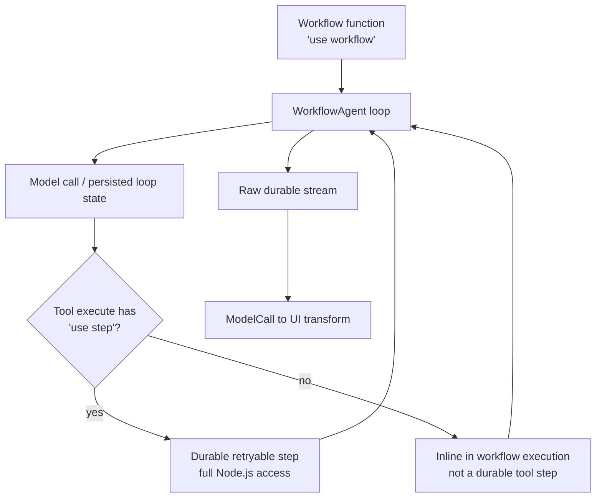

# Workflows, Durability, and Background Execution

> Research date: **2026-08-31** | Applies to `@ai-sdk/workflow` 2.x with Workflow 5 beta at the researched snapshot.

`WorkflowAgent` makes an agent loop resumable by integrating it with Workflow DevKit. It does not make every line, every tool, or every external effect exactly once. Durability applies where the Workflow compiler and runtime have a checkpoint boundary.

## Three execution choices

| Choice | Use when | Persistence model |
| --- | --- | --- |
| Core calls in normal code | Short request, explicit flow, caller can retry | Application-owned |
| `ToolLoopAgent` | Reusable bounded loop within one process | In-memory unless application checkpoints |
| `WorkflowAgent` | Long loop, process loss, durable approval, reconnectable stream | Workflow event log and steps |

`WorkflowAgent` is in `@ai-sdk/workflow`, runs inside a function marked `'use workflow'`, and receives a Workflow `writable`. It exposes `stream()` rather than `generate()`. It expects `ModelMessage[]` and writes `ModelCallStreamPart` values. At the HTTP/UI boundary, `createModelCallToUIChunkTransform` converts raw model-call parts to UI chunks.

The package snapshot researched here was `@ai-sdk/workflow` 2.0.15, but its required `workflow` peer was `^5.0.0-beta.42`, and official installation still used `workflow@beta`. Treat the combined system as a beta adoption even though the integration package has a stable-looking major.

## Durable boundary

Mark a tool implementation with `'use step'` when it must be independently retried and observed. A tool without that directive runs in memory and does not receive the same durable-step guarantee. Workflow orchestration has restricted/deterministic semantics, while a step has full Node.js access and serializable inputs/outputs.

Persist IDs and plain data in workflow state, not database clients, open sockets, functions, class instances, or sandbox handles. Reconnect to external resources inside a step.

## Stop conditions remain mandatory

The current WorkflowAgent guide shows natural-loop completion through `isLoopFinished()`. That removes a fixed maximum. Always pair the desired completion behavior with an independent maximum step/cost/time policy. A durable runaway loop is still a runaway loop, and retries make its cost profile more complex.

Separate these counters:

- logical model steps;
- provider call attempts;
- durable step attempts;
- tool effect attempts;
- stream reconnect attempts.

A single user turn can consume all five.

## Retry is at-least-once pressure

Workflow steps automatically retry failures; current WorkflowAgent documentation describes three attempts by default. A process can fail after a remote service committed an effect but before the step result checkpointed. Therefore every mutating step needs an application operation ID and one of:

- provider-supported idempotency key;
- transactional outbox/inbox;
- database unique constraint and stored result;
- explicit query-and-reconcile operation.

Do not generate a new idempotency key inside each retry. Derive it from stable workflow/run/step identity.

Use fatal versus retryable errors intentionally. Invalid input, denied authorization, and permanent business conflicts should not consume automatic retries. Transient provider or network failures may retry only within the overall attempt and deadline budget.

## Approval and suspension

WorkflowAgent uses `needsApproval` on a tool. The approval request is persisted, so the workflow can suspend and resume after a restart or long delay. Still bind approval to actor, tenant, exact arguments, schema version, resource version, expiry, and one-time use. Re-authorize the effect after resume.

Deployments can change while a workflow is suspended. Maintain compatibility for in-flight serialized state and tool schemas, or version the workflow/tool and route old runs to compatible code.

## Reconnectable streaming

`WorkflowChatTransport` expects the POST response to expose `x-workflow-run-id` and a GET endpoint at `{api}/{runId}/stream`. It reconnects when a stream ends without a `finish` event.

The transport counts UI chunks, but the durable stream stores raw `ModelCallStreamPart` values. The documented server pattern replays the raw stream from index zero and passes the requested UI cursor to `createModelCallToUIChunkTransform`. Validate cursors and authorize the run. During a model-step retry, `reset-step` tells the client to remove partial failed-step content.

## Background work is not one feature

- `waitUntil` extends work within a function's allowed lifetime and suits short completion tasks such as flushing telemetry.
- A queue suits independently retryable jobs with explicit delivery semantics.
- Workflow suits durable multi-step coordination, timers, approvals, and reconnectable progress.
- A normal server or worker may be simpler for continuously running, high-throughput, or specialized compute.

Do not use `waitUntil` as a durable job queue, or Workflow solely to avoid a modest request timeout.

## Adoption gate

- [ ] Exact package versions and a tested upgrade window are defined.
- [ ] All workflow state and step I/O serialize and are size-bounded.
- [ ] Every retryable effect is idempotent and reconcilable.
- [ ] Max steps, attempts, wall time, tokens, spend, and reconnects are enforced.
- [ ] Rolling-deployment and suspended-run compatibility is tested.
- [ ] Run/stream/approval endpoints enforce tenant authorization.
- [ ] Operators can inspect, cancel, retry, and reconcile a stuck run.

## Sources

- [AI SDK WorkflowAgent guide](https://ai-sdk.dev/docs/agents/workflow-agent)
- [`WorkflowChatTransport`](https://ai-sdk.dev/docs/reference/ai-sdk-workflow/workflow-chat-transport)
- [Vercel Workflow documentation](https://vercel.com/docs/workflow)
- [Workflow directives](https://github.com/vercel/workflow/blob/main/docs/content/docs/v5/how-it-works/understanding-directives.mdx)
- [`@ai-sdk/workflow` source and changelog](https://github.com/vercel/ai/tree/main/packages/workflow)

